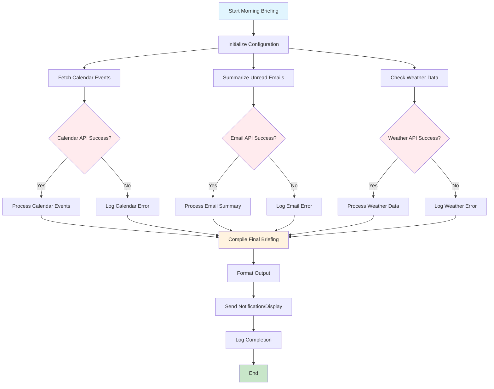

# Morning Briefing Workflow Diagram

## Workflow Components:

1. **Initialization**: Load configuration and API credentials
2. **Parallel Data Fetching**: 
   - Calendar events for today
   - Unread emails from last 24 hours
   - Current weather and forecast
3. **Error Handling**: Each API call has fallback error handling
4. **Data Processing**: Format and summarize information
5. **Final Compilation**: Combine all data into briefing
6. **Output**: Display or send formatted briefing
