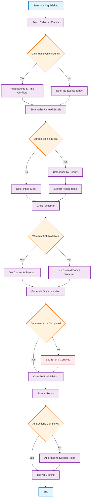

# Morning Briefing Workflow

## Workflow Description

This morning briefing workflow includes the following key components:

### 1. **Calendar Events Processing**
- Fetches calendar events for the day
- Checks for scheduling conflicts
- Handles cases where no events are found

### 2. **Email Summarization**
- Processes unread emails
- Categorizes by priority level
- Extracts actionable items
- Gracefully handles empty inbox

### 3. **Weather Check**
- Retrieves current weather and forecast
- Falls back to cached data if API unavailable
- Ensures weather info is always included

### 4. **Documentation Generation**
- Creates or updates relevant documentation
- Includes error handling for incomplete generation
- Continues workflow even if documentation fails

### 5. **Final Briefing Compilation**
- Assembles all components into cohesive report
- Validates completeness of all sections
- Adds notes for any missing information
- Delivers final formatted briefing

### Decision Points
- **Calendar availability**: Handles empty calendars
- **Email status**: Manages inbox states  
- **API connectivity**: Weather service fallbacks
- **Documentation success**: Error recovery
- **Completeness check**: Quality assurance

This workflow ensures a comprehensive morning briefing is always delivered, even when individual components encounter issues.