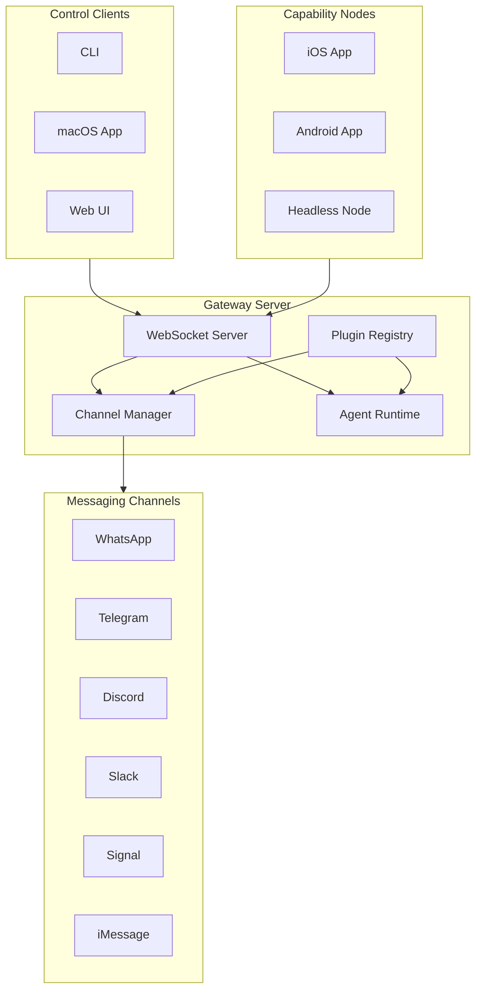
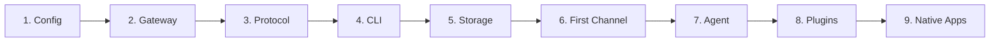

# Skynet Architecture

> A multi-channel AI messaging gateway with native apps, plugin system, and real-time agent capabilities.

**Last Updated:** 2026-01-28  
**Version:** 0.1.0

---

## Implementation Progress

Track your implementation progress using this checklist. Update status as you complete each component.

### Progress Legend
- ⬜ **Not Started** - Work has not begun
- 🟡 **In Progress** - Currently being implemented
- 🟢 **Complete** - Implementation finished and tested
- 🔴 **Blocked** - Cannot proceed due to dependencies or issues
- ⏸️ **Paused** - Temporarily on hold

### Component Status

| # | Component | Status | Priority | Dependencies | Notes |
|---|-----------|--------|----------|--------------|-------|
| 1 | [Configuration System](sections/03-configuration-system/README.md) | ⬜ | P0 | None | Foundation - start here |
| 2 | [Gateway Server](sections/01-gateway-server/README.md) | ⬜ | P0 | Config | Core runtime |
| 3 | [Gateway Protocol](sections/07-gateway-protocol/README.md) | ⬜ | P0 | Gateway | WebSocket API |
| 4 | [CLI Architecture](sections/02-cli-architecture/README.md) | ⬜ | P1 | Config, Gateway | Developer interface |
| 5 | [Data Storage](sections/09-data-storage/README.md) | ⬜ | P1 | Config | Sessions, state |
| 6 | [Channel System](sections/04-channel-system/README.md) | ⬜ | P1 | Gateway, Storage | First messaging platform |
| 7 | [Agent System](sections/05-agent-system/README.md) | ⬜ | P1 | Channels, Storage | AI capabilities |
| 8 | [Plugin System](sections/06-plugin-system/README.md) | ⬜ | P2 | All core | Extensibility |
| 9 | [Native Apps](sections/08-native-apps/README.md) | ⬜ | P2 | Protocol | Mobile/desktop |
| 10 | [Testing Strategy](sections/10-testing-strategy/README.md) | ⬜ | P1 | Parallel | Quality assurance |
| 11 | [CI/CD Pipeline](sections/11-cicd-pipeline/README.md) | ⬜ | P2 | Testing | Automation |

### Milestone Tracking

| Milestone | Target | Status | Components Required |
|-----------|--------|--------|---------------------|
| **M1: Foundation** | - | ⬜ | Config, Gateway, Protocol |
| **M2: First Channel** | - | ⬜ | M1 + Storage, Channel, CLI |
| **M3: AI Agent** | - | ⬜ | M2 + Agent System |
| **M4: Extensibility** | - | ⬜ | M3 + Plugin System |
| **M5: Native Apps** | - | ⬜ | M4 + Native Apps |
| **M6: Production** | - | ⬜ | M5 + Testing, CI/CD |

---

## High-Level Architecture



---

## System Overview

### What This System Does

1. **Multi-Channel Messaging Gateway**
   - Connects to multiple messaging platforms simultaneously
   - Unified message format across all channels
   - Session-based routing and state management

2. **AI Agent Runtime**
   - LLM-powered conversational agents
   - Tool execution (file operations, code execution, API calls)
   - Multi-provider support with fallback chains

3. **Control Plane**
   - WebSocket-based real-time communication
   - Device pairing and authentication
   - Event streaming for all clients

4. **Native Applications**
   - macOS menubar app (gateway controller)
   - iOS/Android apps (capability nodes)
   - Screen, camera, voice capabilities

5. **Extensibility**
   - Plugin system for new channels/tools/providers
   - Hook points throughout lifecycle
   - Config-driven feature toggles

---

## Implementation Sections

### Core Infrastructure (Start Here)

| Section | Description | Link |
|---------|-------------|------|
| **Configuration System** | JSON5 config with Zod validation, env substitution, migrations | [Details →](sections/03-configuration-system/README.md) |
| **Gateway Server** | Central WebSocket server, connection management, event broadcasting | [Details →](sections/01-gateway-server/README.md) |
| **Gateway Protocol** | WebSocket framing, handshake, roles/scopes, typed methods | [Details →](sections/07-gateway-protocol/README.md) |

### Messaging & Agents

| Section | Description | Link |
|---------|-------------|------|
| **Channel System** | Channel plugin architecture, message flow, routing | [Details →](sections/04-channel-system/README.md) |
| **Agent System** | Agent lifecycle, tools, providers, context management | [Details →](sections/05-agent-system/README.md) |
| **Data Storage** | Sessions, transcripts, credentials, migrations | [Details →](sections/09-data-storage/README.md) |

### Developer Experience

| Section | Description | Link |
|---------|-------------|------|
| **CLI Architecture** | Commander.js CLI with DI, command patterns, runtime abstraction | [Details →](sections/02-cli-architecture/README.md) |
| **Plugin System** | Plugin discovery, API, lifecycle, registration | [Details →](sections/06-plugin-system/README.md) |

### Applications & Deployment

| Section | Description | Link |
|---------|-------------|------|
| **Native Apps** | macOS, iOS, Android app architecture | [Details →](sections/08-native-apps/README.md) |
| **Testing Strategy** | Unit, E2E, live tests, mocking patterns | [Details →](sections/10-testing-strategy/README.md) |
| **CI/CD Pipeline** | GitHub Actions, multi-platform builds | [Details →](sections/11-cicd-pipeline/README.md) |

---

## Technology Stack

### Core Runtime
- **Node.js 22+** - Production runtime
- **Bun** - Development, TypeScript execution
- **TypeScript (ESM)** - Primary language with strict typing

### Key Libraries
| Category | Library | Purpose |
|----------|---------|---------|
| CLI | Commander.js | Command-line interface |
| Validation | Zod | Schema validation |
| Testing | Vitest | Test framework |
| WebSocket | ws | Real-time communication |
| Agent | pi-agent-core | Agent runtime |

### Native Apps
| Platform | Language | Framework |
|----------|----------|-----------|
| macOS | Swift | SwiftUI |
| iOS | Swift | SwiftUI |
| Android | Kotlin | Jetpack Compose |

### Build Tools
- **pnpm** - Package manager
- **tsc** - TypeScript compiler
- **Oxlint/Oxfmt** - Linting/formatting
- **Xcode** - Apple platforms
- **Gradle** - Android

---

## Quick Start Guide

### Recommended Implementation Order



### Phase 1: Foundation (Week 1-2)
1. Set up project structure and dependencies
2. Implement configuration system with validation
3. Build basic gateway server with WebSocket
4. Define protocol types and handshake

### Phase 2: Core Features (Week 3-4)
1. Build CLI with dependency injection
2. Implement session/data storage
3. Add first channel integration (e.g., Telegram)
4. Build routing and message flow

### Phase 3: AI Capabilities (Week 5-6)
1. Implement agent runtime with tool execution
2. Add provider abstraction (OpenAI, Anthropic)
3. Build context management and compaction
4. Add memory/search capabilities

### Phase 4: Extensibility (Week 7-8)
1. Build plugin discovery and loading
2. Implement plugin API and lifecycle
3. Add hook points throughout system
4. Create example plugins

### Phase 5: Applications (Week 9-10)
1. Build macOS menubar app
2. Create iOS/Android apps
3. Implement node capabilities
4. Add device pairing

### Phase 6: Production (Week 11-12)
1. Set up comprehensive testing
2. Configure CI/CD pipeline
3. Add monitoring and logging
4. Documentation and polish

---

## Key Design Principles

### 1. Extensibility First
- Plugin system for new channels, tools, providers
- Hook points throughout the lifecycle
- Config-driven feature toggles

### 2. Multi-Channel Abstraction
- Channel-agnostic message format
- Unified routing and session management
- Platform-specific adapters behind common interfaces

### 3. Security by Design
- Device-based pairing with signature verification
- Scope-based authorization
- TLS support with optional pinning
- Token rotation and revocation

### 4. Resilience
- Queue-based message serialization
- Auto-reconnect for all connections
- Graceful degradation with fallback chains
- Health monitoring and heartbeats

### 5. Developer Experience
- TypeScript with strict typing
- Colocated tests
- Comprehensive documentation
- CLI with progressive disclosure

---

## File Structure

```
project/
├── src/
│   ├── cli/                 # CLI commands and runtime
│   ├── config/              # Configuration loading/validation
│   ├── gateway/             # WebSocket server and protocol
│   ├── channels/            # Channel plugin system
│   │   ├── plugins/         # Channel adapters
│   │   ├── telegram/        # Telegram implementation
│   │   ├── discord/         # Discord implementation
│   │   └── ...
│   ├── agents/              # Agent runtime and tools
│   ├── plugins/             # Plugin loader and registry
│   ├── infra/               # Infrastructure utilities
│   ├── sessions/            # Session management
│   └── utils/               # Shared utilities
├── extensions/              # Plugin packages
├── apps/
│   ├── macos/               # macOS SwiftUI app
│   ├── ios/                 # iOS SwiftUI app
│   └── android/             # Android Kotlin app
├── docs/                    # Documentation
├── test/                    # E2E and integration tests
└── scripts/                 # Build and utility scripts
```

---

## Next Steps

1. **Read the Configuration System section first** - It's the foundation everything else builds on
2. **Set up your development environment** - Node 22+, pnpm, TypeScript
3. **Create the basic project structure** - Follow the file structure above
4. **Implement components in order** - Follow the dependency chain

Start with: **[Configuration System →](sections/03-configuration-system/README.md)**
