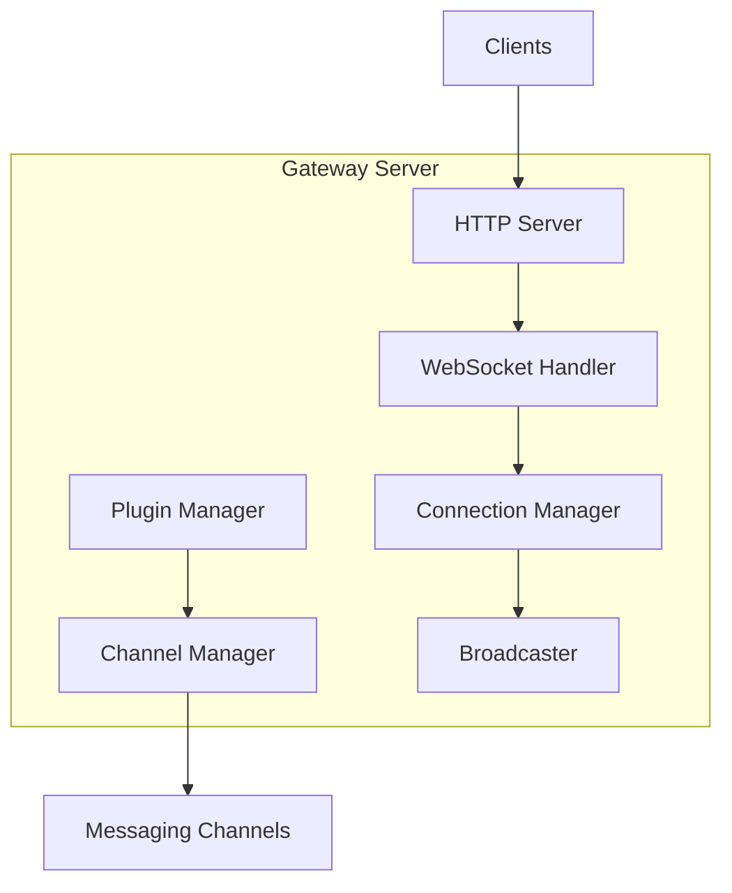
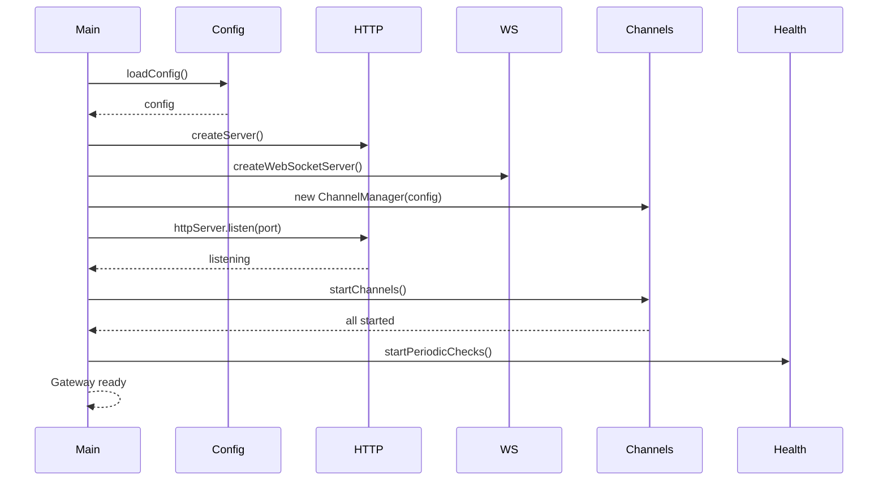

# Gateway Server Implementation Guide

[← Back to Architecture](../../ARCHITECTURE.md)

---

## Implementation Progress

| Task | Status | Notes |
|------|--------|-------|
| Create server entry point | ⬜ | |
| Implement HTTP server | ⬜ | |
| Add WebSocket upgrade handler | ⬜ | |
| Implement connection manager | ⬜ | |
| Add event broadcasting | ⬜ | |
| Implement channel manager | ⬜ | |
| Add health monitoring | ⬜ | |
| Implement graceful shutdown | ⬜ | |
| Add hot reload support | ⬜ | |
| Write tests | ⬜ | |

---

## Overview

The Gateway Server is the central long-running process that:
- Owns all messaging channel connections
- Exposes WebSocket API for clients and nodes
- Manages agent execution
- Handles plugin lifecycle
- Broadcasts events to connected clients



---

## File Structure

```
src/gateway/
├── server.ts              # Main server class
├── server.impl.ts         # Server implementation
├── server-runtime-state.ts # Runtime state management
├── server/
│   ├── http-server.ts     # HTTP server setup
│   ├── ws-connection.ts   # WebSocket connection handling
│   ├── ws-handler.ts      # Message handler
│   └── ws-frame.ts        # Frame parsing/serialization
├── connection/
│   ├── manager.ts         # Connection manager
│   ├── client.ts          # Client connection class
│   └── types.ts           # Connection types
├── broadcast/
│   ├── broadcaster.ts     # Event broadcaster
│   └── events.ts          # Event definitions
├── channels/
│   ├── manager.ts         # Channel lifecycle manager
│   └── types.ts           # Channel types
└── health/
    ├── monitor.ts         # Health monitoring
    └── heartbeat.ts       # Heartbeat service
```

---

## Core Components

### 1. Server Entry Point

**File:** `src/gateway/server.ts`

```typescript
import { createServer } from 'http';
import { WebSocketServer } from 'ws';
import { loadConfig } from '../config/io';
import { ConnectionManager } from './connection/manager';
import { ChannelManager } from './channels/manager';
import { Broadcaster } from './broadcast/broadcaster';

export interface GatewayServerOptions {
  port: number;
  host: string;
  token?: string;
  tlsConfig?: TlsConfig;
}

export interface GatewayRuntimeState {
  config: Config;
  connections: ConnectionManager;
  channels: ChannelManager;
  broadcaster: Broadcaster;
  startedAt: number;
}

export async function createGatewayServer(
  options: GatewayServerOptions
): Promise<GatewayServer> {
  // Load configuration
  const config = await loadConfig();
  
  // Create HTTP server
  const httpServer = createServer();
  
  // Create WebSocket server (noServer mode for upgrade handling)
  const wss = new WebSocketServer({ noServer: true });
  
  // Initialize managers
  const connections = new ConnectionManager();
  const channels = new ChannelManager(config);
  const broadcaster = new Broadcaster(connections);
  
  // Runtime state
  const state: GatewayRuntimeState = {
    config,
    connections,
    channels,
    broadcaster,
    startedAt: Date.now(),
  };
  
  // Handle HTTP upgrade to WebSocket
  httpServer.on('upgrade', (request, socket, head) => {
    wss.handleUpgrade(request, socket, head, (ws) => {
      wss.emit('connection', ws, request);
    });
  });
  
  // Handle new WebSocket connections
  wss.on('connection', (ws, request) => {
    handleNewConnection(ws, request, state, options);
  });
  
  return {
    state,
    httpServer,
    wss,
    start: () => startServer(httpServer, options),
    stop: () => stopServer(state),
  };
}
```

### 2. Connection Manager

**File:** `src/gateway/connection/manager.ts`

```typescript
import { WebSocket } from 'ws';
import { randomUUID } from 'crypto';

export interface ClientConnection {
  id: string;
  ws: WebSocket;
  role: 'operator' | 'node';
  scopes: string[];
  deviceId?: string;
  connectedAt: number;
  lastPingAt: number;
}

export class ConnectionManager {
  private connections = new Map<string, ClientConnection>();
  private byDeviceId = new Map<string, Set<string>>();
  
  /**
   * Register a new connection after successful handshake
   */
  register(ws: WebSocket, params: ConnectParams): ClientConnection {
    const id = randomUUID();
    const conn: ClientConnection = {
      id,
      ws,
      role: params.role,
      scopes: params.scopes || [],
      deviceId: params.device?.id,
      connectedAt: Date.now(),
      lastPingAt: Date.now(),
    };
    
    this.connections.set(id, conn);
    
    // Track by device ID for presence
    if (conn.deviceId) {
      if (!this.byDeviceId.has(conn.deviceId)) {
        this.byDeviceId.set(conn.deviceId, new Set());
      }
      this.byDeviceId.get(conn.deviceId)!.add(id);
    }
    
    return conn;
  }
  
  /**
   * Remove a connection
   */
  unregister(id: string): void {
    const conn = this.connections.get(id);
    if (conn) {
      this.connections.delete(id);
      if (conn.deviceId) {
        this.byDeviceId.get(conn.deviceId)?.delete(id);
      }
    }
  }
  
  /**
   * Get all connections with a specific role
   */
  getByRole(role: 'operator' | 'node'): ClientConnection[] {
    return [...this.connections.values()].filter(c => c.role === role);
  }
  
  /**
   * Get all connections with a specific scope
   */
  getByScope(scope: string): ClientConnection[] {
    return [...this.connections.values()].filter(c => 
      c.scopes.includes(scope)
    );
  }
  
  /**
   * Get connection count
   */
  get count(): number {
    return this.connections.size;
  }
  
  /**
   * Iterate all connections
   */
  *[Symbol.iterator](): Iterator<ClientConnection> {
    yield* this.connections.values();
  }
}
```

### 3. Event Broadcaster

**File:** `src/gateway/broadcast/broadcaster.ts`

```typescript
import { ConnectionManager, ClientConnection } from '../connection/manager';

export interface BroadcastOptions {
  /** Only send to connections with this role */
  role?: 'operator' | 'node';
  /** Only send to connections with this scope */
  scope?: string;
  /** Exclude these connection IDs */
  exclude?: string[];
  /** Only send to these connection IDs */
  include?: string[];
}

export class Broadcaster {
  private stateVersion = 0;
  
  constructor(private connections: ConnectionManager) {}
  
  /**
   * Broadcast an event to matching connections
   */
  broadcast(
    event: string,
    payload: unknown,
    options: BroadcastOptions = {}
  ): number {
    this.stateVersion++;
    
    const frame = JSON.stringify({
      type: 'event',
      event,
      payload,
      stateVersion: this.stateVersion,
    });
    
    let sent = 0;
    
    for (const conn of this.connections) {
      // Apply filters
      if (options.role && conn.role !== options.role) continue;
      if (options.scope && !conn.scopes.includes(options.scope)) continue;
      if (options.exclude?.includes(conn.id)) continue;
      if (options.include && !options.include.includes(conn.id)) continue;
      
      // Check if connection is open
      if (conn.ws.readyState !== 1 /* OPEN */) continue;
      
      // Check buffer (drop slow consumers)
      if (conn.ws.bufferedAmount > 1024 * 1024) {
        console.warn(`Dropping slow consumer: ${conn.id}`);
        continue;
      }
      
      try {
        conn.ws.send(frame);
        sent++;
      } catch (err) {
        console.error(`Failed to send to ${conn.id}:`, err);
      }
    }
    
    return sent;
  }
  
  /**
   * Send to a specific connection
   */
  sendTo(connId: string, event: string, payload: unknown): boolean {
    const frame = JSON.stringify({
      type: 'event',
      event,
      payload,
    });
    
    for (const conn of this.connections) {
      if (conn.id === connId && conn.ws.readyState === 1) {
        conn.ws.send(frame);
        return true;
      }
    }
    
    return false;
  }
}
```

### 4. Channel Manager

**File:** `src/gateway/channels/manager.ts`

```typescript
import { ChannelPlugin } from '../../channels/plugins/types';

export interface ChannelAccountState {
  channelId: string;
  accountId: string;
  running: boolean;
  lastStartAt?: number;
  lastStopAt?: number;
  lastError?: string;
}

export class ChannelManager {
  private plugins = new Map<string, ChannelPlugin>();
  private accounts = new Map<string, ChannelAccountState>();
  
  constructor(private config: Config) {}
  
  /**
   * Register a channel plugin
   */
  registerPlugin(plugin: ChannelPlugin): void {
    this.plugins.set(plugin.id, plugin);
  }
  
  /**
   * Start all configured channels
   */
  async startChannels(): Promise<void> {
    const startPromises: Promise<void>[] = [];
    
    for (const [channelId, plugin] of this.plugins) {
      const channelConfig = this.config.channels[channelId];
      if (!channelConfig?.enabled) continue;
      
      for (const account of channelConfig.accounts || [{ id: 'default' }]) {
        startPromises.push(
          this.startChannel(channelId, account.id)
        );
      }
    }
    
    await Promise.allSettled(startPromises);
  }
  
  /**
   * Start a specific channel account
   */
  async startChannel(channelId: string, accountId: string): Promise<void> {
    const plugin = this.plugins.get(channelId);
    if (!plugin) {
      throw new Error(`Unknown channel: ${channelId}`);
    }
    
    const key = `${channelId}:${accountId}`;
    const state = this.accounts.get(key) || {
      channelId,
      accountId,
      running: false,
    };
    
    try {
      if (plugin.gateway?.startAccount) {
        await plugin.gateway.startAccount(accountId, this.config);
      }
      
      state.running = true;
      state.lastStartAt = Date.now();
      state.lastError = undefined;
    } catch (err) {
      state.running = false;
      state.lastError = err instanceof Error ? err.message : String(err);
      throw err;
    } finally {
      this.accounts.set(key, state);
    }
  }
  
  /**
   * Stop a specific channel account
   */
  async stopChannel(channelId: string, accountId: string): Promise<void> {
    const plugin = this.plugins.get(channelId);
    if (!plugin) return;
    
    const key = `${channelId}:${accountId}`;
    const state = this.accounts.get(key);
    if (!state?.running) return;
    
    try {
      if (plugin.gateway?.stopAccount) {
        await plugin.gateway.stopAccount(accountId);
      }
    } finally {
      state.running = false;
      state.lastStopAt = Date.now();
      this.accounts.set(key, state);
    }
  }
  
  /**
   * Get runtime snapshot of all channels
   */
  getRuntimeSnapshot(): ChannelAccountState[] {
    return [...this.accounts.values()];
  }
}
```

### 5. Health Monitor

**File:** `src/gateway/health/monitor.ts`

```typescript
export interface HealthStatus {
  status: 'healthy' | 'degraded' | 'unhealthy';
  uptime: number;
  connections: number;
  channels: ChannelHealth[];
  memory: MemoryUsage;
  timestamp: number;
}

export interface ChannelHealth {
  channelId: string;
  accountId: string;
  status: 'connected' | 'disconnected' | 'error';
  lastActivity?: number;
  error?: string;
}

export class HealthMonitor {
  private startedAt = Date.now();
  
  constructor(
    private connections: ConnectionManager,
    private channels: ChannelManager
  ) {}
  
  /**
   * Get current health status
   */
  getStatus(): HealthStatus {
    const channelStates = this.channels.getRuntimeSnapshot();
    
    const channelHealth: ChannelHealth[] = channelStates.map(s => ({
      channelId: s.channelId,
      accountId: s.accountId,
      status: s.running ? 'connected' : s.lastError ? 'error' : 'disconnected',
      lastActivity: s.lastStartAt,
      error: s.lastError,
    }));
    
    const hasErrors = channelHealth.some(c => c.status === 'error');
    const allConnected = channelHealth.every(c => c.status === 'connected');
    
    return {
      status: hasErrors ? 'unhealthy' : allConnected ? 'healthy' : 'degraded',
      uptime: Date.now() - this.startedAt,
      connections: this.connections.count,
      channels: channelHealth,
      memory: process.memoryUsage(),
      timestamp: Date.now(),
    };
  }
  
  /**
   * Start periodic health checks
   */
  startPeriodicChecks(intervalMs: number = 30000): NodeJS.Timeout {
    return setInterval(() => {
      const status = this.getStatus();
      if (status.status !== 'healthy') {
        console.warn('Health check:', status);
      }
    }, intervalMs);
  }
}
```

---

## Server Lifecycle

### Startup Sequence



### Graceful Shutdown

```typescript
async function stopServer(state: GatewayRuntimeState): Promise<void> {
  console.log('Shutting down gateway...');
  
  // 1. Stop accepting new connections
  state.httpServer.close();
  
  // 2. Notify all clients
  state.broadcaster.broadcast('shutdown', { reason: 'server_stopping' });
  
  // 3. Stop all channels
  for (const channel of state.channels.getRuntimeSnapshot()) {
    await state.channels.stopChannel(channel.channelId, channel.accountId);
  }
  
  // 4. Close all WebSocket connections
  for (const conn of state.connections) {
    conn.ws.close(1001, 'Server shutting down');
  }
  
  // 5. Wait for cleanup
  await new Promise(resolve => setTimeout(resolve, 1000));
  
  console.log('Gateway stopped');
}
```

---

## Configuration

### Gateway Config Section

```typescript
interface GatewayConfig {
  /** Server port (default: 18789) */
  port: number;
  
  /** Bind host options */
  bind: {
    /** Bind to loopback only */
    loopback?: boolean;
    /** Bind to LAN interfaces */
    lan?: boolean;
    /** Specific host to bind */
    host?: string;
  };
  
  /** Authentication */
  auth: {
    /** Required token for connections */
    token?: string;
    /** Allow insecure local connections */
    allowInsecureLocal?: boolean;
  };
  
  /** TLS configuration */
  tls?: {
    enabled: boolean;
    cert: string;
    key: string;
    /** Optional CA for client verification */
    ca?: string;
  };
  
  /** Heartbeat interval in ms */
  heartbeatInterval?: number;
  
  /** Connection timeout in ms */
  connectionTimeout?: number;
}
```

---

## Error Handling

### Connection Errors

```typescript
ws.on('error', (err) => {
  console.error(`WebSocket error for ${conn.id}:`, err);
  connections.unregister(conn.id);
});

ws.on('close', (code, reason) => {
  console.log(`Connection closed: ${conn.id}, code: ${code}`);
  connections.unregister(conn.id);
  broadcaster.broadcast('presence', getPresenceSnapshot(), {
    scope: 'operator.read',
  });
});
```

### Channel Errors

```typescript
try {
  await channels.startChannel('telegram', 'default');
} catch (err) {
  console.error('Failed to start telegram:', err);
  // Continue with other channels
  broadcaster.broadcast('health', healthMonitor.getStatus());
}
```

---

## Testing

### Unit Tests

```typescript
import { describe, it, expect, beforeEach } from 'vitest';
import { ConnectionManager } from './connection/manager';

describe('ConnectionManager', () => {
  let manager: ConnectionManager;
  
  beforeEach(() => {
    manager = new ConnectionManager();
  });
  
  it('should register and unregister connections', () => {
    const mockWs = { readyState: 1 } as WebSocket;
    const conn = manager.register(mockWs, {
      role: 'operator',
      scopes: ['operator.read'],
    });
    
    expect(manager.count).toBe(1);
    
    manager.unregister(conn.id);
    expect(manager.count).toBe(0);
  });
  
  it('should filter by role', () => {
    const mockWs = { readyState: 1 } as WebSocket;
    manager.register(mockWs, { role: 'operator', scopes: [] });
    manager.register(mockWs, { role: 'node', scopes: [] });
    
    const operators = manager.getByRole('operator');
    expect(operators.length).toBe(1);
  });
});
```

### Integration Tests

```typescript
import { describe, it, expect, beforeAll, afterAll } from 'vitest';
import { createGatewayServer } from './server';
import WebSocket from 'ws';

describe('Gateway Server', () => {
  let server: GatewayServer;
  const port = 19000;
  
  beforeAll(async () => {
    server = await createGatewayServer({ port, host: '127.0.0.1' });
    await server.start();
  });
  
  afterAll(async () => {
    await server.stop();
  });
  
  it('should accept WebSocket connections', async () => {
    const ws = new WebSocket(`ws://127.0.0.1:${port}`);
    
    await new Promise<void>((resolve, reject) => {
      ws.on('open', resolve);
      ws.on('error', reject);
    });
    
    expect(ws.readyState).toBe(WebSocket.OPEN);
    ws.close();
  });
});
```

---

## Next Steps

After implementing the Gateway Server:

1. **[Gateway Protocol →](../07-gateway-protocol/README.md)** - Define the WebSocket message protocol
2. **[Configuration System →](../03-configuration-system/README.md)** - If not already done, implement config loading

---

## References

- [ws library documentation](https://github.com/websockets/ws)
- [Node.js HTTP server](https://nodejs.org/api/http.html)
- [WebSocket protocol RFC 6455](https://datatracker.ietf.org/doc/html/rfc6455)
