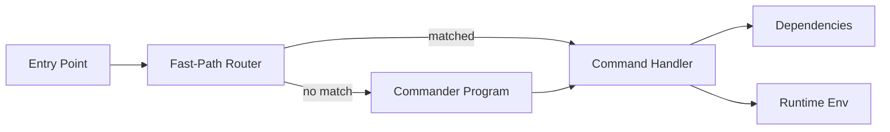

# CLI Architecture Implementation Guide

[← Back to Architecture](../../ARCHITECTURE.md)

---

## Implementation Progress

| Task | Status | Notes |
|------|--------|-------|
| Set up Commander.js | ⬜ | |
| Create program builder | ⬜ | |
| Implement command registry | ⬜ | |
| Create runtime abstraction | ⬜ | |
| Build dependency injection | ⬜ | |
| Add fast-path routing | ⬜ | |
| Implement core commands | ⬜ | |
| Add progress indicators | ⬜ | |
| Write tests | ⬜ | |

---

## Overview

The CLI provides the primary developer interface for interacting with the system. Key features:

- **Commander.js** based command structure
- **Lazy loading** for fast startup
- **Dependency injection** for testability
- **Runtime abstraction** for consistent I/O
- **Fast-path routing** for common commands



---

## File Structure

```
src/cli/
├── entry.ts              # Main entry point
├── run-main.ts           # CLI runner with routing
├── program/
│   ├── build-program.ts  # Commander program builder
│   ├── command-registry.ts # Command registration
│   └── context.ts        # Program context
├── deps.ts               # Dependency injection
├── runtime.ts            # Runtime abstraction
├── progress.ts           # Progress indicators
└── utils.ts              # CLI utilities

src/commands/
├── gateway/
│   ├── start.ts
│   ├── stop.ts
│   └── status.ts
├── agent/
│   ├── run.ts
│   └── list.ts
├── channels/
│   └── status.ts
├── config/
│   ├── get.ts
│   ├── set.ts
│   └── show.ts
└── index.ts              # Command exports
```

---

## Core Components

### 1. Entry Point

**File:** `src/cli/entry.ts`

```typescript
#!/usr/bin/env node

import { runMain } from './run-main';

// Handle uncaught errors
process.on('uncaughtException', (err) => {
  console.error('Uncaught exception:', err);
  process.exit(1);
});

process.on('unhandledRejection', (reason) => {
  console.error('Unhandled rejection:', reason);
  process.exit(1);
});

// Run CLI
runMain(process.argv).catch((err) => {
  console.error(err);
  process.exit(1);
});
```

### 2. Runtime Abstraction

**File:** `src/cli/runtime.ts`

```typescript
/**
 * Runtime environment abstraction for CLI commands.
 * Enables consistent I/O and testability.
 */
export interface RuntimeEnv {
  /** Log to stdout */
  log: (...args: unknown[]) => void;
  
  /** Log to stderr */
  error: (...args: unknown[]) => void;
  
  /** Exit the process */
  exit: (code: number) => never;
  
  /** Check if running in TTY */
  isTTY: boolean;
  
  /** Get terminal width */
  terminalWidth: number;
}

/**
 * Default runtime using process stdout/stderr
 */
export const defaultRuntime: RuntimeEnv = {
  log: (...args) => {
    // Clear any progress indicators before logging
    clearProgress();
    console.log(...args);
  },
  
  error: (...args) => {
    clearProgress();
    console.error(...args);
  },
  
  exit: (code) => {
    process.exit(code);
  },
  
  isTTY: process.stdout.isTTY ?? false,
  
  terminalWidth: process.stdout.columns ?? 80,
};

/**
 * Create a mock runtime for testing
 */
export function createMockRuntime(): RuntimeEnv & {
  logs: string[];
  errors: string[];
  exitCode?: number;
} {
  const runtime = {
    logs: [] as string[],
    errors: [] as string[],
    exitCode: undefined as number | undefined,
    
    log: (...args: unknown[]) => {
      runtime.logs.push(args.map(String).join(' '));
    },
    
    error: (...args: unknown[]) => {
      runtime.errors.push(args.map(String).join(' '));
    },
    
    exit: (code: number) => {
      runtime.exitCode = code;
      throw new Error(`Exit: ${code}`);
    },
    
    isTTY: false,
    terminalWidth: 80,
  };
  
  return runtime;
}
```

### 3. Dependency Injection

**File:** `src/cli/deps.ts`

```typescript
import { loadConfig } from '../config/io';
import type { Config } from '../config/types';

/**
 * CLI dependencies that can be injected for testing
 */
export interface CliDeps {
  /** Load configuration */
  loadConfig: () => Promise<Config>;
  
  /** Send message via channel */
  sendMessage: (channel: string, to: string, text: string) => Promise<void>;
  
  /** Connect to gateway */
  connectGateway: (host: string, port: number) => Promise<GatewayClient>;
  
  /** Get current timestamp */
  now: () => number;
}

/**
 * Create default dependencies for production use
 */
export function createDefaultDeps(): CliDeps {
  return {
    loadConfig,
    
    sendMessage: async (channel, to, text) => {
      const config = await loadConfig();
      const client = await connectToGateway(config);
      await client.send('send', { channel, to, text });
    },
    
    connectGateway: async (host, port) => {
      return createGatewayClient({ host, port });
    },
    
    now: () => Date.now(),
  };
}

/**
 * Create mock dependencies for testing
 */
export function createMockDeps(overrides: Partial<CliDeps> = {}): CliDeps {
  return {
    loadConfig: async () => ({} as Config),
    sendMessage: async () => {},
    connectGateway: async () => ({} as GatewayClient),
    now: () => 1704067200000, // Fixed timestamp for tests
    ...overrides,
  };
}
```

### 4. Command Registry

**File:** `src/cli/program/command-registry.ts`

```typescript
import { Command } from 'commander';
import type { RuntimeEnv } from '../runtime';
import type { CliDeps } from '../deps';

/**
 * Command registration definition
 */
export interface CommandRegistration {
  /** Unique command ID */
  id: string;
  
  /** Register command with Commander program */
  register: (program: Command, context: ProgramContext) => void;
  
  /** Fast-path routes for quick matching */
  routes?: {
    /** Primary command name */
    primary: string;
    /** Subcommand name (optional) */
    sub?: string;
    /** Action to run */
    action: (args: string[], runtime: RuntimeEnv, deps: CliDeps) => Promise<void>;
  }[];
}

/**
 * Program context passed to command registration
 */
export interface ProgramContext {
  version: string;
  runtime: RuntimeEnv;
  deps: CliDeps;
}

/**
 * All command registrations
 */
export const commandRegistrations: CommandRegistration[] = [
  // Gateway commands
  {
    id: 'gateway',
    register: (program, ctx) => {
      const gateway = program
        .command('gateway')
        .description('Manage the gateway server');
      
      gateway
        .command('start')
        .description('Start the gateway server')
        .option('-p, --port <port>', 'Port to listen on', '18789')
        .option('--force', 'Force start even if already running')
        .action(async (opts) => {
          const { gatewayStartCommand } = await import('../../commands/gateway/start');
          await gatewayStartCommand(opts, ctx.runtime, ctx.deps);
        });
      
      gateway
        .command('stop')
        .description('Stop the gateway server')
        .action(async () => {
          const { gatewayStopCommand } = await import('../../commands/gateway/stop');
          await gatewayStopCommand({}, ctx.runtime, ctx.deps);
        });
      
      gateway
        .command('status')
        .description('Show gateway status')
        .action(async () => {
          const { gatewayStatusCommand } = await import('../../commands/gateway/status');
          await gatewayStatusCommand({}, ctx.runtime, ctx.deps);
        });
    },
    routes: [
      {
        primary: 'gateway',
        sub: 'start',
        action: async (args, runtime, deps) => {
          const { gatewayStartCommand } = await import('../../commands/gateway/start');
          await gatewayStartCommand({ port: '18789' }, runtime, deps);
        },
      },
    ],
  },
  
  // Agent commands
  {
    id: 'agent',
    register: (program, ctx) => {
      program
        .command('agent')
        .description('Run an agent')
        .argument('[message]', 'Message to send to agent')
        .option('-s, --session <id>', 'Session ID')
        .option('--model <model>', 'Model to use')
        .action(async (message, opts) => {
          const { agentCommand } = await import('../../commands/agent/run');
          await agentCommand({ message, ...opts }, ctx.runtime, ctx.deps);
        });
    },
  },
  
  // Config commands
  {
    id: 'config',
    register: (program, ctx) => {
      const config = program
        .command('config')
        .description('Manage configuration');
      
      config
        .command('show')
        .description('Show current configuration')
        .action(async () => {
          const { configShowCommand } = await import('../../commands/config/show');
          await configShowCommand({}, ctx.runtime, ctx.deps);
        });
      
      config
        .command('get <key>')
        .description('Get a configuration value')
        .action(async (key) => {
          const { configGetCommand } = await import('../../commands/config/get');
          await configGetCommand({ key }, ctx.runtime, ctx.deps);
        });
      
      config
        .command('set <key> <value>')
        .description('Set a configuration value')
        .action(async (key, value) => {
          const { configSetCommand } = await import('../../commands/config/set');
          await configSetCommand({ key, value }, ctx.runtime, ctx.deps);
        });
    },
  },
  
  // Status command
  {
    id: 'status',
    register: (program, ctx) => {
      program
        .command('status')
        .description('Show system status')
        .option('--all', 'Show all details')
        .option('--deep', 'Probe all connections')
        .action(async (opts) => {
          const { statusCommand } = await import('../../commands/status');
          await statusCommand(opts, ctx.runtime, ctx.deps);
        });
    },
  },
];
```

### 5. Program Builder

**File:** `src/cli/program/build-program.ts`

```typescript
import { Command } from 'commander';
import { version } from '../../package.json';
import { commandRegistrations, type ProgramContext } from './command-registry';
import type { RuntimeEnv } from '../runtime';
import type { CliDeps } from '../deps';

/**
 * Build the Commander program with all commands registered
 */
export function buildProgram(
  runtime: RuntimeEnv,
  deps: CliDeps
): Command {
  const program = new Command();
  
  program
    .name('skynet')
    .description('Multi-channel AI messaging gateway')
    .version(version);
  
  const context: ProgramContext = {
    version,
    runtime,
    deps,
  };
  
  // Register all commands
  for (const registration of commandRegistrations) {
    registration.register(program, context);
  }
  
  // Global error handling
  program.exitOverride((err) => {
    if (err.code === 'commander.help') {
      runtime.exit(0);
    }
    throw err;
  });
  
  return program;
}
```

### 6. Fast-Path Router

**File:** `src/cli/run-main.ts`

```typescript
import { buildProgram } from './program/build-program';
import { commandRegistrations } from './program/command-registry';
import { defaultRuntime, type RuntimeEnv } from './runtime';
import { createDefaultDeps, type CliDeps } from './deps';

/**
 * Try to route command via fast-path (skip full program build)
 */
function tryFastPath(
  args: string[],
  runtime: RuntimeEnv,
  deps: CliDeps
): Promise<void> | null {
  // args: ['node', 'skynet', 'command', 'subcommand', ...]
  const primary = args[2];
  const sub = args[3];
  
  if (!primary) return null;
  
  for (const reg of commandRegistrations) {
    for (const route of reg.routes || []) {
      if (route.primary === primary) {
        if (route.sub && route.sub !== sub) continue;
        
        // Found matching fast-path
        return route.action(args.slice(4), runtime, deps);
      }
    }
  }
  
  return null;
}

/**
 * Main entry point for CLI
 */
export async function runMain(argv: string[]): Promise<void> {
  const runtime = defaultRuntime;
  const deps = createDefaultDeps();
  
  // Try fast-path first
  const fastPath = tryFastPath(argv, runtime, deps);
  if (fastPath) {
    await fastPath;
    return;
  }
  
  // Fall back to full Commander program
  const program = buildProgram(runtime, deps);
  await program.parseAsync(argv);
}
```

### 7. Progress Indicators

**File:** `src/cli/progress.ts`

```typescript
import { spinner } from '@clack/prompts';

let currentSpinner: ReturnType<typeof spinner> | null = null;

/**
 * Start a spinner with a message
 */
export function startSpinner(message: string): void {
  currentSpinner = spinner();
  currentSpinner.start(message);
}

/**
 * Update spinner message
 */
export function updateSpinner(message: string): void {
  currentSpinner?.message(message);
}

/**
 * Stop spinner with success
 */
export function stopSpinner(message?: string): void {
  currentSpinner?.stop(message);
  currentSpinner = null;
}

/**
 * Stop spinner with error
 */
export function failSpinner(message: string): void {
  currentSpinner?.stop(message, 1);
  currentSpinner = null;
}

/**
 * Clear any active progress indicators
 */
export function clearProgress(): void {
  if (currentSpinner) {
    currentSpinner.stop();
    currentSpinner = null;
  }
}

/**
 * Run an async operation with a spinner
 */
export async function withSpinner<T>(
  message: string,
  operation: () => Promise<T>,
  successMessage?: string
): Promise<T> {
  startSpinner(message);
  
  try {
    const result = await operation();
    stopSpinner(successMessage);
    return result;
  } catch (err) {
    failSpinner(`Failed: ${err instanceof Error ? err.message : String(err)}`);
    throw err;
  }
}
```

---

## Command Implementation Pattern

### Standard Command Structure

**File:** `src/commands/gateway/start.ts`

```typescript
import type { RuntimeEnv } from '../../cli/runtime';
import type { CliDeps } from '../../cli/deps';
import { withSpinner } from '../../cli/progress';

export interface GatewayStartOptions {
  port?: string;
  force?: boolean;
}

export async function gatewayStartCommand(
  opts: GatewayStartOptions,
  runtime: RuntimeEnv,
  deps: CliDeps
): Promise<void> {
  const config = await deps.loadConfig();
  const port = parseInt(opts.port || config.gateway?.port?.toString() || '18789', 10);
  
  // Check if already running
  if (!opts.force) {
    const status = await checkGatewayStatus(port);
    if (status.running) {
      runtime.error('Gateway is already running. Use --force to restart.');
      runtime.exit(1);
    }
  }
  
  // Start gateway
  await withSpinner(
    'Starting gateway...',
    async () => {
      await startGatewayProcess(port, config);
    },
    `Gateway started on port ${port}`
  );
  
  runtime.log(`\nGateway is running at http://localhost:${port}`);
}
```

### Command with Subcommands

**File:** `src/commands/channels/status.ts`

```typescript
import type { RuntimeEnv } from '../../cli/runtime';
import type { CliDeps } from '../../cli/deps';

export interface ChannelsStatusOptions {
  channel?: string;
  probe?: boolean;
}

export async function channelsStatusCommand(
  opts: ChannelsStatusOptions,
  runtime: RuntimeEnv,
  deps: CliDeps
): Promise<void> {
  const client = await deps.connectGateway('localhost', 18789);
  
  const status = await client.call('channels.status', {
    channel: opts.channel,
    probe: opts.probe,
  });
  
  // Format output as table
  runtime.log('\nChannel Status:\n');
  runtime.log('Channel      Account     Status     Last Activity');
  runtime.log('─'.repeat(60));
  
  for (const channel of status.channels) {
    runtime.log(
      `${channel.id.padEnd(12)} ${channel.account.padEnd(11)} ` +
      `${formatStatus(channel.status).padEnd(10)} ${formatTime(channel.lastActivity)}`
    );
  }
}

function formatStatus(status: string): string {
  switch (status) {
    case 'connected': return '🟢 OK';
    case 'disconnected': return '⚪ Off';
    case 'error': return '🔴 Error';
    default: return status;
  }
}

function formatTime(ts?: number): string {
  if (!ts) return '-';
  const ago = Date.now() - ts;
  if (ago < 60000) return 'Just now';
  if (ago < 3600000) return `${Math.floor(ago / 60000)}m ago`;
  return new Date(ts).toLocaleString();
}
```

---

## Testing

### Unit Tests

```typescript
import { describe, it, expect, vi } from 'vitest';
import { gatewayStartCommand } from './start';
import { createMockRuntime } from '../../cli/runtime';
import { createMockDeps } from '../../cli/deps';

describe('gateway start command', () => {
  it('should start gateway on specified port', async () => {
    const runtime = createMockRuntime();
    const deps = createMockDeps({
      loadConfig: async () => ({ gateway: { port: 18789 } }),
    });
    
    const startGateway = vi.fn().mockResolvedValue(undefined);
    vi.mock('./utils', () => ({
      startGatewayProcess: startGateway,
      checkGatewayStatus: () => ({ running: false }),
    }));
    
    await gatewayStartCommand({ port: '19000' }, runtime, deps);
    
    expect(runtime.logs).toContain('Gateway is running at http://localhost:19000');
  });
  
  it('should fail if gateway already running', async () => {
    const runtime = createMockRuntime();
    const deps = createMockDeps();
    
    vi.mock('./utils', () => ({
      checkGatewayStatus: () => ({ running: true }),
    }));
    
    await expect(
      gatewayStartCommand({}, runtime, deps)
    ).rejects.toThrow('Exit: 1');
    
    expect(runtime.errors[0]).toContain('already running');
  });
});
```

---

## Next Steps

After implementing CLI Architecture:

1. **[Configuration System →](../03-configuration-system/README.md)** - Config loading for CLI
2. **[Gateway Server →](../01-gateway-server/README.md)** - Server to control via CLI

---

## References

- [Commander.js documentation](https://github.com/tj/commander.js)
- [@clack/prompts](https://github.com/natemoo-re/clack)
- [chalk for colors](https://github.com/chalk/chalk)
