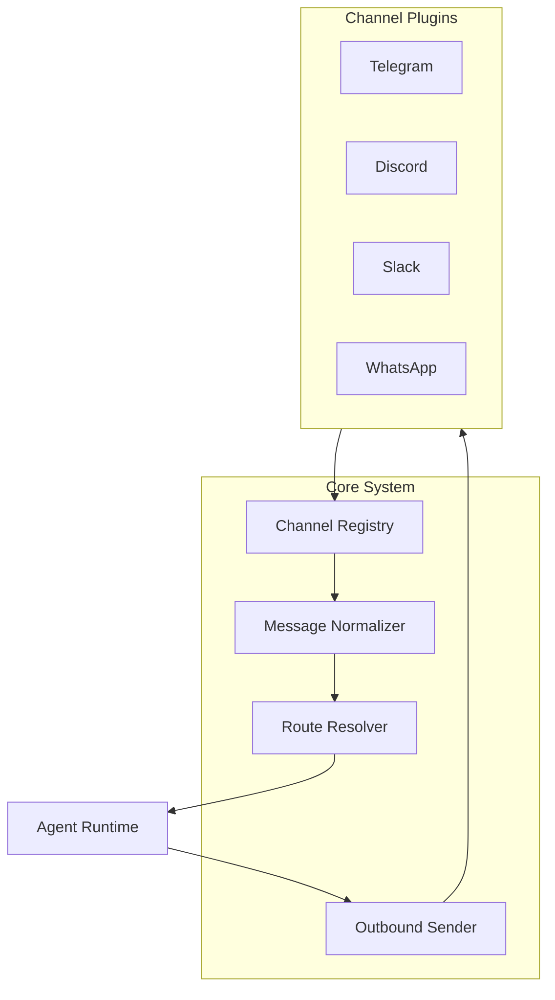
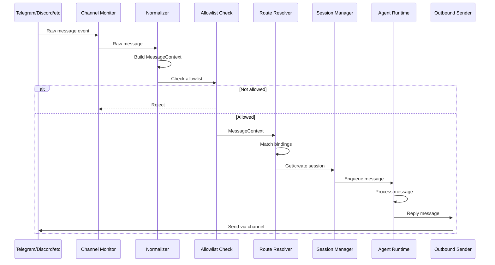

# Channel System Implementation Guide

[← Back to Architecture](../../ARCHITECTURE.md)

---

## Implementation Progress

| Task | Status | Notes |
|------|--------|-------|
| Define ChannelPlugin interface | ⬜ | |
| Create channel registry | ⬜ | |
| Implement message normalizer | ⬜ | |
| Build routing system | ⬜ | |
| Create session key generator | ⬜ | |
| Implement outbound adapter | ⬜ | |
| Build first channel (Telegram) | ⬜ | |
| Add channel status/health | ⬜ | |
| Implement allowlist system | ⬜ | |
| Write tests | ⬜ | |

---

## Overview

The Channel System provides a unified abstraction for multiple messaging platforms:

- **Plugin Architecture** - Each channel is a plugin with standard adapters
- **Message Normalization** - Platform-specific messages → unified format
- **Session-Based Routing** - Route messages to correct agent/session
- **Outbound Abstraction** - Send messages back through any channel



---

## File Structure

```
src/channels/
├── plugins/
│   ├── types.ts           # Plugin interface definitions
│   ├── registry.ts        # Plugin registration
│   └── loader.ts          # Plugin discovery/loading
├── normalize/
│   ├── context.ts         # Message context builder
│   ├── telegram.ts        # Telegram normalization
│   ├── discord.ts         # Discord normalization
│   └── common.ts          # Shared normalization
├── routing/
│   ├── resolver.ts        # Route resolution
│   ├── session-key.ts     # Session key generation
│   └── bindings.ts        # Binding configuration
├── outbound/
│   ├── sender.ts          # Outbound message sender
│   ├── chunker.ts         # Message chunking
│   └── adapters.ts        # Per-channel adapters
├── allowlist/
│   ├── matcher.ts         # Allowlist matching
│   └── types.ts           # Allowlist types
└── types.ts               # Shared types

src/telegram/              # Telegram implementation
├── bot.ts                 # Grammy bot setup
├── monitor.ts             # Message handler
├── send.ts                # Send functions
└── types.ts

src/discord/               # Discord implementation
├── client.ts              # Discord.js client
├── monitor.ts             # Message handler
├── send.ts                # Send functions
└── types.ts
```

---

## Core Components

### 1. Channel Plugin Interface

**File:** `src/channels/plugins/types.ts`

```typescript
import type { Config } from '../../config/types';

/**
 * Channel plugin interface - all channels implement this
 */
export interface ChannelPlugin {
  /** Unique channel identifier */
  id: string;
  
  /** Human-readable label */
  label: string;
  
  /** Channel capabilities */
  capabilities: ChannelCapabilities;
  
  /** Configuration adapter */
  config?: ConfigAdapter;
  
  /** Outbound message adapter */
  outbound?: OutboundAdapter;
  
  /** Gateway lifecycle adapter */
  gateway?: GatewayAdapter;
  
  /** Security/allowlist adapter */
  security?: SecurityAdapter;
  
  /** User pairing adapter */
  pairing?: PairingAdapter;
  
  /** Status/health adapter */
  status?: StatusAdapter;
  
  /** Threading adapter */
  threading?: ThreadingAdapter;
  
  /** Mention detection adapter */
  mentions?: MentionsAdapter;
  
  /** Message normalization */
  normalize?: NormalizeAdapter;
}

/**
 * Channel capabilities declaration
 */
export interface ChannelCapabilities {
  /** Supported chat types */
  chatTypes: ('dm' | 'group' | 'channel')[];
  
  /** Supports media attachments */
  media?: boolean;
  
  /** Supports reactions */
  reactions?: boolean;
  
  /** Supports message editing */
  edit?: boolean;
  
  /** Supports message deletion */
  unsend?: boolean;
  
  /** Supports reply threading */
  reply?: boolean;
  
  /** Supports native threads */
  threads?: boolean;
  
  /** Supports polls */
  polls?: boolean;
  
  /** Max text message length */
  maxTextLength?: number;
}

/**
 * Configuration adapter
 */
export interface ConfigAdapter {
  /** Get account configuration */
  getAccountConfig: (accountId: string, config: Config) => AccountConfig | undefined;
  
  /** Validate account configuration */
  validateConfig?: (accountConfig: unknown) => ValidationResult;
  
  /** Get all configured accounts */
  getAccounts?: (config: Config) => string[];
}

/**
 * Outbound message adapter
 */
export interface OutboundAdapter {
  /** Send text message */
  sendText: (params: SendTextParams) => Promise<SendResult>;
  
  /** Send media message */
  sendMedia?: (params: SendMediaParams) => Promise<SendResult>;
  
  /** Send structured payload */
  sendPayload?: (params: SendPayloadParams) => Promise<SendResult>;
  
  /** Resolve target from context */
  resolveTarget?: (context: MessageContext) => OutboundTarget;
  
  /** Chunk text for platform limits */
  chunker?: TextChunker;
  
  /** Platform text limit */
  textChunkLimit?: number;
}

/**
 * Gateway lifecycle adapter
 */
export interface GatewayAdapter {
  /** Start channel account */
  startAccount: (accountId: string, config: Config) => Promise<void>;
  
  /** Stop channel account */
  stopAccount: (accountId: string) => Promise<void>;
  
  /** Get runtime state */
  getRuntimeState?: (accountId: string) => RuntimeState;
}

/**
 * Security adapter for allowlists and permissions
 */
export interface SecurityAdapter {
  /** Check if sender is allowed */
  isAllowed: (context: MessageContext, config: Config) => boolean;
  
  /** Get DM policy */
  getDmPolicy?: (config: Config) => 'open' | 'allowlist' | 'disabled';
  
  /** Get group policy */
  getGroupPolicy?: (config: Config) => 'open' | 'allowlist' | 'disabled';
}

/**
 * Status adapter for health checks
 */
export interface StatusAdapter {
  /** Get connection status */
  getStatus: (accountId: string) => ConnectionStatus;
  
  /** Probe connection */
  probe?: (accountId: string) => Promise<ProbeResult>;
  
  /** Get account snapshot */
  getSnapshot?: (accountId: string) => AccountSnapshot;
}

/**
 * Message normalization adapter
 */
export interface NormalizeAdapter {
  /** Normalize inbound message to standard context */
  normalizeInbound: (raw: unknown) => MessageContext;
  
  /** Format outbound message for platform */
  formatOutbound?: (text: string, context: MessageContext) => string;
}
```

### 2. Channel Registry

**File:** `src/channels/plugins/registry.ts`

```typescript
import type { ChannelPlugin } from './types';

/**
 * Central registry of all channel plugins
 */
export class ChannelRegistry {
  private plugins = new Map<string, ChannelPlugin>();
  
  /**
   * Register a channel plugin
   */
  register(plugin: ChannelPlugin): void {
    if (this.plugins.has(plugin.id)) {
      throw new Error(`Channel plugin already registered: ${plugin.id}`);
    }
    this.plugins.set(plugin.id, plugin);
  }
  
  /**
   * Get a channel plugin by ID
   */
  get(channelId: string): ChannelPlugin | undefined {
    return this.plugins.get(channelId);
  }
  
  /**
   * Get all registered plugins
   */
  getAll(): ChannelPlugin[] {
    return [...this.plugins.values()];
  }
  
  /**
   * Check if channel is registered
   */
  has(channelId: string): boolean {
    return this.plugins.has(channelId);
  }
  
  /**
   * Get channel IDs
   */
  getIds(): string[] {
    return [...this.plugins.keys()];
  }
}

/**
 * Global channel registry singleton
 */
export const channelRegistry = new ChannelRegistry();

/**
 * Register core channels
 */
export function registerCoreChannels(): void {
  // Import and register each core channel
  // These are lazy-loaded to avoid circular dependencies
}
```

### 3. Message Context (Normalized Format)

**File:** `src/channels/normalize/context.ts`

```typescript
/**
 * Normalized message context - the common format for all channels
 */
export interface MessageContext {
  /** Unique message ID */
  messageId: string;
  
  /** Channel identifier (telegram, discord, etc.) */
  channel: string;
  
  /** Account ID within channel */
  accountId: string;
  
  /** Processed message text */
  Body: string;
  
  /** Original raw text */
  RawBody: string;
  
  /** Text for command parsing (mentions stripped) */
  CommandBody: string;
  
  /** Text for agent processing */
  BodyForAgent: string;
  
  /** Session key for routing */
  SessionKey: string;
  
  /** Sender information */
  From: SenderInfo;
  
  /** Recipient/group information */
  To: RecipientInfo;
  
  /** Chat type */
  ChatType: 'dm' | 'group' | 'channel';
  
  /** Human-readable conversation label */
  ConversationLabel: string;
  
  /** Whether bot was mentioned (in group) */
  IsMentioned: boolean;
  
  /** Reply context if replying to a message */
  ReplyTo?: ReplyContext;
  
  /** Thread context if in a thread */
  Thread?: ThreadContext;
  
  /** Media attachments */
  Media?: MediaAttachment[];
  
  /** Message timestamp */
  Timestamp: number;
  
  /** Platform-specific raw data */
  Raw: unknown;
}

export interface SenderInfo {
  /** Platform user ID */
  id: string;
  /** Display name */
  name?: string;
  /** Username (without @) */
  username?: string;
  /** Is this the bot itself */
  isBot?: boolean;
}

export interface RecipientInfo {
  /** Platform chat/group ID */
  id: string;
  /** Chat/group name */
  name?: string;
  /** Is DM */
  isDm: boolean;
}

export interface ReplyContext {
  /** Message being replied to */
  messageId: string;
  /** Text of replied message */
  text?: string;
  /** Sender of replied message */
  from?: SenderInfo;
}

export interface ThreadContext {
  /** Thread ID */
  threadId: string;
  /** Thread name/topic */
  name?: string;
  /** Parent message ID */
  parentMessageId?: string;
}

export interface MediaAttachment {
  /** Media type */
  type: 'image' | 'video' | 'audio' | 'document' | 'voice' | 'sticker';
  /** Media URL or file ID */
  url?: string;
  fileId?: string;
  /** MIME type */
  mimeType?: string;
  /** File name */
  fileName?: string;
  /** File size in bytes */
  size?: number;
  /** Caption */
  caption?: string;
}

/**
 * Build final message context with computed fields
 */
export function finalizeMessageContext(
  partial: Partial<MessageContext>,
  channel: string,
  accountId: string
): MessageContext {
  const chatType = partial.To?.isDm ? 'dm' : 'group';
  const sessionKey = buildSessionKey({
    channel,
    accountId,
    chatType,
    chatId: partial.To?.id || '',
    threadId: partial.Thread?.threadId,
  });
  
  return {
    messageId: partial.messageId || '',
    channel,
    accountId,
    Body: partial.Body || '',
    RawBody: partial.RawBody || partial.Body || '',
    CommandBody: partial.CommandBody || partial.Body || '',
    BodyForAgent: partial.BodyForAgent || partial.Body || '',
    SessionKey: sessionKey,
    From: partial.From || { id: '' },
    To: partial.To || { id: '', isDm: true },
    ChatType: chatType,
    ConversationLabel: partial.ConversationLabel || '',
    IsMentioned: partial.IsMentioned || false,
    Timestamp: partial.Timestamp || Date.now(),
    Raw: partial.Raw,
    ...partial,
  };
}
```

### 4. Routing System

**File:** `src/channels/routing/resolver.ts`

```typescript
import type { MessageContext } from '../normalize/context';
import type { Config } from '../../config/types';

/**
 * Binding configuration for routing messages to agents
 */
export interface Binding {
  /** Target agent ID */
  agent: string;
  /** Match specific channel */
  channel?: string;
  /** Match specific account */
  account?: string;
  /** Match specific peer */
  peer?: {
    kind: 'user' | 'group' | 'channel';
    id: string;
  };
  /** Match Discord guild */
  guild?: string;
  /** Match Slack team */
  team?: string;
  /** Priority (higher = checked first) */
  priority?: number;
}

/**
 * Route resolution result
 */
export interface ResolvedRoute {
  /** Target agent ID */
  agentId: string;
  /** Session key for this conversation */
  sessionKey: string;
  /** Matched binding (if any) */
  binding?: Binding;
}

/**
 * Resolve which agent should handle a message
 */
export function resolveAgentRoute(
  context: MessageContext,
  config: Config
): ResolvedRoute | null {
  const bindings = config.routing?.bindings || [];
  
  // Sort by priority (descending)
  const sorted = [...bindings].sort(
    (a, b) => (b.priority || 0) - (a.priority || 0)
  );
  
  // Try each binding in order
  for (const binding of sorted) {
    if (matchesBinding(context, binding)) {
      return {
        agentId: binding.agent,
        sessionKey: context.SessionKey,
        binding,
      };
    }
  }
  
  // Fall back to default agent
  const defaultAgent = config.agents.list.find(a => a.default);
  if (defaultAgent) {
    return {
      agentId: defaultAgent.id,
      sessionKey: context.SessionKey,
    };
  }
  
  return null;
}

/**
 * Check if context matches a binding
 */
function matchesBinding(context: MessageContext, binding: Binding): boolean {
  // Channel filter
  if (binding.channel && binding.channel !== context.channel) {
    return false;
  }
  
  // Account filter
  if (binding.account && binding.account !== context.accountId) {
    return false;
  }
  
  // Peer filter
  if (binding.peer) {
    const peerKind = context.ChatType === 'dm' ? 'user' : context.ChatType;
    if (binding.peer.kind !== peerKind) return false;
    if (binding.peer.id !== context.From.id && binding.peer.id !== context.To.id) {
      return false;
    }
  }
  
  return true;
}
```

### 5. Session Key Generation

**File:** `src/channels/routing/session-key.ts`

```typescript
export interface SessionKeyParams {
  /** Agent ID */
  agentId?: string;
  /** Channel ID */
  channel: string;
  /** Account ID */
  accountId: string;
  /** Chat type */
  chatType: 'dm' | 'group' | 'channel';
  /** Chat/group ID */
  chatId: string;
  /** Thread ID (optional) */
  threadId?: string;
}

/**
 * Build a session key from parameters
 * 
 * Format:
 * - DM: agent:<agentId>:main (collapsed to single session)
 * - Group: agent:<agentId>:<channel>:group:<groupId>
 * - Channel: agent:<agentId>:<channel>:channel:<channelId>
 * - Thread: ...:thread:<threadId>
 */
export function buildSessionKey(params: SessionKeyParams): string {
  const { agentId, channel, accountId, chatType, chatId, threadId } = params;
  
  const parts: string[] = [];
  
  // Agent prefix
  if (agentId) {
    parts.push(`agent:${agentId}`);
  }
  
  // DMs collapse to main session
  if (chatType === 'dm') {
    parts.push('main');
  } else {
    // Groups and channels include channel and ID
    parts.push(channel);
    parts.push(chatType);
    parts.push(sanitizeId(chatId));
  }
  
  // Thread suffix
  if (threadId) {
    parts.push('thread');
    parts.push(sanitizeId(threadId));
  }
  
  return parts.join(':');
}

/**
 * Parse a session key into components
 */
export function parseSessionKey(key: string): SessionKeyParams | null {
  const parts = key.split(':');
  
  if (parts.length < 2) return null;
  
  // Check for agent prefix
  let idx = 0;
  let agentId: string | undefined;
  
  if (parts[0] === 'agent') {
    agentId = parts[1];
    idx = 2;
  }
  
  // Main (DM) session
  if (parts[idx] === 'main') {
    return {
      agentId,
      channel: '',
      accountId: '',
      chatType: 'dm',
      chatId: '',
    };
  }
  
  // Group/channel session
  const channel = parts[idx];
  const chatType = parts[idx + 1] as 'group' | 'channel';
  const chatId = parts[idx + 2];
  
  // Thread suffix
  let threadId: string | undefined;
  if (parts[idx + 3] === 'thread') {
    threadId = parts[idx + 4];
  }
  
  return {
    agentId,
    channel,
    accountId: '',
    chatType,
    chatId,
    threadId,
  };
}

/**
 * Sanitize ID for use in session key
 */
function sanitizeId(id: string): string {
  return id.replace(/[:\s]/g, '_');
}
```

### 6. Outbound Sender

**File:** `src/channels/outbound/sender.ts`

```typescript
import { channelRegistry } from '../plugins/registry';
import type { MessageContext } from '../normalize/context';

export interface OutboundMessage {
  /** Target channel */
  channel: string;
  /** Target account */
  accountId: string;
  /** Recipient ID */
  to: string;
  /** Message text */
  text: string;
  /** Reply to message ID */
  replyTo?: string;
  /** Thread ID */
  threadId?: string;
  /** Media attachments */
  media?: OutboundMedia[];
}

export interface OutboundMedia {
  type: 'image' | 'video' | 'audio' | 'document';
  url: string;
  caption?: string;
}

export interface SendResult {
  success: boolean;
  messageId?: string;
  error?: string;
}

/**
 * Send a message through the appropriate channel
 */
export async function sendMessage(
  message: OutboundMessage
): Promise<SendResult> {
  const plugin = channelRegistry.get(message.channel);
  
  if (!plugin) {
    return {
      success: false,
      error: `Unknown channel: ${message.channel}`,
    };
  }
  
  if (!plugin.outbound) {
    return {
      success: false,
      error: `Channel ${message.channel} does not support outbound messages`,
    };
  }
  
  // Chunk text if needed
  const chunks = chunkText(
    message.text,
    plugin.outbound.textChunkLimit || 4096
  );
  
  const results: SendResult[] = [];
  
  for (const chunk of chunks) {
    try {
      const result = await plugin.outbound.sendText({
        accountId: message.accountId,
        to: message.to,
        text: chunk,
        replyTo: message.replyTo,
        threadId: message.threadId,
      });
      results.push(result);
    } catch (err) {
      results.push({
        success: false,
        error: err instanceof Error ? err.message : String(err),
      });
    }
  }
  
  // Send media if present
  if (message.media && plugin.outbound.sendMedia) {
    for (const media of message.media) {
      try {
        const result = await plugin.outbound.sendMedia({
          accountId: message.accountId,
          to: message.to,
          media,
          replyTo: message.replyTo,
          threadId: message.threadId,
        });
        results.push(result);
      } catch (err) {
        results.push({
          success: false,
          error: err instanceof Error ? err.message : String(err),
        });
      }
    }
  }
  
  // Return combined result
  const allSuccess = results.every(r => r.success);
  return {
    success: allSuccess,
    messageId: results[0]?.messageId,
    error: allSuccess ? undefined : results.find(r => r.error)?.error,
  };
}

/**
 * Chunk text to fit platform limits
 */
function chunkText(text: string, limit: number): string[] {
  if (text.length <= limit) {
    return [text];
  }
  
  const chunks: string[] = [];
  let remaining = text;
  
  while (remaining.length > 0) {
    if (remaining.length <= limit) {
      chunks.push(remaining);
      break;
    }
    
    // Find a good break point
    let breakAt = limit;
    const lastNewline = remaining.lastIndexOf('\n', limit);
    const lastSpace = remaining.lastIndexOf(' ', limit);
    
    if (lastNewline > limit * 0.8) {
      breakAt = lastNewline + 1;
    } else if (lastSpace > limit * 0.8) {
      breakAt = lastSpace + 1;
    }
    
    chunks.push(remaining.slice(0, breakAt));
    remaining = remaining.slice(breakAt);
  }
  
  return chunks;
}
```

### 7. Example: Telegram Plugin

**File:** `src/telegram/plugin.ts`

```typescript
import { Bot, Context } from 'grammy';
import type { ChannelPlugin } from '../channels/plugins/types';
import type { Config } from '../config/types';
import { finalizeMessageContext } from '../channels/normalize/context';

/**
 * Telegram channel plugin
 */
export const telegramPlugin: ChannelPlugin = {
  id: 'telegram',
  label: 'Telegram',
  
  capabilities: {
    chatTypes: ['dm', 'group', 'channel'],
    media: true,
    reactions: true,
    edit: true,
    unsend: true,
    reply: true,
    threads: false,
    maxTextLength: 4096,
  },
  
  config: {
    getAccountConfig: (accountId, config) => {
      return config.channels.telegram;
    },
    
    getAccounts: (config) => {
      return config.channels.telegram?.enabled ? ['default'] : [];
    },
  },
  
  normalize: {
    normalizeInbound: (ctx: Context) => {
      const msg = ctx.message;
      if (!msg) throw new Error('No message in context');
      
      const isPrivate = msg.chat.type === 'private';
      const from = msg.from;
      
      return finalizeMessageContext({
        messageId: msg.message_id.toString(),
        Body: msg.text || msg.caption || '',
        RawBody: msg.text || msg.caption || '',
        From: {
          id: from?.id.toString() || '',
          name: [from?.first_name, from?.last_name].filter(Boolean).join(' '),
          username: from?.username,
          isBot: from?.is_bot,
        },
        To: {
          id: msg.chat.id.toString(),
          name: isPrivate ? undefined : (msg.chat as any).title,
          isDm: isPrivate,
        },
        ChatType: isPrivate ? 'dm' : 'group',
        ConversationLabel: isPrivate 
          ? `DM with ${from?.first_name}` 
          : (msg.chat as any).title,
        IsMentioned: false, // Computed separately
        Timestamp: msg.date * 1000,
        Raw: ctx,
      }, 'telegram', 'default');
    },
  },
  
  gateway: {
    startAccount: async (accountId, config) => {
      const token = config.channels.telegram?.botToken;
      if (!token) {
        throw new Error('Telegram bot token not configured');
      }
      
      const bot = new Bot(token);
      
      // Set up message handler
      bot.on('message', async (ctx) => {
        const context = telegramPlugin.normalize!.normalizeInbound(ctx);
        // Route to agent...
      });
      
      await bot.start();
      
      // Store bot reference for stopping
      (telegramPlugin as any)._bots = (telegramPlugin as any)._bots || {};
      (telegramPlugin as any)._bots[accountId] = bot;
    },
    
    stopAccount: async (accountId) => {
      const bot = (telegramPlugin as any)._bots?.[accountId];
      if (bot) {
        await bot.stop();
        delete (telegramPlugin as any)._bots[accountId];
      }
    },
  },
  
  outbound: {
    textChunkLimit: 4096,
    
    sendText: async ({ accountId, to, text, replyTo }) => {
      const bot = (telegramPlugin as any)._bots?.[accountId];
      if (!bot) {
        return { success: false, error: 'Bot not started' };
      }
      
      try {
        const result = await bot.api.sendMessage(to, text, {
          reply_to_message_id: replyTo ? parseInt(replyTo) : undefined,
        });
        
        return {
          success: true,
          messageId: result.message_id.toString(),
        };
      } catch (err) {
        return {
          success: false,
          error: err instanceof Error ? err.message : String(err),
        };
      }
    },
    
    sendMedia: async ({ accountId, to, media, caption }) => {
      const bot = (telegramPlugin as any)._bots?.[accountId];
      if (!bot) {
        return { success: false, error: 'Bot not started' };
      }
      
      try {
        let result;
        
        switch (media.type) {
          case 'image':
            result = await bot.api.sendPhoto(to, media.url, { caption });
            break;
          case 'video':
            result = await bot.api.sendVideo(to, media.url, { caption });
            break;
          case 'document':
            result = await bot.api.sendDocument(to, media.url, { caption });
            break;
          default:
            return { success: false, error: `Unsupported media type: ${media.type}` };
        }
        
        return {
          success: true,
          messageId: result.message_id.toString(),
        };
      } catch (err) {
        return {
          success: false,
          error: err instanceof Error ? err.message : String(err),
        };
      }
    },
  },
  
  status: {
    getStatus: (accountId) => {
      const bot = (telegramPlugin as any)._bots?.[accountId];
      return {
        connected: !!bot,
        status: bot ? 'connected' : 'disconnected',
      };
    },
    
    probe: async (accountId) => {
      const bot = (telegramPlugin as any)._bots?.[accountId];
      if (!bot) {
        return { success: false, error: 'Bot not started' };
      }
      
      try {
        const me = await bot.api.getMe();
        return {
          success: true,
          data: { username: me.username },
        };
      } catch (err) {
        return {
          success: false,
          error: err instanceof Error ? err.message : String(err),
        };
      }
    },
  },
};
```

---

## Message Flow



---

## Testing

```typescript
import { describe, it, expect } from 'vitest';
import { buildSessionKey, parseSessionKey } from './routing/session-key';

describe('Session Keys', () => {
  it('should build DM session key', () => {
    const key = buildSessionKey({
      agentId: 'default',
      channel: 'telegram',
      accountId: 'main',
      chatType: 'dm',
      chatId: '123',
    });
    
    expect(key).toBe('agent:default:main');
  });
  
  it('should build group session key', () => {
    const key = buildSessionKey({
      agentId: 'default',
      channel: 'telegram',
      accountId: 'main',
      chatType: 'group',
      chatId: '-100123456',
    });
    
    expect(key).toBe('agent:default:telegram:group:-100123456');
  });
  
  it('should include thread suffix', () => {
    const key = buildSessionKey({
      agentId: 'default',
      channel: 'discord',
      accountId: 'main',
      chatType: 'channel',
      chatId: '123',
      threadId: '456',
    });
    
    expect(key).toBe('agent:default:discord:channel:123:thread:456');
  });
});
```

---

## Next Steps

After implementing Channel System:

1. **[Agent System →](../05-agent-system/README.md)** - Agent that processes messages
2. **[Data Storage →](../09-data-storage/README.md)** - Session persistence

---

## References

- [Grammy (Telegram)](https://grammy.dev/)
- [Discord.js](https://discord.js.org/)
- [Slack Bolt](https://slack.dev/bolt-js/)
