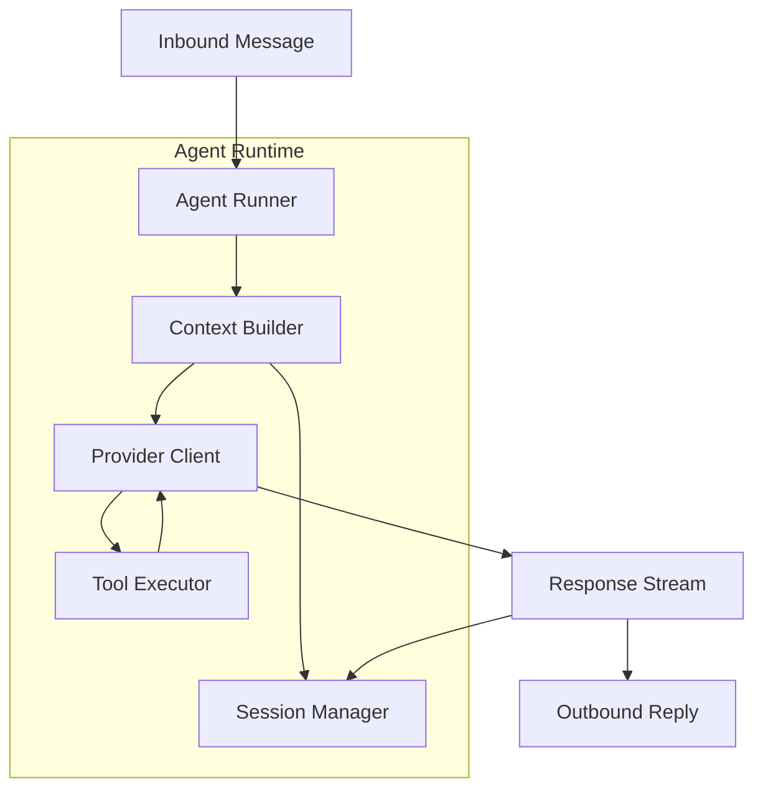
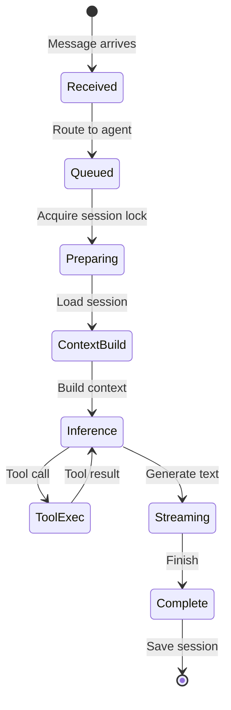

# Agent System Implementation Guide

[← Back to Architecture](../../ARCHITECTURE.md)

---

## Implementation Progress

| Task | Status | Notes |
|------|--------|-------|
| Define agent configuration | ⬜ | |
| Build agent runner | ⬜ | |
| Implement session management | ⬜ | |
| Create tool system | ⬜ | |
| Build provider abstraction | ⬜ | |
| Implement context assembly | ⬜ | |
| Add streaming support | ⬜ | |
| Create compaction system | ⬜ | |
| Implement memory/search | ⬜ | |
| Build queue system | ⬜ | |
| Write tests | ⬜ | |

---

## Overview

The Agent System provides AI-powered conversational agents with:

- **Multi-provider support** - OpenAI, Anthropic, Google, etc.
- **Tool execution** - Read, write, execute, custom tools
- **Session management** - Persistent conversation history
- **Context management** - Token limits, compaction
- **Streaming** - Real-time response streaming
- **Queue system** - Serialized per-session execution



---

## File Structure

```
src/agents/
├── runner.ts              # Main agent runner
├── runner-execution.ts    # Execution logic
├── context/
│   ├── builder.ts         # Context assembly
│   ├── system-prompt.ts   # System prompt generation
│   ├── bootstrap.ts       # Bootstrap file injection
│   └── window-guard.ts    # Token limit enforcement
├── tools/
│   ├── registry.ts        # Tool registration
│   ├── executor.ts        # Tool execution
│   ├── policy.ts          # Tool access policy
│   ├── builtin/
│   │   ├── read.ts        # File read tool
│   │   ├── write.ts       # File write tool
│   │   ├── edit.ts        # File edit tool
│   │   ├── exec.ts        # Command execution
│   │   └── search.ts      # Code search
│   └── messaging/         # Channel-specific tools
├── providers/
│   ├── registry.ts        # Provider registration
│   ├── client.ts          # Unified provider client
│   ├── auth.ts            # Auth profile management
│   ├── openai.ts          # OpenAI adapter
│   ├── anthropic.ts       # Anthropic adapter
│   └── google.ts          # Google adapter
├── session/
│   ├── manager.ts         # Session management
│   ├── store.ts           # Session persistence
│   └── transcript.ts      # JSONL transcript handling
├── compaction/
│   ├── compactor.ts       # Message compaction
│   └── summarizer.ts      # Summary generation
├── memory/
│   ├── manager.ts         # Memory index
│   └── search.ts          # Memory search
└── queue/
    ├── runner.ts          # Queue execution
    └── lanes.ts           # Per-session lanes
```

---

## Core Components

### 1. Agent Configuration

**File:** `src/agents/types.ts`

```typescript
/**
 * Agent configuration
 */
export interface AgentConfig {
  /** Unique agent ID */
  id: string;
  
  /** Is default agent */
  default?: boolean;
  
  /** Display name */
  name?: string;
  
  /** Workspace directory */
  workspace?: string;
  
  /** Primary model (provider/model format) */
  model: string;
  
  /** Fallback models */
  fallbackModels?: string[];
  
  /** Memory search config */
  memorySearch?: {
    enabled?: boolean;
    provider?: string;
    topK?: number;
  };
  
  /** Sandbox config */
  sandbox?: {
    enabled?: boolean;
    root?: string;
    allowedPaths?: string[];
  };
  
  /** Tool policy */
  tools?: ToolPolicy;
  
  /** Agent identity */
  identity?: {
    name?: string;
    emoji?: string;
    theme?: string;
  };
  
  /** System prompt additions */
  systemPrompt?: string;
  
  /** Bootstrap files to include */
  bootstrapFiles?: string[];
  
  /** Skills directories */
  skills?: string[];
}

/**
 * Tool access policy
 */
export interface ToolPolicy {
  /** Allowed tool patterns */
  allow?: string[];
  
  /** Denied tool patterns */
  deny?: string[];
  
  /** Elevated tools (no sandbox) */
  elevated?: string[];
}

/**
 * Agent run parameters
 */
export interface AgentRunParams {
  /** Agent ID */
  agentId: string;
  
  /** Session key */
  sessionKey: string;
  
  /** Input message */
  message: string;
  
  /** Model override */
  model?: string;
  
  /** Enable verbose output */
  verbose?: boolean;
  
  /** Thinking mode */
  thinking?: 'none' | 'low' | 'high';
  
  /** Abort signal */
  signal?: AbortSignal;
}

/**
 * Agent run result
 */
export interface AgentRunResult {
  /** Run ID */
  runId: string;
  
  /** Status */
  status: 'ok' | 'error' | 'cancelled';
  
  /** Reply payloads */
  payloads: MessagePayload[];
  
  /** Token usage */
  usage?: TokenUsage;
  
  /** Error if failed */
  error?: string;
  
  /** Timing info */
  timing: {
    startedAt: number;
    endedAt: number;
    durationMs: number;
  };
}

export interface MessagePayload {
  type: 'text' | 'media' | 'tool_result';
  text?: string;
  media?: MediaPayload;
  toolResult?: ToolResultPayload;
}

export interface TokenUsage {
  promptTokens: number;
  completionTokens: number;
  totalTokens: number;
  cost?: number;
}
```

### 2. Agent Runner

**File:** `src/agents/runner.ts`

```typescript
import { randomUUID } from 'crypto';
import { SessionManager } from './session/manager';
import { buildContext } from './context/builder';
import { createProviderClient } from './providers/client';
import { executeTools } from './tools/executor';
import { QueueRunner } from './queue/runner';
import type { AgentConfig, AgentRunParams, AgentRunResult } from './types';
import type { Config } from '../config/types';

/**
 * Agent runner - orchestrates agent execution
 */
export class AgentRunner {
  private queue: QueueRunner;
  
  constructor(
    private config: Config,
    private onEvent?: (event: AgentEvent) => void
  ) {
    this.queue = new QueueRunner();
  }
  
  /**
   * Run agent with a message
   */
  async run(params: AgentRunParams): Promise<AgentRunResult> {
    const runId = randomUUID();
    const startedAt = Date.now();
    
    // Get agent config
    const agentConfig = this.getAgentConfig(params.agentId);
    if (!agentConfig) {
      throw new Error(`Agent not found: ${params.agentId}`);
    }
    
    // Emit start event
    this.emitEvent({
      runId,
      type: 'lifecycle',
      phase: 'start',
      agentId: params.agentId,
      sessionKey: params.sessionKey,
    });
    
    try {
      // Queue for serialized execution per session
      const result = await this.queue.enqueue(
        params.sessionKey,
        () => this.executeRun(runId, agentConfig, params)
      );
      
      // Emit end event
      this.emitEvent({
        runId,
        type: 'lifecycle',
        phase: 'end',
        status: 'ok',
      });
      
      return {
        runId,
        status: 'ok',
        payloads: result.payloads,
        usage: result.usage,
        timing: {
          startedAt,
          endedAt: Date.now(),
          durationMs: Date.now() - startedAt,
        },
      };
    } catch (err) {
      // Emit error event
      this.emitEvent({
        runId,
        type: 'lifecycle',
        phase: 'error',
        error: err instanceof Error ? err.message : String(err),
      });
      
      return {
        runId,
        status: 'error',
        payloads: [],
        error: err instanceof Error ? err.message : String(err),
        timing: {
          startedAt,
          endedAt: Date.now(),
          durationMs: Date.now() - startedAt,
        },
      };
    }
  }
  
  /**
   * Execute a single run
   */
  private async executeRun(
    runId: string,
    agentConfig: AgentConfig,
    params: AgentRunParams
  ): Promise<{ payloads: MessagePayload[]; usage?: TokenUsage }> {
    // Get or create session
    const session = new SessionManager(
      params.agentId,
      params.sessionKey,
      this.config
    );
    await session.load();
    
    // Add user message to session
    session.addMessage({
      role: 'user',
      content: params.message,
      timestamp: Date.now(),
    });
    
    // Build context (messages + system prompt)
    const context = await buildContext({
      session,
      agentConfig,
      config: this.config,
    });
    
    // Create provider client
    const model = params.model || agentConfig.model;
    const client = await createProviderClient(model, this.config);
    
    // Run inference loop
    const payloads: MessagePayload[] = [];
    let usage: TokenUsage | undefined;
    
    while (true) {
      // Call model
      const response = await client.chat({
        messages: context.messages,
        tools: context.tools,
        maxTokens: context.maxOutputTokens,
        temperature: 0.7,
        onToken: (token) => {
          this.emitEvent({
            runId,
            type: 'assistant',
            delta: token,
          });
        },
      });
      
      // Track usage
      if (response.usage) {
        usage = response.usage;
      }
      
      // Check for tool calls
      if (response.toolCalls && response.toolCalls.length > 0) {
        // Execute tools
        const toolResults = await executeTools(
          response.toolCalls,
          agentConfig,
          this.config,
          (event) => this.emitEvent({ runId, type: 'tool', ...event })
        );
        
        // Add tool results to context
        for (const result of toolResults) {
          context.messages.push({
            role: 'tool',
            toolCallId: result.toolCallId,
            content: JSON.stringify(result.result),
          });
        }
        
        // Continue loop for next model call
        continue;
      }
      
      // Got final response
      if (response.content) {
        payloads.push({ type: 'text', text: response.content });
        
        // Add assistant message to session
        session.addMessage({
          role: 'assistant',
          content: response.content,
          timestamp: Date.now(),
        });
      }
      
      break;
    }
    
    // Save session
    await session.save();
    
    return { payloads, usage };
  }
  
  /**
   * Get agent config by ID
   */
  private getAgentConfig(agentId: string): AgentConfig | undefined {
    return this.config.agents.list.find(a => a.id === agentId);
  }
  
  /**
   * Emit agent event
   */
  private emitEvent(event: AgentEvent): void {
    this.onEvent?.(event);
  }
}

/**
 * Agent event types
 */
export type AgentEvent =
  | { runId: string; type: 'lifecycle'; phase: 'start'; agentId: string; sessionKey: string }
  | { runId: string; type: 'lifecycle'; phase: 'end'; status: 'ok' }
  | { runId: string; type: 'lifecycle'; phase: 'error'; error: string }
  | { runId: string; type: 'assistant'; delta: string }
  | { runId: string; type: 'tool'; toolId: string; name: string; phase: 'start' | 'end'; params?: unknown; result?: unknown };
```

### 3. Context Builder

**File:** `src/agents/context/builder.ts`

```typescript
import { buildSystemPrompt } from './system-prompt';
import { loadBootstrapFiles } from './bootstrap';
import { enforceContextWindow } from './window-guard';
import type { SessionManager } from '../session/manager';
import type { AgentConfig } from '../types';
import type { Config } from '../../config/types';

export interface ContextParams {
  session: SessionManager;
  agentConfig: AgentConfig;
  config: Config;
}

export interface BuiltContext {
  messages: Message[];
  tools: ToolDefinition[];
  maxOutputTokens: number;
}

export interface Message {
  role: 'system' | 'user' | 'assistant' | 'tool';
  content: string;
  toolCallId?: string;
}

/**
 * Build context for agent inference
 */
export async function buildContext(
  params: ContextParams
): Promise<BuiltContext> {
  const { session, agentConfig, config } = params;
  
  // Load bootstrap files
  const bootstrapContent = await loadBootstrapFiles(
    agentConfig.bootstrapFiles || [],
    agentConfig.workspace || process.cwd()
  );
  
  // Build system prompt
  const systemPrompt = buildSystemPrompt({
    agentConfig,
    bootstrapContent,
    customPrompt: agentConfig.systemPrompt,
  });
  
  // Get session history
  const history = session.getMessages();
  
  // Build initial messages
  let messages: Message[] = [
    { role: 'system', content: systemPrompt },
    ...history.map(m => ({
      role: m.role as Message['role'],
      content: m.content,
    })),
  ];
  
  // Get available tools
  const tools = await getAvailableTools(agentConfig, config);
  
  // Get context window size
  const contextWindow = getContextWindow(agentConfig.model, config);
  const maxOutputTokens = Math.min(
    contextWindow * 0.25, // Reserve 25% for output
    config.agents.defaults?.maxOutputTokens || 8192
  );
  
  // Enforce context window (may trigger compaction)
  messages = await enforceContextWindow(messages, {
    contextWindow,
    reserveTokens: maxOutputTokens + 1000, // Reserve for output + buffer
    session,
    agentConfig,
  });
  
  return {
    messages,
    tools,
    maxOutputTokens,
  };
}

/**
 * Get context window size for model
 */
function getContextWindow(model: string, config: Config): number {
  // Check config overrides
  const [provider, modelName] = model.split('/');
  const providerConfig = config.models?.providers?.find(p => p.id === provider);
  const modelConfig = providerConfig?.models?.find(m => m.id === modelName);
  
  if (modelConfig?.contextWindow) {
    return modelConfig.contextWindow;
  }
  
  // Use defaults based on known models
  const defaults: Record<string, number> = {
    'gpt-4': 8192,
    'gpt-4-turbo': 128000,
    'gpt-4o': 128000,
    'claude-3-opus': 200000,
    'claude-3-sonnet': 200000,
    'claude-sonnet-4': 200000,
    'gemini-pro': 128000,
  };
  
  return defaults[modelName] || config.agents.defaults?.contextTokens || 128000;
}
```

### 4. Tool System

**File:** `src/agents/tools/executor.ts`

```typescript
import { toolRegistry } from './registry';
import { checkToolPolicy } from './policy';
import type { AgentConfig, ToolPolicy } from '../types';
import type { Config } from '../../config/types';

export interface ToolCall {
  id: string;
  name: string;
  arguments: Record<string, unknown>;
}

export interface ToolResult {
  toolCallId: string;
  name: string;
  result: unknown;
  error?: string;
}

export type ToolEventCallback = (event: ToolEvent) => void;

export interface ToolEvent {
  toolId: string;
  name: string;
  phase: 'start' | 'update' | 'end';
  params?: unknown;
  result?: unknown;
  error?: string;
}

/**
 * Execute a batch of tool calls
 */
export async function executeTools(
  toolCalls: ToolCall[],
  agentConfig: AgentConfig,
  config: Config,
  onEvent?: ToolEventCallback
): Promise<ToolResult[]> {
  const results: ToolResult[] = [];
  
  for (const call of toolCalls) {
    // Check tool policy
    const allowed = checkToolPolicy(call.name, agentConfig.tools);
    if (!allowed) {
      results.push({
        toolCallId: call.id,
        name: call.name,
        result: null,
        error: `Tool ${call.name} is not allowed by policy`,
      });
      continue;
    }
    
    // Get tool implementation
    const tool = toolRegistry.get(call.name);
    if (!tool) {
      results.push({
        toolCallId: call.id,
        name: call.name,
        result: null,
        error: `Unknown tool: ${call.name}`,
      });
      continue;
    }
    
    // Emit start event
    onEvent?.({
      toolId: call.id,
      name: call.name,
      phase: 'start',
      params: call.arguments,
    });
    
    try {
      // Execute tool
      const result = await tool.execute(call.arguments, {
        agentConfig,
        config,
        workspaceRoot: agentConfig.workspace || process.cwd(),
      });
      
      // Emit end event
      onEvent?.({
        toolId: call.id,
        name: call.name,
        phase: 'end',
        result,
      });
      
      results.push({
        toolCallId: call.id,
        name: call.name,
        result,
      });
    } catch (err) {
      const error = err instanceof Error ? err.message : String(err);
      
      // Emit error event
      onEvent?.({
        toolId: call.id,
        name: call.name,
        phase: 'end',
        error,
      });
      
      results.push({
        toolCallId: call.id,
        name: call.name,
        result: null,
        error,
      });
    }
  }
  
  return results;
}
```

**File:** `src/agents/tools/registry.ts`

```typescript
export interface Tool {
  /** Tool name */
  name: string;
  
  /** Tool description for LLM */
  description: string;
  
  /** JSON Schema for parameters */
  parameters: object;
  
  /** Execute the tool */
  execute: (params: Record<string, unknown>, context: ToolContext) => Promise<unknown>;
}

export interface ToolContext {
  agentConfig: AgentConfig;
  config: Config;
  workspaceRoot: string;
}

/**
 * Tool registry
 */
class ToolRegistry {
  private tools = new Map<string, Tool>();
  
  register(tool: Tool): void {
    this.tools.set(tool.name, tool);
  }
  
  get(name: string): Tool | undefined {
    return this.tools.get(name);
  }
  
  getAll(): Tool[] {
    return [...this.tools.values()];
  }
  
  getDefinitions(): ToolDefinition[] {
    return this.getAll().map(t => ({
      type: 'function',
      function: {
        name: t.name,
        description: t.description,
        parameters: t.parameters,
      },
    }));
  }
}

export const toolRegistry = new ToolRegistry();

// Register builtin tools
import { readTool } from './builtin/read';
import { writeTool } from './builtin/write';
import { editTool } from './builtin/edit';
import { execTool } from './builtin/exec';

toolRegistry.register(readTool);
toolRegistry.register(writeTool);
toolRegistry.register(editTool);
toolRegistry.register(execTool);
```

**File:** `src/agents/tools/builtin/read.ts`

```typescript
import { readFile } from 'fs/promises';
import { join, isAbsolute } from 'path';
import type { Tool } from '../registry';

export const readTool: Tool = {
  name: 'read_file',
  description: 'Read the contents of a file',
  parameters: {
    type: 'object',
    properties: {
      path: {
        type: 'string',
        description: 'Path to the file to read (relative to workspace or absolute)',
      },
      offset: {
        type: 'number',
        description: 'Line number to start reading from (1-based)',
      },
      limit: {
        type: 'number',
        description: 'Maximum number of lines to read',
      },
    },
    required: ['path'],
  },
  
  async execute(params, context) {
    const { path: filePath, offset, limit } = params as {
      path: string;
      offset?: number;
      limit?: number;
    };
    
    // Resolve path relative to workspace
    const fullPath = isAbsolute(filePath)
      ? filePath
      : join(context.workspaceRoot, filePath);
    
    // Read file
    const content = await readFile(fullPath, 'utf-8');
    
    // Apply offset and limit
    let lines = content.split('\n');
    
    if (offset && offset > 1) {
      lines = lines.slice(offset - 1);
    }
    
    if (limit) {
      lines = lines.slice(0, limit);
    }
    
    // Add line numbers
    const startLine = offset || 1;
    const numberedLines = lines.map((line, i) => 
      `${String(startLine + i).padStart(6)}|${line}`
    );
    
    return numberedLines.join('\n');
  },
};
```

### 5. Provider Abstraction

**File:** `src/agents/providers/client.ts`

```typescript
import type { Config } from '../../config/types';

export interface ChatParams {
  messages: Message[];
  tools?: ToolDefinition[];
  maxTokens?: number;
  temperature?: number;
  onToken?: (token: string) => void;
}

export interface ChatResponse {
  content?: string;
  toolCalls?: ToolCall[];
  usage?: TokenUsage;
  finishReason: 'stop' | 'tool_calls' | 'length';
}

export interface ProviderClient {
  chat(params: ChatParams): Promise<ChatResponse>;
}

/**
 * Create a provider client for a model
 */
export async function createProviderClient(
  model: string,
  config: Config
): Promise<ProviderClient> {
  const [provider, modelName] = model.split('/');
  
  switch (provider) {
    case 'openai':
      return createOpenAIClient(modelName, config);
    case 'anthropic':
      return createAnthropicClient(modelName, config);
    case 'google':
      return createGoogleClient(modelName, config);
    default:
      throw new Error(`Unknown provider: ${provider}`);
  }
}

/**
 * OpenAI client implementation
 */
async function createOpenAIClient(
  modelName: string,
  config: Config
): Promise<ProviderClient> {
  const apiKey = process.env.OPENAI_API_KEY;
  if (!apiKey) {
    throw new Error('OPENAI_API_KEY not set');
  }
  
  return {
    async chat(params: ChatParams): Promise<ChatResponse> {
      const response = await fetch('https://api.openai.com/v1/chat/completions', {
        method: 'POST',
        headers: {
          'Authorization': `Bearer ${apiKey}`,
          'Content-Type': 'application/json',
        },
        body: JSON.stringify({
          model: modelName,
          messages: params.messages,
          tools: params.tools,
          max_tokens: params.maxTokens,
          temperature: params.temperature,
          stream: !!params.onToken,
        }),
      });
      
      if (!response.ok) {
        throw new Error(`OpenAI API error: ${response.status}`);
      }
      
      if (params.onToken && response.body) {
        // Handle streaming
        return handleStreamingResponse(response.body, params.onToken);
      }
      
      const data = await response.json();
      const choice = data.choices[0];
      
      return {
        content: choice.message.content,
        toolCalls: choice.message.tool_calls?.map((tc: any) => ({
          id: tc.id,
          name: tc.function.name,
          arguments: JSON.parse(tc.function.arguments),
        })),
        usage: {
          promptTokens: data.usage.prompt_tokens,
          completionTokens: data.usage.completion_tokens,
          totalTokens: data.usage.total_tokens,
        },
        finishReason: choice.finish_reason === 'tool_calls' ? 'tool_calls' : 'stop',
      };
    },
  };
}
```

### 6. Session Manager

**File:** `src/agents/session/manager.ts`

```typescript
import { readFile, writeFile, mkdir } from 'fs/promises';
import { existsSync } from 'fs';
import { join, dirname } from 'path';
import type { Config } from '../../config/types';

export interface SessionMessage {
  role: 'user' | 'assistant' | 'tool';
  content: string;
  toolCallId?: string;
  timestamp: number;
}

/**
 * Manages a single conversation session
 */
export class SessionManager {
  private messages: SessionMessage[] = [];
  private transcriptPath: string;
  private loaded = false;
  
  constructor(
    private agentId: string,
    private sessionKey: string,
    private config: Config
  ) {
    const baseDir = config.session?.directory || '~/.skynet/agents';
    const expandedBase = baseDir.replace('~', process.env.HOME || '');
    this.transcriptPath = join(
      expandedBase,
      agentId,
      'sessions',
      `${this.sanitizeKey(sessionKey)}.jsonl`
    );
  }
  
  /**
   * Load session from disk
   */
  async load(): Promise<void> {
    if (this.loaded) return;
    
    if (existsSync(this.transcriptPath)) {
      const content = await readFile(this.transcriptPath, 'utf-8');
      const lines = content.trim().split('\n').filter(Boolean);
      
      this.messages = lines.map(line => JSON.parse(line));
    }
    
    this.loaded = true;
  }
  
  /**
   * Save session to disk
   */
  async save(): Promise<void> {
    await mkdir(dirname(this.transcriptPath), { recursive: true });
    
    const content = this.messages
      .map(m => JSON.stringify(m))
      .join('\n') + '\n';
    
    await writeFile(this.transcriptPath, content, 'utf-8');
  }
  
  /**
   * Add a message to the session
   */
  addMessage(message: SessionMessage): void {
    this.messages.push(message);
  }
  
  /**
   * Get all messages
   */
  getMessages(): SessionMessage[] {
    return [...this.messages];
  }
  
  /**
   * Get message count
   */
  get length(): number {
    return this.messages.length;
  }
  
  /**
   * Clear session
   */
  clear(): void {
    this.messages = [];
  }
  
  /**
   * Sanitize session key for file name
   */
  private sanitizeKey(key: string): string {
    return key.replace(/[^a-zA-Z0-9-_]/g, '_');
  }
}
```

---

## Agent Lifecycle



---

## Testing

```typescript
import { describe, it, expect, beforeEach, vi } from 'vitest';
import { AgentRunner } from './runner';
import { SessionManager } from './session/manager';

describe('AgentRunner', () => {
  it('should execute a simple message', async () => {
    const config = createTestConfig();
    const events: AgentEvent[] = [];
    
    const runner = new AgentRunner(config, (event) => {
      events.push(event);
    });
    
    // Mock provider
    vi.mock('./providers/client', () => ({
      createProviderClient: () => ({
        chat: async () => ({
          content: 'Hello! How can I help?',
          finishReason: 'stop',
          usage: { promptTokens: 10, completionTokens: 5, totalTokens: 15 },
        }),
      }),
    }));
    
    const result = await runner.run({
      agentId: 'default',
      sessionKey: 'test-session',
      message: 'Hello',
    });
    
    expect(result.status).toBe('ok');
    expect(result.payloads[0].text).toBe('Hello! How can I help?');
    expect(events[0].type).toBe('lifecycle');
    expect(events[0].phase).toBe('start');
  });
});
```

---

## Next Steps

After implementing Agent System:

1. **[Plugin System →](../06-plugin-system/README.md)** - Add custom tools via plugins
2. **[Data Storage →](../09-data-storage/README.md)** - Session persistence details

---

## References

- [OpenAI API Reference](https://platform.openai.com/docs/api-reference)
- [Anthropic API Reference](https://docs.anthropic.com/claude/reference)
- [Google AI API Reference](https://ai.google.dev/docs)
