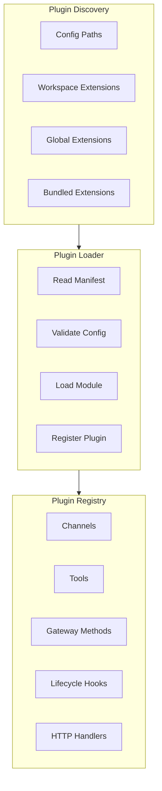

# Plugin System Implementation Guide

[← Back to Architecture](../../ARCHITECTURE.md)

---

## Implementation Progress

| Task | Status | Notes |
|------|--------|-------|
| Define plugin interface | ⬜ | |
| Build plugin discovery | ⬜ | |
| Create plugin loader | ⬜ | |
| Implement plugin registry | ⬜ | |
| Build Plugin API | ⬜ | |
| Add lifecycle hooks | ⬜ | |
| Implement config validation | ⬜ | |
| Create example plugin | ⬜ | |
| Write tests | ⬜ | |

---

## Overview

The Plugin System provides extensibility for:

- **New Channels** - Add messaging platforms
- **Custom Tools** - Add agent capabilities
- **Gateway Methods** - Add RPC endpoints
- **HTTP Handlers** - Add webhooks/APIs
- **CLI Commands** - Extend the CLI
- **Lifecycle Hooks** - React to events



---

## File Structure

```
src/plugins/
├── types.ts              # Plugin interface definitions
├── discovery.ts          # Plugin discovery
├── loader.ts             # Plugin loading
├── registry.ts           # Plugin registration
├── api.ts                # Plugin API implementation
├── hooks.ts              # Hook execution
├── config-schema.ts      # Plugin config validation
└── manifest.ts           # Manifest parsing

extensions/               # Plugin packages
├── my-channel/
│   ├── package.json
│   ├── clawdbot.plugin.json
│   ├── index.ts
│   └── src/
└── my-tool/
    ├── package.json
    ├── clawdbot.plugin.json
    └── index.ts
```

---

## Core Components

### 1. Plugin Interface

**File:** `src/plugins/types.ts`

```typescript
import type { Config } from '../config/types';
import type { ChannelPlugin } from '../channels/plugins/types';
import type { Tool } from '../agents/tools/registry';

/**
 * Plugin definition - what a plugin exports
 */
export interface Plugin {
  /** Unique plugin ID */
  id: string;
  
  /** Plugin display name */
  name: string;
  
  /** Plugin description */
  description?: string;
  
  /** Plugin version */
  version?: string;
  
  /** Config schema for validation */
  configSchema?: PluginConfigSchema;
  
  /** Register plugin capabilities */
  register: (api: PluginApi) => void | Promise<void>;
}

/**
 * Plugin configuration schema
 */
export interface PluginConfigSchema {
  type: 'object';
  properties: Record<string, {
    type: string;
    description?: string;
    default?: unknown;
    required?: boolean;
  }>;
}

/**
 * Plugin API - what plugins can do
 */
export interface PluginApi {
  /** Plugin ID */
  id: string;
  
  /** Plugin name */
  name: string;
  
  /** Plugin version */
  version: string;
  
  /** Plugin description */
  description: string;
  
  /** Plugin source path */
  source: string;
  
  /** Main application config */
  config: Config;
  
  /** Plugin-specific config */
  pluginConfig?: Record<string, unknown>;
  
  /** Plugin runtime utilities */
  runtime: PluginRuntime;
  
  /** Plugin logger */
  logger: PluginLogger;
  
  // Registration methods
  
  /** Register a tool */
  registerTool(tool: Tool): void;
  
  /** Register a lifecycle hook */
  registerHook(hook: string, handler: HookHandler): void;
  
  /** Register a channel plugin */
  registerChannel(plugin: ChannelPlugin): void;
  
  /** Register a gateway RPC method */
  registerGatewayMethod(method: GatewayMethod): void;
  
  /** Register a CLI command */
  registerCli(registration: CliRegistration): void;
  
  /** Register a background service */
  registerService(service: ServiceDef): void;
  
  /** Register an HTTP handler */
  registerHttpHandler(path: string, handler: HttpHandler): void;
  
  /** Register a provider */
  registerProvider(provider: ProviderDef): void;
  
  /** Resolve path relative to plugin */
  resolvePath(path: string): string;
  
  /** Listen for lifecycle events */
  on(event: LifecycleEvent, handler: () => void): void;
}

/**
 * Plugin runtime utilities
 */
export interface PluginRuntime {
  /** Get channel plugin by ID */
  getChannel(channelId: string): ChannelPlugin | undefined;
  
  /** Send message via channel */
  sendMessage(channel: string, to: string, text: string): Promise<void>;
  
  /** Get session history */
  getSessionHistory(sessionKey: string): Promise<SessionMessage[]>;
  
  /** Broadcast event to clients */
  broadcast(event: string, payload: unknown): void;
}

/**
 * Plugin logger
 */
export interface PluginLogger {
  debug(message: string, ...args: unknown[]): void;
  info(message: string, ...args: unknown[]): void;
  warn(message: string, ...args: unknown[]): void;
  error(message: string, ...args: unknown[]): void;
}

/**
 * Lifecycle hook handler
 */
export type HookHandler = (context: HookContext) => void | Promise<void>;

export interface HookContext {
  /** Event that triggered the hook */
  event: string;
  /** Event payload */
  payload: unknown;
  /** Modify the payload (for before_* hooks) */
  setPayload?: (payload: unknown) => void;
}

/**
 * Available lifecycle events
 */
export type LifecycleEvent =
  | 'gateway_start'
  | 'gateway_stop'
  | 'before_agent_start'
  | 'agent_end'
  | 'message_received'
  | 'message_sending'
  | 'message_sent'
  | 'before_tool_call'
  | 'after_tool_call'
  | 'session_start'
  | 'session_end'
  | 'before_compaction'
  | 'after_compaction';

/**
 * Gateway RPC method definition
 */
export interface GatewayMethod {
  name: string;
  description?: string;
  handler: (params: unknown, context: MethodContext) => Promise<unknown>;
}

/**
 * Background service definition
 */
export interface ServiceDef {
  id: string;
  start: (context: ServiceContext) => Promise<void>;
  stop: (context: ServiceContext) => Promise<void>;
}

/**
 * HTTP handler
 */
export type HttpHandler = (req: HttpRequest, res: HttpResponse) => void | Promise<void>;
```

### 2. Plugin Discovery

**File:** `src/plugins/discovery.ts`

```typescript
import { readdir, stat, readFile } from 'fs/promises';
import { join, dirname } from 'path';
import { existsSync } from 'fs';
import type { Config } from '../config/types';

export interface DiscoveredPlugin {
  /** Plugin ID from manifest */
  id: string;
  /** Path to plugin directory */
  path: string;
  /** Path to manifest file */
  manifestPath: string;
  /** Parsed manifest */
  manifest: PluginManifest;
  /** Discovery source */
  source: 'config' | 'workspace' | 'global' | 'bundled';
}

export interface PluginManifest {
  id: string;
  name?: string;
  version?: string;
  description?: string;
  main?: string;
  channels?: string[];
  skills?: string[];
  configSchema?: object;
}

/**
 * Discover all available plugins
 */
export async function discoverPlugins(
  config: Config
): Promise<DiscoveredPlugin[]> {
  const discovered: DiscoveredPlugin[] = [];
  
  // 1. Config paths (highest priority)
  const configPaths = config.plugins?.load?.paths || [];
  for (const path of configPaths) {
    const plugins = await scanPath(path, 'config');
    discovered.push(...plugins);
  }
  
  // 2. Workspace extensions
  const workspaceExt = join(process.cwd(), '.skynet', 'extensions');
  if (existsSync(workspaceExt)) {
    const plugins = await scanDirectory(workspaceExt, 'workspace');
    discovered.push(...plugins);
  }
  
  // 3. Global extensions
  const globalExt = join(
    process.env.HOME || '',
    '.skynet',
    'extensions'
  );
  if (existsSync(globalExt)) {
    const plugins = await scanDirectory(globalExt, 'global');
    discovered.push(...plugins);
  }
  
  // 4. Bundled extensions (lowest priority, disabled by default)
  if (config.plugins?.load?.bundled !== false) {
    const bundledExt = join(dirname(__dirname), '..', 'extensions');
    if (existsSync(bundledExt)) {
      const plugins = await scanDirectory(bundledExt, 'bundled');
      discovered.push(...plugins);
    }
  }
  
  return discovered;
}

/**
 * Scan a single path for plugin
 */
async function scanPath(
  path: string,
  source: DiscoveredPlugin['source']
): Promise<DiscoveredPlugin[]> {
  const manifestPath = join(path, 'skynet.plugin.json');
  
  if (!existsSync(manifestPath)) {
    return [];
  }
  
  const manifest = await loadManifest(manifestPath);
  
  return [{
    id: manifest.id,
    path,
    manifestPath,
    manifest,
    source,
  }];
}

/**
 * Scan a directory for plugins
 */
async function scanDirectory(
  dir: string,
  source: DiscoveredPlugin['source']
): Promise<DiscoveredPlugin[]> {
  const entries = await readdir(dir, { withFileTypes: true });
  const plugins: DiscoveredPlugin[] = [];
  
  for (const entry of entries) {
    if (!entry.isDirectory()) continue;
    
    const pluginPath = join(dir, entry.name);
    const found = await scanPath(pluginPath, source);
    plugins.push(...found);
  }
  
  return plugins;
}

/**
 * Load and parse plugin manifest
 */
async function loadManifest(path: string): Promise<PluginManifest> {
  const content = await readFile(path, 'utf-8');
  return JSON.parse(content);
}
```

### 3. Plugin Loader

**File:** `src/plugins/loader.ts`

```typescript
import { pathToFileURL } from 'url';
import { join } from 'path';
import type { Plugin, PluginApi } from './types';
import type { DiscoveredPlugin } from './discovery';
import type { Config } from '../config/types';
import { createPluginApi } from './api';
import { pluginRegistry } from './registry';

/**
 * Load and register discovered plugins
 */
export async function loadPlugins(
  discovered: DiscoveredPlugin[],
  config: Config
): Promise<void> {
  // Get enabled plugins from config
  const enabledIds = new Set(
    config.plugins?.entries
      ?.filter(e => e.enabled !== false)
      ?.map(e => e.id) || []
  );
  
  for (const pluginInfo of discovered) {
    // Skip disabled plugins
    if (!enabledIds.has(pluginInfo.id)) {
      continue;
    }
    
    try {
      const plugin = await loadPlugin(pluginInfo, config);
      
      if (plugin) {
        // Create plugin API
        const api = createPluginApi(pluginInfo, config);
        
        // Register plugin
        await plugin.register(api);
        
        // Track in registry
        pluginRegistry.register(pluginInfo.id, {
          plugin,
          api,
          info: pluginInfo,
        });
        
        console.log(`Loaded plugin: ${pluginInfo.id}`);
      }
    } catch (err) {
      console.error(`Failed to load plugin ${pluginInfo.id}:`, err);
    }
  }
}

/**
 * Load a single plugin module
 */
async function loadPlugin(
  info: DiscoveredPlugin,
  config: Config
): Promise<Plugin | null> {
  // Determine entry point
  const entryPoint = info.manifest.main || 'index.ts';
  const modulePath = join(info.path, entryPoint);
  
  try {
    // Use dynamic import (works with both TS and JS)
    const moduleUrl = pathToFileURL(modulePath).href;
    const module = await import(moduleUrl);
    
    // Get plugin export
    const plugin = module.default || module.plugin;
    
    if (!plugin) {
      console.warn(`Plugin ${info.id} has no default export`);
      return null;
    }
    
    // Validate plugin structure
    if (!plugin.id || !plugin.register) {
      console.warn(`Plugin ${info.id} is missing required fields`);
      return null;
    }
    
    return plugin as Plugin;
  } catch (err) {
    console.error(`Error importing plugin ${info.id}:`, err);
    return null;
  }
}

/**
 * Unload a plugin
 */
export async function unloadPlugin(pluginId: string): Promise<void> {
  const entry = pluginRegistry.get(pluginId);
  
  if (entry) {
    // Stop any services
    await pluginRegistry.stopServices(pluginId);
    
    // Unregister
    pluginRegistry.unregister(pluginId);
  }
}
```

### 4. Plugin Registry

**File:** `src/plugins/registry.ts`

```typescript
import type { Plugin, PluginApi, ServiceDef, GatewayMethod } from './types';
import type { DiscoveredPlugin } from './discovery';
import type { ChannelPlugin } from '../channels/plugins/types';
import type { Tool } from '../agents/tools/registry';

export interface RegisteredPlugin {
  plugin: Plugin;
  api: PluginApi;
  info: DiscoveredPlugin;
}

/**
 * Central registry for loaded plugins
 */
class PluginRegistry {
  private plugins = new Map<string, RegisteredPlugin>();
  private channels = new Map<string, ChannelPlugin>();
  private tools = new Map<string, Tool>();
  private gatewayMethods = new Map<string, GatewayMethod>();
  private services = new Map<string, ServiceDef>();
  private hooks = new Map<string, Set<HookHandler>>();
  private httpHandlers = new Map<string, HttpHandler>();
  
  /**
   * Register a plugin
   */
  register(id: string, entry: RegisteredPlugin): void {
    this.plugins.set(id, entry);
  }
  
  /**
   * Unregister a plugin
   */
  unregister(id: string): void {
    this.plugins.delete(id);
  }
  
  /**
   * Get a registered plugin
   */
  get(id: string): RegisteredPlugin | undefined {
    return this.plugins.get(id);
  }
  
  /**
   * Get all registered plugins
   */
  getAll(): RegisteredPlugin[] {
    return [...this.plugins.values()];
  }
  
  // Channel registration
  
  registerChannel(plugin: ChannelPlugin): void {
    this.channels.set(plugin.id, plugin);
  }
  
  getChannel(id: string): ChannelPlugin | undefined {
    return this.channels.get(id);
  }
  
  getAllChannels(): ChannelPlugin[] {
    return [...this.channels.values()];
  }
  
  // Tool registration
  
  registerTool(tool: Tool): void {
    this.tools.set(tool.name, tool);
  }
  
  getTool(name: string): Tool | undefined {
    return this.tools.get(name);
  }
  
  getAllTools(): Tool[] {
    return [...this.tools.values()];
  }
  
  // Gateway method registration
  
  registerGatewayMethod(method: GatewayMethod): void {
    this.gatewayMethods.set(method.name, method);
  }
  
  getGatewayMethod(name: string): GatewayMethod | undefined {
    return this.gatewayMethods.get(name);
  }
  
  getAllGatewayMethods(): GatewayMethod[] {
    return [...this.gatewayMethods.values()];
  }
  
  // Hook registration
  
  registerHook(event: string, handler: HookHandler): void {
    if (!this.hooks.has(event)) {
      this.hooks.set(event, new Set());
    }
    this.hooks.get(event)!.add(handler);
  }
  
  async executeHooks(event: string, context: HookContext): Promise<void> {
    const handlers = this.hooks.get(event);
    if (!handlers) return;
    
    for (const handler of handlers) {
      await handler(context);
    }
  }
  
  // Service registration
  
  registerService(service: ServiceDef): void {
    this.services.set(service.id, service);
  }
  
  async startServices(): Promise<void> {
    for (const [id, service] of this.services) {
      try {
        await service.start({ pluginId: id });
        console.log(`Started service: ${id}`);
      } catch (err) {
        console.error(`Failed to start service ${id}:`, err);
      }
    }
  }
  
  async stopServices(pluginId?: string): Promise<void> {
    for (const [id, service] of this.services) {
      if (pluginId && !id.startsWith(pluginId)) continue;
      
      try {
        await service.stop({ pluginId: id });
        console.log(`Stopped service: ${id}`);
      } catch (err) {
        console.error(`Failed to stop service ${id}:`, err);
      }
    }
  }
  
  // HTTP handler registration
  
  registerHttpHandler(path: string, handler: HttpHandler): void {
    this.httpHandlers.set(path, handler);
  }
  
  getHttpHandler(path: string): HttpHandler | undefined {
    return this.httpHandlers.get(path);
  }
}

export const pluginRegistry = new PluginRegistry();
```

### 5. Plugin API Implementation

**File:** `src/plugins/api.ts`

```typescript
import { join } from 'path';
import type { PluginApi, PluginRuntime, PluginLogger } from './types';
import type { DiscoveredPlugin } from './discovery';
import type { Config } from '../config/types';
import { pluginRegistry } from './registry';

/**
 * Create the Plugin API for a plugin
 */
export function createPluginApi(
  info: DiscoveredPlugin,
  config: Config
): PluginApi {
  // Get plugin-specific config
  const pluginConfig = config.plugins?.entries
    ?.find(e => e.id === info.id)
    ?.config;
  
  // Create logger
  const logger = createPluginLogger(info.id);
  
  // Create runtime
  const runtime = createPluginRuntime();
  
  return {
    id: info.id,
    name: info.manifest.name || info.id,
    version: info.manifest.version || '0.0.0',
    description: info.manifest.description || '',
    source: info.path,
    config,
    pluginConfig,
    runtime,
    logger,
    
    // Registration methods
    
    registerTool(tool) {
      pluginRegistry.registerTool(tool);
      logger.debug(`Registered tool: ${tool.name}`);
    },
    
    registerHook(hook, handler) {
      pluginRegistry.registerHook(hook, handler);
      logger.debug(`Registered hook: ${hook}`);
    },
    
    registerChannel(plugin) {
      pluginRegistry.registerChannel(plugin);
      logger.debug(`Registered channel: ${plugin.id}`);
    },
    
    registerGatewayMethod(method) {
      pluginRegistry.registerGatewayMethod(method);
      logger.debug(`Registered gateway method: ${method.name}`);
    },
    
    registerCli(registration) {
      // CLI registration handled separately
      logger.debug(`Registered CLI command: ${registration.name}`);
    },
    
    registerService(service) {
      pluginRegistry.registerService(service);
      logger.debug(`Registered service: ${service.id}`);
    },
    
    registerHttpHandler(path, handler) {
      pluginRegistry.registerHttpHandler(path, handler);
      logger.debug(`Registered HTTP handler: ${path}`);
    },
    
    registerProvider(provider) {
      // Provider registration handled separately
      logger.debug(`Registered provider: ${provider.id}`);
    },
    
    resolvePath(path) {
      return join(info.path, path);
    },
    
    on(event, handler) {
      pluginRegistry.registerHook(event, async () => handler());
    },
  };
}

/**
 * Create plugin logger
 */
function createPluginLogger(pluginId: string): PluginLogger {
  const prefix = `[${pluginId}]`;
  
  return {
    debug: (msg, ...args) => console.debug(prefix, msg, ...args),
    info: (msg, ...args) => console.info(prefix, msg, ...args),
    warn: (msg, ...args) => console.warn(prefix, msg, ...args),
    error: (msg, ...args) => console.error(prefix, msg, ...args),
  };
}

/**
 * Create plugin runtime
 */
function createPluginRuntime(): PluginRuntime {
  return {
    getChannel(channelId) {
      return pluginRegistry.getChannel(channelId);
    },
    
    async sendMessage(channel, to, text) {
      // Delegate to channel system
      const plugin = pluginRegistry.getChannel(channel);
      if (plugin?.outbound) {
        await plugin.outbound.sendText({
          accountId: 'default',
          to,
          text,
        });
      }
    },
    
    async getSessionHistory(sessionKey) {
      // Delegate to session system
      return [];
    },
    
    broadcast(event, payload) {
      // Delegate to gateway broadcaster
    },
  };
}
```

---

## Example Plugin

**File:** `extensions/my-plugin/skynet.plugin.json`

```json
{
  "id": "my-plugin",
  "name": "My Custom Plugin",
  "version": "1.0.0",
  "description": "Example plugin demonstrating capabilities",
  "main": "index.ts",
  "configSchema": {
    "type": "object",
    "properties": {
      "apiKey": {
        "type": "string",
        "description": "API key for external service"
      },
      "enabled": {
        "type": "boolean",
        "default": true
      }
    }
  }
}
```

**File:** `extensions/my-plugin/index.ts`

```typescript
import type { Plugin, PluginApi } from 'skynet/plugins';

const plugin: Plugin = {
  id: 'my-plugin',
  name: 'My Custom Plugin',
  description: 'Example plugin',
  
  register(api: PluginApi) {
    // Register a custom tool
    api.registerTool({
      name: 'my_tool',
      description: 'A custom tool from my plugin',
      parameters: {
        type: 'object',
        properties: {
          input: { type: 'string', description: 'Input value' },
        },
        required: ['input'],
      },
      async execute(params) {
        const { input } = params as { input: string };
        return `Processed: ${input.toUpperCase()}`;
      },
    });
    
    // Register a lifecycle hook
    api.registerHook('message_received', async (context) => {
      api.logger.info('Message received:', context.payload);
    });
    
    // Register a gateway method
    api.registerGatewayMethod({
      name: 'my-plugin.status',
      description: 'Get plugin status',
      async handler(params, context) {
        return {
          enabled: true,
          version: api.version,
        };
      },
    });
    
    // Register a background service
    api.registerService({
      id: 'my-plugin:background',
      async start(ctx) {
        api.logger.info('Background service started');
      },
      async stop(ctx) {
        api.logger.info('Background service stopped');
      },
    });
    
    api.logger.info('Plugin registered successfully');
  },
};

export default plugin;
```

---

## Testing

```typescript
import { describe, it, expect, beforeEach } from 'vitest';
import { discoverPlugins } from './discovery';
import { loadPlugins } from './loader';
import { pluginRegistry } from './registry';

describe('Plugin System', () => {
  beforeEach(() => {
    // Clear registry between tests
  });
  
  it('should discover plugins in configured paths', async () => {
    const config = {
      plugins: {
        load: {
          paths: ['./test-fixtures/plugins/test-plugin'],
        },
      },
    };
    
    const discovered = await discoverPlugins(config);
    
    expect(discovered.length).toBe(1);
    expect(discovered[0].id).toBe('test-plugin');
  });
  
  it('should load and register plugin', async () => {
    const discovered = [{
      id: 'test-plugin',
      path: './test-fixtures/plugins/test-plugin',
      manifestPath: './test-fixtures/plugins/test-plugin/skynet.plugin.json',
      manifest: { id: 'test-plugin', main: 'index.ts' },
      source: 'config' as const,
    }];
    
    await loadPlugins(discovered, { plugins: { entries: [{ id: 'test-plugin' }] } });
    
    expect(pluginRegistry.get('test-plugin')).toBeDefined();
  });
});
```

---

## Next Steps

After implementing Plugin System:

1. **[Testing Strategy →](../10-testing-strategy/README.md)** - Test plugins
2. **[Native Apps →](../08-native-apps/README.md)** - App plugins

---

## References

- [Node.js ESM Dynamic Import](https://nodejs.org/api/esm.html#import-expressions)
- [JSON Schema](https://json-schema.org/)
