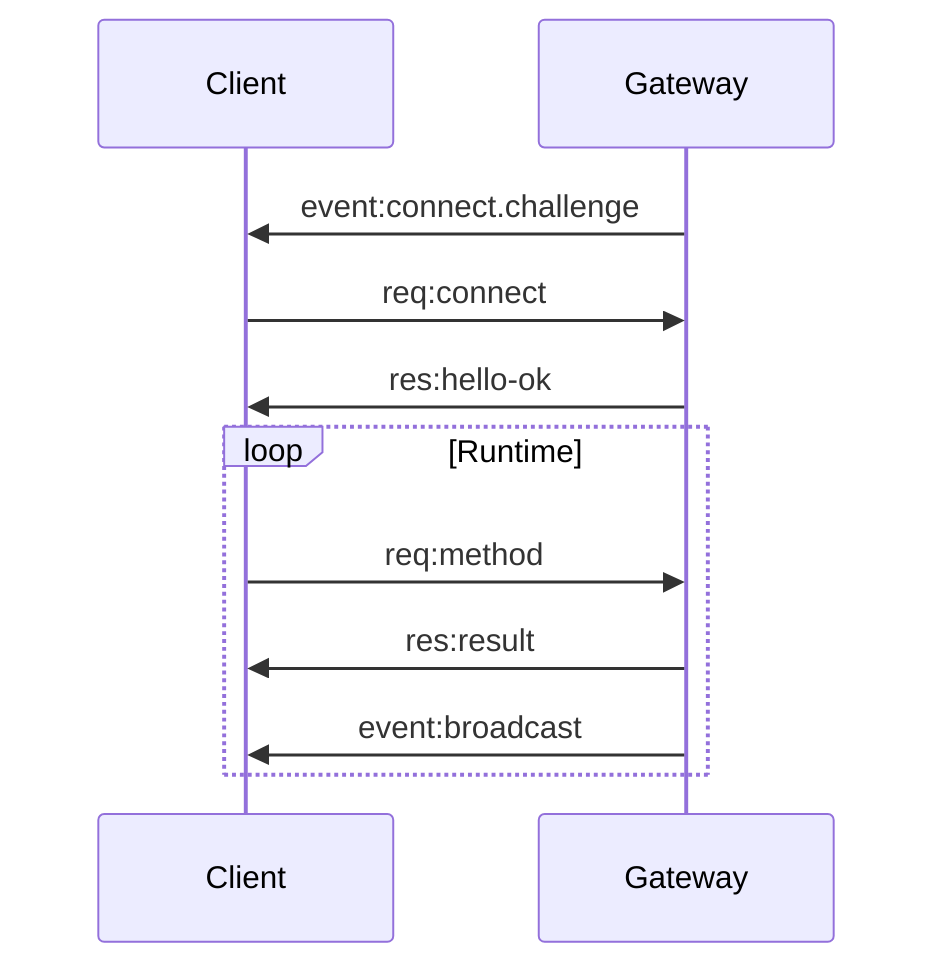

# Gateway Protocol Implementation Guide

[← Back to Architecture](../../ARCHITECTURE.md)

---

## Implementation Progress

| Task | Status | Notes |
|------|--------|-------|
| Define protocol types | ⬜ | |
| Implement frame parsing | ⬜ | |
| Build handshake logic | ⬜ | |
| Implement request/response | ⬜ | |
| Add event broadcasting | ⬜ | |
| Define core methods | ⬜ | |
| Add device pairing | ⬜ | |
| Implement scopes/auth | ⬜ | |
| Generate schema | ⬜ | |
| Write tests | ⬜ | |

---

## Overview

The Gateway Protocol defines how clients communicate with the Gateway server:

- **WebSocket transport** with JSON text frames
- **Request/Response** pattern for RPC calls
- **Event streaming** for real-time updates
- **Role-based access** (operator vs node)
- **Device-based authentication** with pairing



---

## File Structure

```
src/gateway/protocol/
├── schema.ts              # TypeBox schema definitions
├── types.ts               # TypeScript types
├── frames.ts              # Frame parsing/serialization
├── handshake.ts           # Connection handshake
├── methods/
│   ├── registry.ts        # Method registration
│   ├── health.ts          # Health method
│   ├── status.ts          # Status method
│   ├── agent.ts           # Agent methods
│   ├── chat.ts            # Chat methods
│   ├── sessions.ts        # Session methods
│   ├── channels.ts        # Channel methods
│   ├── nodes.ts           # Node methods
│   └── pairing.ts         # Pairing methods
├── auth/
│   ├── scopes.ts          # Scope definitions
│   ├── tokens.ts          # Token management
│   └── device.ts          # Device verification
└── codegen/
    ├── json-schema.ts     # JSON Schema generation
    └── swift.ts           # Swift model generation
```

---

## Core Components

### 1. Protocol Types

**File:** `src/gateway/protocol/types.ts`

```typescript
/**
 * Protocol version - increment on breaking changes
 */
export const PROTOCOL_VERSION = 3;

/**
 * Frame types
 */
export type Frame = RequestFrame | ResponseFrame | EventFrame;

/**
 * Request frame - client to server RPC call
 */
export interface RequestFrame {
  type: 'req';
  /** Unique request ID for correlation */
  id: string;
  /** Method name */
  method: string;
  /** Method parameters */
  params?: unknown;
  /** Idempotency key for side-effecting methods */
  idempotencyKey?: string;
}

/**
 * Response frame - server response to request
 */
export interface ResponseFrame {
  type: 'res';
  /** Request ID being responded to */
  id: string;
  /** Success flag */
  ok: boolean;
  /** Response payload on success */
  payload?: unknown;
  /** Error details on failure */
  error?: ErrorPayload;
}

/**
 * Event frame - server push notification
 */
export interface EventFrame {
  type: 'event';
  /** Event name */
  event: string;
  /** Event payload */
  payload: unknown;
  /** Event sequence number */
  seq?: number;
  /** State version for cache invalidation */
  stateVersion?: number;
}

/**
 * Error payload
 */
export interface ErrorPayload {
  /** Error code */
  code: string;
  /** Human-readable message */
  message: string;
  /** Additional details */
  details?: unknown;
}

/**
 * Connect request parameters
 */
export interface ConnectParams {
  /** Minimum protocol version supported */
  minProtocol: number;
  /** Maximum protocol version supported */
  maxProtocol: number;
  /** Client information */
  client: ClientInfo;
  /** Connection role */
  role: 'operator' | 'node';
  /** Requested scopes (for operators) */
  scopes?: string[];
  /** Capabilities (for nodes) */
  caps?: string[];
  /** Commands (for nodes) */
  commands?: string[];
  /** Permissions (for nodes) */
  permissions?: Record<string, boolean>;
  /** Authentication */
  auth?: AuthParams;
  /** Device identity */
  device?: DeviceIdentity;
  /** Client locale */
  locale?: string;
  /** User agent string */
  userAgent?: string;
}

export interface ClientInfo {
  /** Client identifier */
  id: string;
  /** Client version */
  version: string;
  /** Platform (macos, ios, android, linux, windows) */
  platform: string;
  /** Mode (operator, node) */
  mode: string;
}

export interface AuthParams {
  /** Auth token */
  token?: string;
  /** Password (alternative to token) */
  password?: string;
}

export interface DeviceIdentity {
  /** Device fingerprint ID */
  id: string;
  /** Device public key */
  publicKey?: string;
  /** Signature of challenge nonce */
  signature?: string;
  /** Signature timestamp */
  signedAt?: number;
  /** Challenge nonce being signed */
  nonce?: string;
}

/**
 * Hello-OK response payload
 */
export interface HelloOkPayload {
  type: 'hello-ok';
  /** Negotiated protocol version */
  protocol: number;
  /** Server information */
  server: ServerInfo;
  /** Policy settings */
  policy: PolicySettings;
  /** Auth result */
  auth?: AuthResult;
  /** Initial snapshot */
  snapshot?: Snapshot;
}

export interface ServerInfo {
  /** Server version */
  version: string;
  /** Git commit */
  commit?: string;
  /** Server hostname */
  host?: string;
}

export interface PolicySettings {
  /** Tick interval in ms */
  tickIntervalMs: number;
  /** Heartbeat interval in ms */
  heartbeatIntervalMs?: number;
}

export interface AuthResult {
  /** Issued device token */
  deviceToken?: string;
  /** Granted role */
  role: 'operator' | 'node';
  /** Granted scopes */
  scopes: string[];
}

export interface Snapshot {
  /** Current presence */
  presence?: PresenceEntry[];
  /** Current health */
  health?: HealthStatus;
  /** Channel status */
  channels?: ChannelStatus[];
}
```

### 2. Frame Parsing

**File:** `src/gateway/protocol/frames.ts`

```typescript
import type { Frame, RequestFrame, ResponseFrame, EventFrame, ErrorPayload } from './types';

/**
 * Parse a raw WebSocket message into a frame
 */
export function parseFrame(data: string): Frame {
  let parsed: unknown;
  
  try {
    parsed = JSON.parse(data);
  } catch {
    throw new ProtocolError('INVALID_JSON', 'Failed to parse JSON');
  }
  
  if (!parsed || typeof parsed !== 'object') {
    throw new ProtocolError('INVALID_FRAME', 'Frame must be an object');
  }
  
  const frame = parsed as Record<string, unknown>;
  
  if (!frame.type) {
    throw new ProtocolError('MISSING_TYPE', 'Frame must have a type');
  }
  
  switch (frame.type) {
    case 'req':
      return parseRequestFrame(frame);
    case 'res':
      return parseResponseFrame(frame);
    case 'event':
      return parseEventFrame(frame);
    default:
      throw new ProtocolError('UNKNOWN_TYPE', `Unknown frame type: ${frame.type}`);
  }
}

function parseRequestFrame(frame: Record<string, unknown>): RequestFrame {
  if (typeof frame.id !== 'string') {
    throw new ProtocolError('MISSING_ID', 'Request must have an id');
  }
  
  if (typeof frame.method !== 'string') {
    throw new ProtocolError('MISSING_METHOD', 'Request must have a method');
  }
  
  return {
    type: 'req',
    id: frame.id,
    method: frame.method,
    params: frame.params,
    idempotencyKey: frame.idempotencyKey as string | undefined,
  };
}

function parseResponseFrame(frame: Record<string, unknown>): ResponseFrame {
  if (typeof frame.id !== 'string') {
    throw new ProtocolError('MISSING_ID', 'Response must have an id');
  }
  
  if (typeof frame.ok !== 'boolean') {
    throw new ProtocolError('MISSING_OK', 'Response must have ok flag');
  }
  
  return {
    type: 'res',
    id: frame.id,
    ok: frame.ok,
    payload: frame.payload,
    error: frame.error as ErrorPayload | undefined,
  };
}

function parseEventFrame(frame: Record<string, unknown>): EventFrame {
  if (typeof frame.event !== 'string') {
    throw new ProtocolError('MISSING_EVENT', 'Event must have an event name');
  }
  
  return {
    type: 'event',
    event: frame.event,
    payload: frame.payload,
    seq: frame.seq as number | undefined,
    stateVersion: frame.stateVersion as number | undefined,
  };
}

/**
 * Serialize a frame to JSON string
 */
export function serializeFrame(frame: Frame): string {
  return JSON.stringify(frame);
}

/**
 * Create a response frame
 */
export function createResponse(id: string, payload: unknown): ResponseFrame {
  return {
    type: 'res',
    id,
    ok: true,
    payload,
  };
}

/**
 * Create an error response frame
 */
export function createErrorResponse(id: string, error: ErrorPayload): ResponseFrame {
  return {
    type: 'res',
    id,
    ok: false,
    error,
  };
}

/**
 * Create an event frame
 */
export function createEvent(event: string, payload: unknown, seq?: number): EventFrame {
  return {
    type: 'event',
    event,
    payload,
    seq,
  };
}

/**
 * Protocol error
 */
export class ProtocolError extends Error {
  constructor(
    public code: string,
    message: string
  ) {
    super(message);
    this.name = 'ProtocolError';
  }
  
  toPayload(): ErrorPayload {
    return {
      code: this.code,
      message: this.message,
    };
  }
}
```

### 3. Connection Handshake

**File:** `src/gateway/protocol/handshake.ts`

```typescript
import { WebSocket } from 'ws';
import { randomBytes } from 'crypto';
import { PROTOCOL_VERSION, type ConnectParams, type HelloOkPayload } from './types';
import { parseFrame, serializeFrame, createEvent, createResponse, ProtocolError } from './frames';
import { verifyDeviceSignature } from './auth/device';
import { validateScopes } from './auth/scopes';

export interface HandshakeResult {
  success: boolean;
  error?: string;
  role?: 'operator' | 'node';
  scopes?: string[];
  deviceId?: string;
  deviceToken?: string;
}

/**
 * Handle the connection handshake
 */
export async function handleHandshake(
  ws: WebSocket,
  config: Config,
  isLocal: boolean
): Promise<HandshakeResult> {
  // 1. Send challenge
  const nonce = randomBytes(32).toString('base64');
  const challenge = createEvent('connect.challenge', {
    nonce,
    ts: Date.now(),
  });
  
  ws.send(serializeFrame(challenge));
  
  // 2. Wait for connect request
  const connectFrame = await waitForMessage(ws, 10000);
  
  if (!connectFrame) {
    return { success: false, error: 'Timeout waiting for connect' };
  }
  
  let parsed;
  try {
    parsed = parseFrame(connectFrame);
  } catch (err) {
    return { success: false, error: err instanceof Error ? err.message : 'Parse error' };
  }
  
  if (parsed.type !== 'req' || parsed.method !== 'connect') {
    return { success: false, error: 'First message must be connect request' };
  }
  
  const params = parsed.params as ConnectParams;
  
  // 3. Validate protocol version
  if (params.minProtocol > PROTOCOL_VERSION || params.maxProtocol < PROTOCOL_VERSION) {
    sendError(ws, parsed.id, 'PROTOCOL_MISMATCH', 
      `Protocol version mismatch: server=${PROTOCOL_VERSION}, client=${params.minProtocol}-${params.maxProtocol}`);
    return { success: false, error: 'Protocol mismatch' };
  }
  
  // 4. Validate authentication
  const authResult = await validateAuth(params, config, isLocal);
  if (!authResult.valid) {
    sendError(ws, parsed.id, 'AUTH_FAILED', authResult.error || 'Authentication failed');
    return { success: false, error: 'Auth failed' };
  }
  
  // 5. Validate device identity (non-local)
  if (!isLocal && params.device) {
    const deviceValid = verifyDeviceSignature(
      params.device,
      nonce,
      config
    );
    
    if (!deviceValid) {
      sendError(ws, parsed.id, 'DEVICE_INVALID', 'Invalid device signature');
      return { success: false, error: 'Device signature invalid' };
    }
  }
  
  // 6. Validate scopes
  const grantedScopes = validateScopes(params.scopes || [], params.role, config);
  
  // 7. Send hello-ok
  const helloPayload: HelloOkPayload = {
    type: 'hello-ok',
    protocol: PROTOCOL_VERSION,
    server: {
      version: process.env.npm_package_version || '0.0.0',
      host: process.env.HOSTNAME,
    },
    policy: {
      tickIntervalMs: config.gateway?.heartbeatInterval || 15000,
    },
    auth: {
      role: params.role,
      scopes: grantedScopes,
      deviceToken: authResult.deviceToken,
    },
    snapshot: await buildSnapshot(config),
  };
  
  ws.send(serializeFrame(createResponse(parsed.id, helloPayload)));
  
  return {
    success: true,
    role: params.role,
    scopes: grantedScopes,
    deviceId: params.device?.id,
    deviceToken: authResult.deviceToken,
  };
}

/**
 * Wait for a WebSocket message with timeout
 */
function waitForMessage(ws: WebSocket, timeoutMs: number): Promise<string | null> {
  return new Promise((resolve) => {
    const timeout = setTimeout(() => {
      ws.off('message', handler);
      resolve(null);
    }, timeoutMs);
    
    const handler = (data: Buffer | string) => {
      clearTimeout(timeout);
      ws.off('message', handler);
      resolve(data.toString());
    };
    
    ws.on('message', handler);
  });
}

/**
 * Send an error response
 */
function sendError(ws: WebSocket, id: string, code: string, message: string): void {
  ws.send(serializeFrame({
    type: 'res',
    id,
    ok: false,
    error: { code, message },
  }));
}

/**
 * Validate authentication
 */
async function validateAuth(
  params: ConnectParams,
  config: Config,
  isLocal: boolean
): Promise<{ valid: boolean; error?: string; deviceToken?: string }> {
  // Local connections may skip auth
  if (isLocal && config.gateway?.auth?.allowInsecureLocal) {
    return { valid: true };
  }
  
  // Check token
  const requiredToken = config.gateway?.auth?.token;
  if (requiredToken) {
    if (params.auth?.token !== requiredToken) {
      return { valid: false, error: 'Invalid token' };
    }
  }
  
  // Check device token for returning devices
  if (params.device?.id) {
    const existingToken = await lookupDeviceToken(params.device.id);
    if (existingToken && params.auth?.token === existingToken) {
      return { valid: true };
    }
  }
  
  return { valid: true };
}
```

### 4. Method Registry

**File:** `src/gateway/protocol/methods/registry.ts`

```typescript
import type { ConnectedClient } from '../../connection/manager';
import type { Config } from '../../../config/types';

export interface MethodContext {
  /** Connected client */
  client: ConnectedClient;
  /** Server config */
  config: Config;
  /** Gateway runtime state */
  state: GatewayState;
}

export interface MethodDefinition {
  /** Method name */
  name: string;
  /** Method description */
  description?: string;
  /** Required scope */
  scope?: string;
  /** Is idempotent (safe to retry) */
  idempotent?: boolean;
  /** Handler function */
  handler: (params: unknown, context: MethodContext) => Promise<unknown>;
}

/**
 * Method registry
 */
class MethodRegistry {
  private methods = new Map<string, MethodDefinition>();
  
  register(method: MethodDefinition): void {
    this.methods.set(method.name, method);
  }
  
  get(name: string): MethodDefinition | undefined {
    return this.methods.get(name);
  }
  
  getAll(): MethodDefinition[] {
    return [...this.methods.values()];
  }
  
  async invoke(
    name: string,
    params: unknown,
    context: MethodContext
  ): Promise<unknown> {
    const method = this.methods.get(name);
    
    if (!method) {
      throw new Error(`Unknown method: ${name}`);
    }
    
    // Check scope
    if (method.scope && !context.client.scopes.includes(method.scope)) {
      throw new Error(`Method ${name} requires scope: ${method.scope}`);
    }
    
    return method.handler(params, context);
  }
}

export const methodRegistry = new MethodRegistry();
```

### 5. Core Methods

**File:** `src/gateway/protocol/methods/health.ts`

```typescript
import { methodRegistry } from './registry';

methodRegistry.register({
  name: 'health',
  description: 'Get gateway health status',
  idempotent: true,
  
  async handler(params, context) {
    const health = context.state.healthMonitor.getStatus();
    
    return {
      status: health.status,
      uptime: health.uptime,
      connections: health.connections,
      channels: health.channels,
      memory: health.memory,
      timestamp: Date.now(),
    };
  },
});
```

**File:** `src/gateway/protocol/methods/agent.ts`

```typescript
import { methodRegistry } from './registry';
import { randomUUID } from 'crypto';

methodRegistry.register({
  name: 'agent',
  description: 'Run an agent with a message',
  scope: 'operator.write',
  
  async handler(params, context) {
    const { message, sessionKey, agentId, model, verbose, thinking } = params as {
      message: string;
      sessionKey?: string;
      agentId?: string;
      model?: string;
      verbose?: boolean;
      thinking?: 'none' | 'low' | 'high';
    };
    
    if (!message) {
      throw new Error('message is required');
    }
    
    const runId = randomUUID();
    const resolvedAgentId = agentId || getDefaultAgentId(context.config);
    const resolvedSessionKey = sessionKey || `agent:${resolvedAgentId}:main`;
    
    // Queue agent run
    context.state.agentRunner.run({
      agentId: resolvedAgentId,
      sessionKey: resolvedSessionKey,
      message,
      model,
      verbose,
      thinking,
    }).then(result => {
      // Broadcast result event
      context.state.broadcaster.broadcast('agent', {
        runId,
        type: 'lifecycle',
        phase: 'end',
        status: result.status,
        payloads: result.payloads,
        usage: result.usage,
      });
    }).catch(err => {
      context.state.broadcaster.broadcast('agent', {
        runId,
        type: 'lifecycle',
        phase: 'error',
        error: err.message,
      });
    });
    
    // Return immediately with runId
    return {
      runId,
      status: 'accepted',
      acceptedAt: Date.now(),
    };
  },
});

methodRegistry.register({
  name: 'agent.wait',
  description: 'Wait for an agent run to complete',
  scope: 'operator.read',
  
  async handler(params, context) {
    const { runId, timeoutMs = 30000 } = params as {
      runId: string;
      timeoutMs?: number;
    };
    
    // Wait for run completion
    const result = await context.state.agentRunner.waitForRun(runId, timeoutMs);
    
    return result;
  },
});
```

**File:** `src/gateway/protocol/methods/channels.ts`

```typescript
import { methodRegistry } from './registry';

methodRegistry.register({
  name: 'channels.status',
  description: 'Get channel status',
  scope: 'operator.read',
  idempotent: true,
  
  async handler(params, context) {
    const { channel, probe } = params as {
      channel?: string;
      probe?: boolean;
    };
    
    const snapshot = context.state.channels.getRuntimeSnapshot();
    
    let channels = snapshot;
    if (channel) {
      channels = channels.filter(c => c.channelId === channel);
    }
    
    // Optionally probe connections
    if (probe) {
      const probeResults = await Promise.all(
        channels.map(async c => {
          const plugin = context.state.channels.getPlugin(c.channelId);
          if (plugin?.status?.probe) {
            const result = await plugin.status.probe(c.accountId);
            return { ...c, probe: result };
          }
          return c;
        })
      );
      channels = probeResults;
    }
    
    return { channels };
  },
});

methodRegistry.register({
  name: 'channels.start',
  description: 'Start a channel',
  scope: 'operator.admin',
  
  async handler(params, context) {
    const { channel, account = 'default' } = params as {
      channel: string;
      account?: string;
    };
    
    await context.state.channels.startChannel(channel, account);
    
    return { success: true };
  },
});

methodRegistry.register({
  name: 'channels.stop',
  description: 'Stop a channel',
  scope: 'operator.admin',
  
  async handler(params, context) {
    const { channel, account = 'default' } = params as {
      channel: string;
      account?: string;
    };
    
    await context.state.channels.stopChannel(channel, account);
    
    return { success: true };
  },
});
```

### 6. Scopes and Authorization

**File:** `src/gateway/protocol/auth/scopes.ts`

```typescript
/**
 * Available operator scopes
 */
export const OPERATOR_SCOPES = [
  'operator.read',      // Read status, health, history
  'operator.write',     // Send messages, run agents
  'operator.admin',     // Start/stop channels, manage config
  'operator.approvals', // Approve exec requests
  'operator.pairing',   // Manage device pairing
] as const;

/**
 * Scope hierarchy - higher scopes include lower ones
 */
const SCOPE_HIERARCHY: Record<string, string[]> = {
  'operator.admin': ['operator.write', 'operator.read'],
  'operator.write': ['operator.read'],
  'operator.approvals': ['operator.read'],
  'operator.pairing': ['operator.read'],
};

/**
 * Validate and expand scopes
 */
export function validateScopes(
  requested: string[],
  role: 'operator' | 'node',
  config: Config
): string[] {
  if (role === 'node') {
    // Nodes don't have scopes
    return [];
  }
  
  const granted = new Set<string>();
  
  for (const scope of requested) {
    if (!OPERATOR_SCOPES.includes(scope as any)) {
      continue; // Unknown scope
    }
    
    granted.add(scope);
    
    // Add implied scopes
    const implied = SCOPE_HIERARCHY[scope];
    if (implied) {
      for (const s of implied) {
        granted.add(s);
      }
    }
  }
  
  return [...granted];
}

/**
 * Check if scopes include a required scope
 */
export function hasScope(scopes: string[], required: string): boolean {
  return scopes.includes(required);
}
```

---

## Event Types

```typescript
/**
 * Agent events
 */
export type AgentEvent =
  | { type: 'lifecycle'; phase: 'start'; runId: string; agentId: string; sessionKey: string }
  | { type: 'lifecycle'; phase: 'end'; runId: string; status: 'ok' | 'error'; payloads: MessagePayload[] }
  | { type: 'lifecycle'; phase: 'error'; runId: string; error: string }
  | { type: 'assistant'; runId: string; delta: string }
  | { type: 'tool'; runId: string; toolId: string; name: string; phase: 'start' | 'end'; result?: unknown };

/**
 * Presence events
 */
export interface PresenceEvent {
  entries: PresenceEntry[];
  stateVersion: number;
}

export interface PresenceEntry {
  deviceId: string;
  connections: ConnectionInfo[];
  lastSeen: number;
}

/**
 * Health events
 */
export interface HealthEvent {
  status: 'healthy' | 'degraded' | 'unhealthy';
  channels: ChannelHealth[];
  timestamp: number;
}

/**
 * Heartbeat event
 */
export interface HeartbeatEvent {
  timestamp: number;
  uptime: number;
}
```

---

## Testing

```typescript
import { describe, it, expect } from 'vitest';
import { parseFrame, serializeFrame, createResponse } from './frames';

describe('Protocol Frames', () => {
  it('should parse request frame', () => {
    const raw = JSON.stringify({
      type: 'req',
      id: '123',
      method: 'health',
      params: {},
    });
    
    const frame = parseFrame(raw);
    
    expect(frame.type).toBe('req');
    expect(frame.method).toBe('health');
  });
  
  it('should create response frame', () => {
    const response = createResponse('123', { status: 'ok' });
    
    expect(response.type).toBe('res');
    expect(response.id).toBe('123');
    expect(response.ok).toBe(true);
    expect(response.payload).toEqual({ status: 'ok' });
  });
  
  it('should reject invalid frames', () => {
    expect(() => parseFrame('not json')).toThrow('INVALID_JSON');
    expect(() => parseFrame('{}')).toThrow('MISSING_TYPE');
  });
});
```

---

## Next Steps

After implementing Gateway Protocol:

1. **[Native Apps →](../08-native-apps/README.md)** - Use protocol from apps
2. **[Gateway Server →](../01-gateway-server/README.md)** - Wire up protocol

---

## References

- [WebSocket Protocol RFC 6455](https://datatracker.ietf.org/doc/html/rfc6455)
- [TypeBox Schema Library](https://github.com/sinclairzx81/typebox)
- [JSON Schema](https://json-schema.org/)
