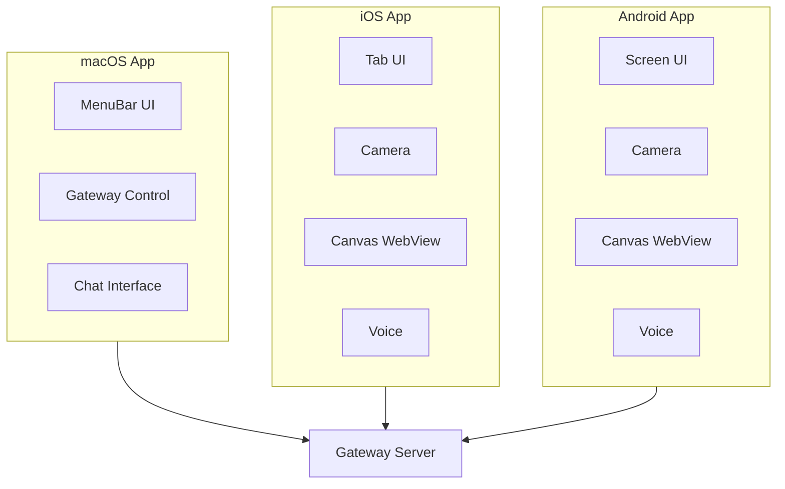

# Native Apps Implementation Guide

[← Back to Architecture](../../ARCHITECTURE.md)

---

## Implementation Progress

| Task | Status | Notes |
|------|--------|-------|
| Define shared protocol models | ⬜ | |
| Build gateway client library | ⬜ | |
| Implement discovery (mDNS) | ⬜ | |
| Create macOS app structure | ⬜ | |
| Implement iOS app structure | ⬜ | |
| Implement Android app structure | ⬜ | |
| Add device pairing | ⬜ | |
| Implement node capabilities | ⬜ | |
| Add chat interface | ⬜ | |
| Write tests | ⬜ | |

---

## Overview

Native apps serve two roles:

1. **Control Clients (Operators)** - Manage the gateway, view status, send messages
2. **Capability Nodes** - Provide device capabilities (camera, screen, voice)



---

## File Structure

```
apps/
├── shared/
│   └── MoltbotKit/
│       └── Sources/
│           ├── MoltbotProtocol/    # Shared protocol types
│           ├── MoltbotGateway/     # Gateway client
│           └── MoltbotChatUI/      # Shared chat components
├── macos/
│   └── Sources/
│       ├── MoltbotApp.swift        # App entry
│       ├── Gateway/
│       │   ├── GatewayConnection.swift
│       │   └── GatewayDiscovery.swift
│       └── Views/
│           ├── MenuBarView.swift
│           ├── SettingsView.swift
│           └── ChatView.swift
├── ios/
│   └── Sources/
│       ├── MoltbotApp.swift
│       ├── Gateway/
│       ├── Views/
│       │   ├── RootTabs.swift
│       │   ├── ScreenTab.swift
│       │   ├── VoiceTab.swift
│       │   └── SettingsTab.swift
│       └── Capabilities/
│           ├── CameraCapability.swift
│           ├── CanvasCapability.swift
│           └── VoiceCapability.swift
└── android/
    └── app/src/main/
        ├── MainActivity.kt
        ├── gateway/
        │   ├── GatewaySession.kt
        │   └── GatewayDiscovery.kt
        ├── ui/
        │   ├── MainScreen.kt
        │   ├── ChatSheet.kt
        │   └── SettingsSheet.kt
        └── capabilities/
            ├── CameraCapability.kt
            ├── CanvasCapability.kt
            └── VoiceCapability.kt
```

---

## Shared Components

### 1. Gateway Client (Swift)

**File:** `apps/shared/MoltbotKit/Sources/MoltbotGateway/GatewayClient.swift`

```swift
import Foundation

public actor GatewayClient {
    private var webSocket: URLSessionWebSocketTask?
    private var session: URLSession
    private var pendingRequests: [String: CheckedContinuation<GatewayResponse, Error>] = [:]
    private var eventHandlers: [String: [(GatewayEvent) -> Void]] = [:]
    private var isConnected = false
    
    public init() {
        self.session = URLSession(configuration: .default)
    }
    
    // MARK: - Connection
    
    public func connect(to url: URL, auth: AuthParams) async throws {
        let ws = session.webSocketTask(with: url)
        self.webSocket = ws
        ws.resume()
        
        // Wait for challenge
        let challenge = try await receiveEvent()
        guard challenge.event == "connect.challenge",
              let nonce = (challenge.payload as? [String: Any])?["nonce"] as? String else {
            throw GatewayError.handshakeFailed("No challenge received")
        }
        
        // Send connect request
        let connectParams = ConnectParams(
            minProtocol: 3,
            maxProtocol: 3,
            client: ClientInfo(
                id: "ios-app",
                version: Bundle.main.version,
                platform: "ios",
                mode: "node"
            ),
            role: .node,
            caps: ["camera", "canvas", "screen", "location", "voice"],
            commands: ["camera.snap", "canvas.navigate", "screen.record", "location.get"],
            auth: auth,
            device: try getDeviceIdentity(nonce: nonce)
        )
        
        let response = try await request("connect", params: connectParams)
        
        guard let hello = response.payload as? HelloOkPayload else {
            throw GatewayError.handshakeFailed("Invalid hello response")
        }
        
        self.isConnected = true
        
        // Start receive loop
        Task { await receiveLoop() }
    }
    
    public func disconnect() {
        webSocket?.cancel(with: .normalClosure, reason: nil)
        webSocket = nil
        isConnected = false
    }
    
    // MARK: - Requests
    
    public func request<T: Encodable, R: Decodable>(
        _ method: String,
        params: T
    ) async throws -> R {
        let id = UUID().uuidString
        
        let frame = RequestFrame(
            type: "req",
            id: id,
            method: method,
            params: params
        )
        
        let data = try JSONEncoder().encode(frame)
        let message = URLSessionWebSocketTask.Message.string(String(data: data, encoding: .utf8)!)
        
        try await webSocket?.send(message)
        
        return try await withCheckedThrowingContinuation { continuation in
            pendingRequests[id] = continuation
        }
    }
    
    // MARK: - Events
    
    public func on(_ event: String, handler: @escaping (GatewayEvent) -> Void) {
        if eventHandlers[event] == nil {
            eventHandlers[event] = []
        }
        eventHandlers[event]?.append(handler)
    }
    
    // MARK: - Receive Loop
    
    private func receiveLoop() async {
        while isConnected {
            do {
                let message = try await webSocket?.receive()
                
                switch message {
                case .string(let text):
                    try await handleMessage(text)
                case .data(let data):
                    try await handleMessage(String(data: data, encoding: .utf8) ?? "")
                case .none:
                    break
                @unknown default:
                    break
                }
            } catch {
                if isConnected {
                    // Connection lost, try to reconnect
                    isConnected = false
                }
                break
            }
        }
    }
    
    private func handleMessage(_ text: String) async throws {
        let data = text.data(using: .utf8)!
        let frame = try JSONDecoder().decode(AnyFrame.self, from: data)
        
        switch frame.type {
        case "res":
            if let continuation = pendingRequests.removeValue(forKey: frame.id ?? "") {
                if frame.ok == true {
                    continuation.resume(returning: frame.payload)
                } else {
                    continuation.resume(throwing: GatewayError.requestFailed(frame.error))
                }
            }
            
        case "event":
            let event = GatewayEvent(event: frame.event ?? "", payload: frame.payload)
            eventHandlers[frame.event ?? ""]?.forEach { $0(event) }
            
        default:
            break
        }
    }
}
```

### 2. Gateway Discovery (Swift)

**File:** `apps/shared/MoltbotKit/Sources/MoltbotGateway/GatewayDiscovery.swift`

```swift
import Foundation
import Network

@Observable
public class GatewayDiscovery {
    public var discoveredGateways: [DiscoveredGateway] = []
    
    private var browser: NWBrowser?
    
    public init() {}
    
    public func startDiscovery() {
        // Bonjour/mDNS discovery
        let parameters = NWParameters()
        parameters.includePeerToPeer = true
        
        browser = NWBrowser(for: .bonjour(type: "_skynet-gw._tcp", domain: nil), using: parameters)
        
        browser?.browseResultsChangedHandler = { [weak self] results, changes in
            self?.handleResults(results)
        }
        
        browser?.start(queue: .main)
    }
    
    public func stopDiscovery() {
        browser?.cancel()
        browser = nil
    }
    
    private func handleResults(_ results: Set<NWBrowser.Result>) {
        discoveredGateways = results.compactMap { result -> DiscoveredGateway? in
            guard case .service(let name, let type, let domain, _) = result.endpoint else {
                return nil
            }
            
            return DiscoveredGateway(
                name: name,
                type: type,
                domain: domain,
                endpoint: result.endpoint
            )
        }
    }
    
    public func resolve(_ gateway: DiscoveredGateway) async throws -> URL {
        // Resolve mDNS to actual host/port
        let connection = NWConnection(to: gateway.endpoint, using: .tcp)
        
        return try await withCheckedThrowingContinuation { continuation in
            connection.stateUpdateHandler = { state in
                switch state {
                case .ready:
                    if let endpoint = connection.currentPath?.remoteEndpoint,
                       case .hostPort(let host, let port) = endpoint {
                        let url = URL(string: "ws://\(host):\(port)")!
                        continuation.resume(returning: url)
                    }
                case .failed(let error):
                    continuation.resume(throwing: error)
                default:
                    break
                }
            }
            connection.start(queue: .main)
        }
    }
}

public struct DiscoveredGateway: Identifiable {
    public let id = UUID()
    public let name: String
    public let type: String
    public let domain: String
    public let endpoint: NWEndpoint
}
```

---

## macOS App

### Menu Bar App

**File:** `apps/macos/Sources/MoltbotApp.swift`

```swift
import SwiftUI
import MoltbotKit

@main
struct MoltbotApp: App {
    @State private var gatewayController = GatewayController()
    
    var body: some Scene {
        MenuBarExtra {
            MenuBarView()
                .environment(gatewayController)
        } label: {
            Image(systemName: gatewayController.isRunning ? "bolt.fill" : "bolt")
        }
        
        Settings {
            SettingsView()
                .environment(gatewayController)
        }
    }
}
```

**File:** `apps/macos/Sources/Views/MenuBarView.swift`

```swift
import SwiftUI
import MoltbotKit

struct MenuBarView: View {
    @Environment(GatewayController.self) var gateway
    
    var body: some View {
        VStack(spacing: 0) {
            // Status section
            HStack {
                Circle()
                    .fill(gateway.isRunning ? .green : .gray)
                    .frame(width: 8, height: 8)
                Text(gateway.isRunning ? "Running" : "Stopped")
                Spacer()
                if gateway.isRunning {
                    Text("Port \(gateway.port)")
                        .foregroundStyle(.secondary)
                }
            }
            .padding()
            
            Divider()
            
            // Actions
            Button(gateway.isRunning ? "Stop Gateway" : "Start Gateway") {
                Task {
                    if gateway.isRunning {
                        await gateway.stop()
                    } else {
                        await gateway.start()
                    }
                }
            }
            .padding(.horizontal)
            .padding(.vertical, 8)
            
            Divider()
            
            // Channels
            if gateway.isRunning {
                ForEach(gateway.channels) { channel in
                    ChannelRow(channel: channel)
                }
                
                Divider()
            }
            
            // Footer
            HStack {
                Button("Settings...") {
                    NSApp.sendAction(Selector(("showSettingsWindow:")), to: nil, from: nil)
                }
                Spacer()
                Button("Quit") {
                    NSApplication.shared.terminate(nil)
                }
            }
            .padding()
        }
        .frame(width: 280)
    }
}
```

---

## iOS App

### Tab-Based Structure

**File:** `apps/ios/Sources/MoltbotApp.swift`

```swift
import SwiftUI
import MoltbotKit

@main
struct MoltbotApp: App {
    @State private var appModel = NodeAppModel()
    
    var body: some Scene {
        WindowGroup {
            RootTabs()
                .environment(appModel)
        }
    }
}
```

**File:** `apps/ios/Sources/Views/RootTabs.swift`

```swift
import SwiftUI
import MoltbotKit

struct RootTabs: View {
    @Environment(NodeAppModel.self) var model
    @State private var selectedTab = 0
    @State private var showingChat = false
    
    var body: some View {
        ZStack {
            TabView(selection: $selectedTab) {
                ScreenTab()
                    .tabItem { Label("Screen", systemImage: "rectangle.on.rectangle") }
                    .tag(0)
                
                VoiceTab()
                    .tabItem { Label("Voice", systemImage: "waveform") }
                    .tag(1)
                
                SettingsTab()
                    .tabItem { Label("Settings", systemImage: "gear") }
                    .tag(2)
            }
            
            // Status pill overlay
            VStack {
                HStack {
                    StatusPill()
                    Spacer()
                    Button {
                        showingChat = true
                    } label: {
                        Image(systemName: "bubble.left.fill")
                            .font(.title2)
                    }
                    .padding()
                }
                Spacer()
            }
        }
        .sheet(isPresented: $showingChat) {
            ChatSheet()
        }
    }
}
```

### Node Capabilities

**File:** `apps/ios/Sources/Capabilities/CameraCapability.swift`

```swift
import AVFoundation
import UIKit

actor CameraCapability {
    private var captureSession: AVCaptureSession?
    
    func snap() async throws -> Data {
        let session = AVCaptureSession()
        session.sessionPreset = .photo
        
        guard let camera = AVCaptureDevice.default(.builtInWideAngleCamera, for: .video, position: .back),
              let input = try? AVCaptureDeviceInput(device: camera) else {
            throw CameraError.notAvailable
        }
        
        session.addInput(input)
        
        let output = AVCapturePhotoOutput()
        session.addOutput(output)
        
        session.startRunning()
        defer { session.stopRunning() }
        
        let settings = AVCapturePhotoSettings()
        
        return try await withCheckedThrowingContinuation { continuation in
            let delegate = PhotoCaptureDelegate { result in
                switch result {
                case .success(let data):
                    continuation.resume(returning: data)
                case .failure(let error):
                    continuation.resume(throwing: error)
                }
            }
            output.capturePhoto(with: settings, delegate: delegate)
        }
    }
}

enum CameraError: Error {
    case notAvailable
    case captureFailed
}
```

---

## Android App

### Main Activity (Kotlin/Compose)

**File:** `apps/android/app/src/main/MainActivity.kt`

```kotlin
package bot.skynet.android

import android.os.Bundle
import androidx.activity.ComponentActivity
import androidx.activity.compose.setContent
import androidx.compose.foundation.layout.*
import androidx.compose.material3.*
import androidx.compose.runtime.*
import androidx.compose.ui.Modifier
import androidx.lifecycle.viewmodel.compose.viewModel

class MainActivity : ComponentActivity() {
    override fun onCreate(savedInstanceState: Bundle?) {
        super.onCreate(savedInstanceState)
        
        setContent {
            SkynetTheme {
                MainScreen()
            }
        }
    }
}

@Composable
fun MainScreen(
    viewModel: MainViewModel = viewModel()
) {
    val connectionState by viewModel.connectionState.collectAsState()
    var showingChat by remember { mutableStateOf(false) }
    var showingSettings by remember { mutableStateOf(false) }
    
    Box(modifier = Modifier.fillMaxSize()) {
        // Canvas WebView
        CanvasView(
            url = viewModel.canvasUrl,
            modifier = Modifier.fillMaxSize()
        )
        
        // Status pill
        StatusPill(
            state = connectionState,
            modifier = Modifier
                .padding(16.dp)
                .align(Alignment.TopStart)
        )
        
        // Action buttons
        Column(
            modifier = Modifier
                .padding(16.dp)
                .align(Alignment.TopEnd)
        ) {
            IconButton(onClick = { showingChat = true }) {
                Icon(Icons.Default.Chat, "Chat")
            }
            IconButton(onClick = { showingSettings = true }) {
                Icon(Icons.Default.Settings, "Settings")
            }
        }
    }
    
    // Chat bottom sheet
    if (showingChat) {
        ChatSheet(
            onDismiss = { showingChat = false }
        )
    }
    
    // Settings bottom sheet
    if (showingSettings) {
        SettingsSheet(
            onDismiss = { showingSettings = false }
        )
    }
}
```

### Gateway Session (Kotlin)

**File:** `apps/android/app/src/main/gateway/GatewaySession.kt`

```kotlin
package bot.skynet.android.gateway

import kotlinx.coroutines.*
import kotlinx.coroutines.flow.*
import kotlinx.serialization.*
import kotlinx.serialization.json.*
import okhttp3.*
import java.util.UUID
import java.util.concurrent.ConcurrentHashMap

class GatewaySession(
    private val client: OkHttpClient = OkHttpClient()
) {
    private var webSocket: WebSocket? = null
    private val pendingRequests = ConcurrentHashMap<String, CompletableDeferred<JsonObject>>()
    
    private val _connectionState = MutableStateFlow<ConnectionState>(ConnectionState.Disconnected)
    val connectionState: StateFlow<ConnectionState> = _connectionState
    
    private val _events = MutableSharedFlow<GatewayEvent>()
    val events: SharedFlow<GatewayEvent> = _events
    
    suspend fun connect(url: String, auth: AuthParams) {
        _connectionState.value = ConnectionState.Connecting
        
        val request = Request.Builder()
            .url(url)
            .build()
        
        webSocket = client.newWebSocket(request, object : WebSocketListener() {
            override fun onOpen(webSocket: WebSocket, response: Response) {
                // Wait for challenge and complete handshake
            }
            
            override fun onMessage(webSocket: WebSocket, text: String) {
                handleMessage(text)
            }
            
            override fun onClosed(webSocket: WebSocket, code: Int, reason: String) {
                _connectionState.value = ConnectionState.Disconnected
            }
            
            override fun onFailure(webSocket: WebSocket, t: Throwable, response: Response?) {
                _connectionState.value = ConnectionState.Error(t.message ?: "Connection failed")
            }
        })
    }
    
    fun disconnect() {
        webSocket?.close(1000, "User disconnect")
        webSocket = null
    }
    
    suspend fun <T> request(method: String, params: T): JsonObject {
        val id = UUID.randomUUID().toString()
        val deferred = CompletableDeferred<JsonObject>()
        pendingRequests[id] = deferred
        
        val frame = buildJsonObject {
            put("type", "req")
            put("id", id)
            put("method", method)
            put("params", Json.encodeToJsonElement(params))
        }
        
        webSocket?.send(frame.toString())
        
        return deferred.await()
    }
    
    private fun handleMessage(text: String) {
        val json = Json.parseToJsonElement(text).jsonObject
        val type = json["type"]?.jsonPrimitive?.content
        
        when (type) {
            "res" -> {
                val id = json["id"]?.jsonPrimitive?.content ?: return
                val deferred = pendingRequests.remove(id) ?: return
                
                if (json["ok"]?.jsonPrimitive?.boolean == true) {
                    deferred.complete(json["payload"]?.jsonObject ?: buildJsonObject {})
                } else {
                    deferred.completeExceptionally(
                        GatewayException(json["error"]?.jsonObject?.get("message")?.jsonPrimitive?.content ?: "Unknown error")
                    )
                }
            }
            "event" -> {
                val event = json["event"]?.jsonPrimitive?.content ?: return
                val payload = json["payload"]
                CoroutineScope(Dispatchers.Default).launch {
                    _events.emit(GatewayEvent(event, payload))
                }
            }
        }
    }
}

sealed class ConnectionState {
    object Disconnected : ConnectionState()
    object Connecting : ConnectionState()
    object Connected : ConnectionState()
    data class Error(val message: String) : ConnectionState()
}

data class GatewayEvent(
    val event: String,
    val payload: JsonElement?
)

class GatewayException(message: String) : Exception(message)
```

---

## Node Capabilities

All apps expose these capabilities to the gateway:

| Capability | Commands | Description |
|------------|----------|-------------|
| `canvas` | `canvas.navigate`, `canvas.eval`, `canvas.snapshot` | WebView control |
| `camera` | `camera.snap`, `camera.record` | Photo/video capture |
| `screen` | `screen.record`, `screen.snapshot` | Screen recording |
| `location` | `location.get` | GPS location |
| `voice` | `voice.wake`, `voice.talk` | Voice features |
| `sms` | `sms.read`, `sms.send` | SMS (Android only) |

---

## Testing

```swift
import XCTest
@testable import MoltbotKit

final class GatewayClientTests: XCTestCase {
    func testConnectHandshake() async throws {
        let client = GatewayClient()
        let mockServer = MockWebSocketServer()
        
        // Start mock server
        try await mockServer.start(port: 19000)
        
        // Connect
        try await client.connect(
            to: URL(string: "ws://localhost:19000")!,
            auth: AuthParams(token: "test")
        )
        
        // Verify handshake
        XCTAssertTrue(client.isConnected)
        
        await mockServer.stop()
    }
}
```

---

## Next Steps

After implementing Native Apps:

1. **[Testing Strategy →](../10-testing-strategy/README.md)** - Test apps
2. **[CI/CD Pipeline →](../11-cicd-pipeline/README.md)** - Build automation

---

## References

- [SwiftUI Documentation](https://developer.apple.com/documentation/swiftui)
- [Jetpack Compose](https://developer.android.com/jetpack/compose)
- [Network.framework](https://developer.apple.com/documentation/network)
- [OkHttp](https://square.github.io/okhttp/)
