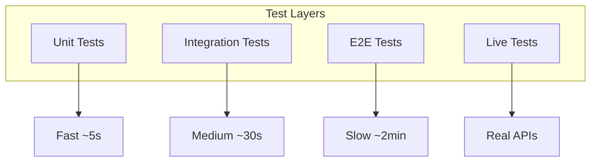

# Testing Strategy Implementation Guide

[← Back to Architecture](../../ARCHITECTURE.md)

---

## Implementation Progress

| Task | Status | Notes |
|------|--------|-------|
| Set up Vitest | ⬜ | |
| Configure coverage | ⬜ | |
| Create test utilities | ⬜ | |
| Build mock factories | ⬜ | |
| Write unit tests | ⬜ | |
| Write integration tests | ⬜ | |
| Write E2E tests | ⬜ | |
| Set up live tests | ⬜ | |
| Configure parallel execution | ⬜ | |

---

## Overview

The testing strategy includes multiple layers:

- **Unit Tests** - Test individual functions and classes
- **Integration Tests** - Test component interactions
- **E2E Tests** - Test full system flows
- **Live Tests** - Test with real APIs (opt-in)



---

## File Structure

```
src/
├── **/*.test.ts           # Unit tests (colocated)
├── **/*.e2e.test.ts       # E2E tests
└── **/*.live.test.ts      # Live tests

test/
├── setup.ts               # Global test setup
├── helpers/
│   ├── isolation.ts       # Test isolation
│   ├── fixtures.ts        # Test fixtures
│   └── mocks/
│       ├── gateway.ts     # Gateway mocks
│       ├── channel.ts     # Channel mocks
│       └── provider.ts    # Provider mocks
└── e2e/
    ├── gateway.e2e.test.ts
    └── onboarding.e2e.test.ts

vitest.config.ts           # Unit test config
vitest.e2e.config.ts       # E2E test config
vitest.live.config.ts      # Live test config
```

---

## Configuration

### Vitest Config

**File:** `vitest.config.ts`

```typescript
import { defineConfig } from 'vitest/config';

export default defineConfig({
  test: {
    // Include patterns
    include: ['src/**/*.test.ts'],
    
    // Exclude patterns
    exclude: [
      'src/**/*.e2e.test.ts',
      'src/**/*.live.test.ts',
      'node_modules/**',
      'dist/**',
    ],
    
    // Global setup
    setupFiles: ['./test/setup.ts'],
    
    // Parallel execution
    pool: 'threads',
    poolOptions: {
      threads: {
        minThreads: 1,
        maxThreads: 16,
      },
    },
    
    // Coverage
    coverage: {
      provider: 'v8',
      reporter: ['text', 'lcov', 'html'],
      include: ['src/**/*.ts'],
      exclude: [
        'src/**/*.test.ts',
        'src/**/*.e2e.test.ts',
        'src/**/*.live.test.ts',
      ],
      thresholds: {
        lines: 70,
        functions: 70,
        branches: 55,
        statements: 70,
      },
    },
    
    // Timeouts
    testTimeout: 10000,
    hookTimeout: 10000,
  },
});
```

**File:** `vitest.e2e.config.ts`

```typescript
import { defineConfig } from 'vitest/config';

export default defineConfig({
  test: {
    include: ['src/**/*.e2e.test.ts', 'test/e2e/**/*.test.ts'],
    
    setupFiles: ['./test/setup.ts'],
    
    // E2E tests run sequentially
    pool: 'threads',
    poolOptions: {
      threads: {
        minThreads: 1,
        maxThreads: 4,
      },
    },
    
    // Longer timeouts for E2E
    testTimeout: 60000,
    hookTimeout: 30000,
  },
});
```

**File:** `vitest.live.config.ts`

```typescript
import { defineConfig } from 'vitest/config';

export default defineConfig({
  test: {
    include: ['src/**/*.live.test.ts'],
    
    setupFiles: ['./test/setup.ts'],
    
    // Live tests run sequentially
    pool: 'forks',
    poolOptions: {
      forks: {
        singleFork: true, // One at a time
      },
    },
    
    // Even longer timeouts for API calls
    testTimeout: 120000,
    hookTimeout: 60000,
  },
});
```

---

## Test Setup

**File:** `test/setup.ts`

```typescript
import { beforeAll, afterAll, beforeEach } from 'vitest';

// Global setup
beforeAll(async () => {
  // Set test environment
  process.env.NODE_ENV = 'test';
  
  // Disable colors for consistent output
  process.env.NO_COLOR = '1';
  
  // Set fixed timezone for date tests
  process.env.TZ = 'UTC';
});

// Cleanup after all tests
afterAll(async () => {
  // Any global cleanup
});

// Reset state before each test
beforeEach(() => {
  // Clear any module caches if needed
});
```

---

## Test Utilities

### Test Isolation

**File:** `test/helpers/isolation.ts`

```typescript
import { mkdtemp, rm } from 'fs/promises';
import { join } from 'path';
import { tmpdir } from 'os';

/**
 * Create an isolated test environment with temp directories
 */
export async function withIsolatedTestHome<T>(
  fn: (tempDir: string) => Promise<T>
): Promise<T> {
  const tempDir = await mkdtemp(join(tmpdir(), 'skynet-test-'));
  
  // Set environment variables
  const originalHome = process.env.HOME;
  const originalStateDir = process.env.SKYNET_STATE_DIR;
  
  process.env.HOME = tempDir;
  process.env.SKYNET_STATE_DIR = join(tempDir, '.skynet');
  
  try {
    return await fn(tempDir);
  } finally {
    // Restore environment
    process.env.HOME = originalHome;
    if (originalStateDir) {
      process.env.SKYNET_STATE_DIR = originalStateDir;
    } else {
      delete process.env.SKYNET_STATE_DIR;
    }
    
    // Cleanup
    await rm(tempDir, { recursive: true, force: true });
  }
}

/**
 * Get a free port for testing
 */
export async function getFreePort(): Promise<number> {
  const { createServer } = await import('net');
  
  return new Promise((resolve, reject) => {
    const server = createServer();
    server.listen(0, () => {
      const { port } = server.address() as { port: number };
      server.close(() => resolve(port));
    });
    server.on('error', reject);
  });
}
```

### Mock Factories

**File:** `test/helpers/mocks/gateway.ts`

```typescript
import { vi } from 'vitest';
import type { GatewayRuntimeState } from '../../../src/gateway/server';

/**
 * Create mock gateway state
 */
export function createMockGatewayState(): GatewayRuntimeState {
  return {
    config: createMockConfig(),
    connections: createMockConnectionManager(),
    channels: createMockChannelManager(),
    broadcaster: createMockBroadcaster(),
    startedAt: Date.now(),
  };
}

/**
 * Create mock connection manager
 */
export function createMockConnectionManager() {
  const connections = new Map();
  
  return {
    register: vi.fn((ws, params) => {
      const conn = { id: 'mock-conn', ws, ...params };
      connections.set(conn.id, conn);
      return conn;
    }),
    unregister: vi.fn((id) => connections.delete(id)),
    getByRole: vi.fn((role) => [...connections.values()].filter(c => c.role === role)),
    getByScope: vi.fn((scope) => [...connections.values()].filter(c => c.scopes?.includes(scope))),
    get count() { return connections.size; },
    [Symbol.iterator]: () => connections.values(),
  };
}

/**
 * Create mock broadcaster
 */
export function createMockBroadcaster() {
  return {
    broadcast: vi.fn(() => 0),
    sendTo: vi.fn(() => true),
  };
}

/**
 * Create mock channel manager
 */
export function createMockChannelManager() {
  const channels = new Map();
  
  return {
    registerPlugin: vi.fn((plugin) => channels.set(plugin.id, plugin)),
    startChannels: vi.fn(),
    startChannel: vi.fn(),
    stopChannel: vi.fn(),
    getRuntimeSnapshot: vi.fn(() => []),
    getPlugin: vi.fn((id) => channels.get(id)),
  };
}
```

**File:** `test/helpers/mocks/channel.ts`

```typescript
import { vi } from 'vitest';
import type { ChannelPlugin } from '../../../src/channels/plugins/types';

/**
 * Create a stub channel plugin
 */
export function createStubChannelPlugin(
  id: string,
  overrides: Partial<ChannelPlugin> = {}
): ChannelPlugin {
  return {
    id,
    label: id.charAt(0).toUpperCase() + id.slice(1),
    capabilities: {
      chatTypes: ['dm', 'group'],
      media: true,
    },
    
    config: {
      getAccountConfig: vi.fn(() => ({ enabled: true })),
      getAccounts: vi.fn(() => ['default']),
    },
    
    outbound: {
      sendText: vi.fn(async () => ({ success: true, messageId: 'mock-msg-id' })),
      sendMedia: vi.fn(async () => ({ success: true, messageId: 'mock-msg-id' })),
      textChunkLimit: 4096,
    },
    
    gateway: {
      startAccount: vi.fn(),
      stopAccount: vi.fn(),
    },
    
    status: {
      getStatus: vi.fn(() => ({ connected: true, status: 'connected' })),
      probe: vi.fn(async () => ({ success: true })),
    },
    
    ...overrides,
  };
}

/**
 * Create mock message context
 */
export function createMockMessageContext(
  overrides: Partial<MessageContext> = {}
): MessageContext {
  return {
    messageId: 'mock-msg-123',
    channel: 'telegram',
    accountId: 'default',
    Body: 'Hello, world!',
    RawBody: 'Hello, world!',
    CommandBody: 'Hello, world!',
    BodyForAgent: 'Hello, world!',
    SessionKey: 'agent:default:main',
    From: { id: 'user-123', name: 'Test User' },
    To: { id: 'chat-456', isDm: true },
    ChatType: 'dm',
    ConversationLabel: 'DM with Test User',
    IsMentioned: false,
    Timestamp: Date.now(),
    Raw: {},
    ...overrides,
  };
}
```

**File:** `test/helpers/mocks/provider.ts`

```typescript
import { vi } from 'vitest';

/**
 * Create mock provider client
 */
export function createMockProviderClient(
  responses: MockProviderResponse[] = []
) {
  let callIndex = 0;
  
  return {
    chat: vi.fn(async (params) => {
      const response = responses[callIndex] || {
        content: 'Mock response',
        finishReason: 'stop',
      };
      callIndex++;
      
      // Simulate streaming if callback provided
      if (params.onToken && response.content) {
        for (const char of response.content) {
          params.onToken(char);
        }
      }
      
      return response;
    }),
  };
}

interface MockProviderResponse {
  content?: string;
  toolCalls?: Array<{
    id: string;
    name: string;
    arguments: Record<string, unknown>;
  }>;
  finishReason: 'stop' | 'tool_calls' | 'length';
  usage?: {
    promptTokens: number;
    completionTokens: number;
    totalTokens: number;
  };
}

/**
 * Install OpenAI mock
 */
export function installOpenAIMock(responses: MockProviderResponse[]) {
  const mock = createMockProviderClient(responses);
  
  vi.mock('../../../src/agents/providers/client', () => ({
    createProviderClient: async () => mock,
  }));
  
  return mock;
}
```

---

## Test Patterns

### Unit Test Example

**File:** `src/channels/routing/session-key.test.ts`

```typescript
import { describe, it, expect } from 'vitest';
import { buildSessionKey, parseSessionKey } from './session-key';

describe('Session Key', () => {
  describe('buildSessionKey', () => {
    it('should build DM session key', () => {
      const key = buildSessionKey({
        agentId: 'default',
        channel: 'telegram',
        accountId: 'main',
        chatType: 'dm',
        chatId: '123',
      });
      
      expect(key).toBe('agent:default:main');
    });
    
    it('should build group session key', () => {
      const key = buildSessionKey({
        agentId: 'default',
        channel: 'telegram',
        accountId: 'main',
        chatType: 'group',
        chatId: '-100123456',
      });
      
      expect(key).toBe('agent:default:telegram:group:-100123456');
    });
    
    it('should include thread suffix', () => {
      const key = buildSessionKey({
        agentId: 'default',
        channel: 'discord',
        accountId: 'main',
        chatType: 'channel',
        chatId: '123',
        threadId: '456',
      });
      
      expect(key).toBe('agent:default:discord:channel:123:thread:456');
    });
  });
  
  describe('parseSessionKey', () => {
    it('should parse DM session key', () => {
      const parsed = parseSessionKey('agent:default:main');
      
      expect(parsed?.agentId).toBe('default');
      expect(parsed?.chatType).toBe('dm');
    });
    
    it('should parse group session key', () => {
      const parsed = parseSessionKey('agent:default:telegram:group:-100123456');
      
      expect(parsed?.agentId).toBe('default');
      expect(parsed?.channel).toBe('telegram');
      expect(parsed?.chatType).toBe('group');
      expect(parsed?.chatId).toBe('-100123456');
    });
  });
});
```

### Integration Test Example

**File:** `src/gateway/server.test.ts`

```typescript
import { describe, it, expect, beforeEach, afterEach } from 'vitest';
import { createGatewayServer } from './server';
import { withIsolatedTestHome, getFreePort } from '../../test/helpers/isolation';

describe('Gateway Server', () => {
  it('should start and accept connections', async () => {
    await withIsolatedTestHome(async (tempDir) => {
      const port = await getFreePort();
      
      const server = await createGatewayServer({
        port,
        host: '127.0.0.1',
      });
      
      await server.start();
      
      try {
        // Verify server is listening
        const health = server.state.healthMonitor.getStatus();
        expect(health.status).toBe('healthy');
        
        // Connect a client
        const WebSocket = (await import('ws')).default;
        const ws = new WebSocket(`ws://127.0.0.1:${port}`);
        
        await new Promise<void>((resolve, reject) => {
          ws.on('open', resolve);
          ws.on('error', reject);
        });
        
        expect(ws.readyState).toBe(WebSocket.OPEN);
        ws.close();
      } finally {
        await server.stop();
      }
    });
  });
});
```

### E2E Test Example

**File:** `test/e2e/gateway.e2e.test.ts`

```typescript
import { describe, it, expect, beforeAll, afterAll } from 'vitest';
import { createGatewayServer, type GatewayServer } from '../../src/gateway/server';
import { withIsolatedTestHome, getFreePort } from '../helpers/isolation';
import WebSocket from 'ws';

describe('Gateway E2E', () => {
  let server: GatewayServer;
  let port: number;
  let tempDir: string;
  
  beforeAll(async () => {
    tempDir = await createTempDir();
    process.env.SKYNET_STATE_DIR = tempDir;
    
    port = await getFreePort();
    server = await createGatewayServer({ port, host: '127.0.0.1' });
    await server.start();
  });
  
  afterAll(async () => {
    await server.stop();
    await cleanupTempDir(tempDir);
  });
  
  it('should complete full handshake', async () => {
    const ws = new WebSocket(`ws://127.0.0.1:${port}`);
    
    // Wait for challenge
    const challenge = await waitForMessage(ws);
    expect(JSON.parse(challenge).event).toBe('connect.challenge');
    
    // Send connect
    const connectReq = {
      type: 'req',
      id: '1',
      method: 'connect',
      params: {
        minProtocol: 3,
        maxProtocol: 3,
        client: { id: 'test', version: '1.0.0', platform: 'test', mode: 'operator' },
        role: 'operator',
        scopes: ['operator.read'],
      },
    };
    ws.send(JSON.stringify(connectReq));
    
    // Wait for hello-ok
    const response = await waitForMessage(ws);
    const parsed = JSON.parse(response);
    
    expect(parsed.type).toBe('res');
    expect(parsed.ok).toBe(true);
    expect(parsed.payload.type).toBe('hello-ok');
    
    ws.close();
  });
  
  it('should execute health method', async () => {
    const ws = await connectClient(port);
    
    // Send health request
    const req = {
      type: 'req',
      id: '2',
      method: 'health',
    };
    ws.send(JSON.stringify(req));
    
    const response = await waitForMessage(ws);
    const parsed = JSON.parse(response);
    
    expect(parsed.type).toBe('res');
    expect(parsed.ok).toBe(true);
    expect(parsed.payload.status).toBe('healthy');
    
    ws.close();
  });
});

async function waitForMessage(ws: WebSocket, timeoutMs = 5000): Promise<string> {
  return new Promise((resolve, reject) => {
    const timeout = setTimeout(() => reject(new Error('Timeout')), timeoutMs);
    
    ws.once('message', (data) => {
      clearTimeout(timeout);
      resolve(data.toString());
    });
  });
}

async function connectClient(port: number): Promise<WebSocket> {
  const ws = new WebSocket(`ws://127.0.0.1:${port}`);
  
  // Wait for challenge
  await waitForMessage(ws);
  
  // Send connect
  ws.send(JSON.stringify({
    type: 'req',
    id: '0',
    method: 'connect',
    params: {
      minProtocol: 3,
      maxProtocol: 3,
      client: { id: 'test', version: '1.0.0', platform: 'test', mode: 'operator' },
      role: 'operator',
      scopes: ['operator.read', 'operator.write'],
    },
  }));
  
  // Wait for hello-ok
  await waitForMessage(ws);
  
  return ws;
}
```

### Live Test Example

**File:** `src/agents/providers/openai.live.test.ts`

```typescript
import { describe, it, expect, beforeAll } from 'vitest';
import { createProviderClient } from './client';

// Skip if no API key
const hasApiKey = !!process.env.OPENAI_API_KEY;

describe.skipIf(!hasApiKey)('OpenAI Provider (Live)', () => {
  let client: ProviderClient;
  
  beforeAll(async () => {
    client = await createProviderClient('openai/gpt-4o-mini', {});
  });
  
  it('should complete a simple chat', async () => {
    const response = await client.chat({
      messages: [
        { role: 'user', content: 'Say "hello" and nothing else.' },
      ],
      maxTokens: 10,
    });
    
    expect(response.content?.toLowerCase()).toContain('hello');
    expect(response.finishReason).toBe('stop');
    expect(response.usage?.totalTokens).toBeGreaterThan(0);
  });
  
  it('should handle tool calls', async () => {
    const response = await client.chat({
      messages: [
        { role: 'user', content: 'What is 2 + 2? Use the calculator tool.' },
      ],
      tools: [
        {
          type: 'function',
          function: {
            name: 'calculator',
            description: 'Perform arithmetic',
            parameters: {
              type: 'object',
              properties: {
                expression: { type: 'string' },
              },
              required: ['expression'],
            },
          },
        },
      ],
    });
    
    expect(response.toolCalls).toBeDefined();
    expect(response.toolCalls?.length).toBeGreaterThan(0);
    expect(response.toolCalls?.[0].name).toBe('calculator');
  });
});
```

---

## Running Tests

```bash
# Run unit tests
pnpm test

# Run with coverage
pnpm test:coverage

# Run E2E tests
pnpm test:e2e

# Run live tests (requires API keys)
SKYNET_LIVE_TEST=1 pnpm test:live

# Run specific test file
pnpm test src/channels/routing/session-key.test.ts

# Watch mode
pnpm test:watch
```

---

## Coverage Thresholds

| Metric | Threshold |
|--------|-----------|
| Lines | 70% |
| Functions | 70% |
| Branches | 55% |
| Statements | 70% |

---

## Next Steps

After implementing Testing Strategy:

1. **[CI/CD Pipeline →](../11-cicd-pipeline/README.md)** - Automate test runs
2. All other sections - Add tests as you implement

---

## References

- [Vitest Documentation](https://vitest.dev/)
- [V8 Coverage](https://v8.dev/blog/javascript-code-coverage)
- [Testing Best Practices](https://kentcdodds.com/blog/common-mistakes-with-react-testing-library)
