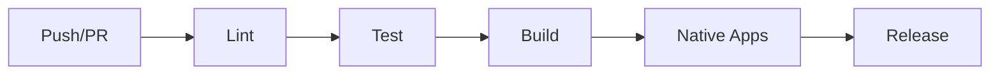

# CI/CD Pipeline Implementation Guide

[← Back to Architecture](../../ARCHITECTURE.md)

---

## Implementation Progress

| Task | Status | Notes |
|------|--------|-------|
| Set up GitHub Actions | ⬜ | |
| Configure lint job | ⬜ | |
| Configure test job | ⬜ | |
| Configure build job | ⬜ | |
| Add macOS app build | ⬜ | |
| Add Android build | ⬜ | |
| Add iOS build | ⬜ | |
| Configure secrets scanning | ⬜ | |
| Set up release workflow | ⬜ | |
| Add Docker builds | ⬜ | |

---

## Overview

The CI/CD pipeline automates:

- **Linting** - Code style and quality checks
- **Testing** - Unit, integration, and E2E tests
- **Building** - TypeScript compilation and bundling
- **Native Apps** - macOS, iOS, Android builds
- **Releases** - Publishing and deployment



---

## File Structure

```
.github/
├── workflows/
│   ├── ci.yml              # Main CI workflow
│   ├── release.yml         # Release workflow
│   ├── docker.yml          # Docker builds
│   └── install-smoke.yml   # Installation tests
├── actions/
│   └── setup-node/
│       └── action.yml      # Reusable setup action
└── CODEOWNERS              # Code ownership
```

---

## Main CI Workflow

**File:** `.github/workflows/ci.yml`

```yaml
name: CI

on:
  push:
    branches: [main]
  pull_request:
    branches: [main]

concurrency:
  group: ${{ github.workflow }}-${{ github.ref }}
  cancel-in-progress: true

env:
  NODE_VERSION: '22'
  PNPM_VERSION: '10'

jobs:
  # Install and cache dependencies
  install:
    runs-on: ubuntu-latest
    steps:
      - uses: actions/checkout@v4
      
      - name: Setup Node.js
        uses: actions/setup-node@v4
        with:
          node-version: ${{ env.NODE_VERSION }}
      
      - name: Setup pnpm
        uses: pnpm/action-setup@v4
        with:
          version: ${{ env.PNPM_VERSION }}
      
      - name: Get pnpm store directory
        id: pnpm-cache
        shell: bash
        run: echo "STORE_PATH=$(pnpm store path)" >> $GITHUB_OUTPUT
      
      - name: Setup pnpm cache
        uses: actions/cache@v4
        with:
          path: ${{ steps.pnpm-cache.outputs.STORE_PATH }}
          key: ${{ runner.os }}-pnpm-store-${{ hashFiles('**/pnpm-lock.yaml') }}
          restore-keys: |
            ${{ runner.os }}-pnpm-store-
      
      - name: Install dependencies
        run: pnpm install --frozen-lockfile

  # Lint check
  lint:
    needs: install
    runs-on: ubuntu-latest
    steps:
      - uses: actions/checkout@v4
      
      - name: Setup Node.js
        uses: actions/setup-node@v4
        with:
          node-version: ${{ env.NODE_VERSION }}
      
      - name: Setup pnpm
        uses: pnpm/action-setup@v4
        with:
          version: ${{ env.PNPM_VERSION }}
      
      - name: Restore pnpm cache
        uses: actions/cache@v4
        with:
          path: ~/.pnpm-store
          key: ${{ runner.os }}-pnpm-store-${{ hashFiles('**/pnpm-lock.yaml') }}
      
      - name: Install dependencies
        run: pnpm install --frozen-lockfile
      
      - name: Run linter
        run: pnpm lint

  # Format check
  format:
    needs: install
    runs-on: ubuntu-latest
    steps:
      - uses: actions/checkout@v4
      
      - name: Setup Node.js
        uses: actions/setup-node@v4
        with:
          node-version: ${{ env.NODE_VERSION }}
      
      - name: Setup pnpm
        uses: pnpm/action-setup@v4
        with:
          version: ${{ env.PNPM_VERSION }}
      
      - name: Install dependencies
        run: pnpm install --frozen-lockfile
      
      - name: Check formatting
        run: pnpm format

  # Unit and integration tests
  test:
    needs: install
    runs-on: ubuntu-latest
    steps:
      - uses: actions/checkout@v4
      
      - name: Setup Node.js
        uses: actions/setup-node@v4
        with:
          node-version: ${{ env.NODE_VERSION }}
      
      - name: Setup pnpm
        uses: pnpm/action-setup@v4
        with:
          version: ${{ env.PNPM_VERSION }}
      
      - name: Install dependencies
        run: pnpm install --frozen-lockfile
      
      - name: Run tests
        run: pnpm test
      
      - name: Upload coverage
        uses: codecov/codecov-action@v4
        with:
          files: ./coverage/lcov.info
          fail_ci_if_error: false

  # Build check
  build:
    needs: install
    runs-on: ubuntu-latest
    steps:
      - uses: actions/checkout@v4
      
      - name: Setup Node.js
        uses: actions/setup-node@v4
        with:
          node-version: ${{ env.NODE_VERSION }}
      
      - name: Setup pnpm
        uses: pnpm/action-setup@v4
        with:
          version: ${{ env.PNPM_VERSION }}
      
      - name: Install dependencies
        run: pnpm install --frozen-lockfile
      
      - name: Build
        run: pnpm build
      
      - name: Upload build artifacts
        uses: actions/upload-artifact@v4
        with:
          name: dist
          path: dist/
          retention-days: 7

  # E2E tests
  test-e2e:
    needs: build
    runs-on: ubuntu-latest
    steps:
      - uses: actions/checkout@v4
      
      - name: Setup Node.js
        uses: actions/setup-node@v4
        with:
          node-version: ${{ env.NODE_VERSION }}
      
      - name: Setup pnpm
        uses: pnpm/action-setup@v4
        with:
          version: ${{ env.PNPM_VERSION }}
      
      - name: Install dependencies
        run: pnpm install --frozen-lockfile
      
      - name: Download build
        uses: actions/download-artifact@v4
        with:
          name: dist
          path: dist/
      
      - name: Run E2E tests
        run: pnpm test:e2e

  # Windows tests
  test-windows:
    needs: install
    runs-on: windows-latest
    steps:
      - uses: actions/checkout@v4
      
      - name: Setup Node.js
        uses: actions/setup-node@v4
        with:
          node-version: ${{ env.NODE_VERSION }}
      
      - name: Setup pnpm
        uses: pnpm/action-setup@v4
        with:
          version: ${{ env.PNPM_VERSION }}
      
      - name: Install dependencies
        run: pnpm install --frozen-lockfile
      
      - name: Run tests
        run: pnpm test
        env:
          NODE_OPTIONS: --max-old-space-size=4096

  # macOS app build
  macos-app:
    needs: build
    runs-on: macos-latest
    if: github.event_name == 'push' || github.event.pull_request.head.repo.full_name == github.repository
    steps:
      - uses: actions/checkout@v4
      
      - name: Select Xcode
        run: sudo xcode-select -s /Applications/Xcode_15.4.app
      
      - name: Setup Swift
        uses: swift-actions/setup-swift@v2
      
      - name: Install SwiftLint
        run: brew install swiftlint swiftformat
      
      - name: Lint Swift
        run: |
          swiftlint lint --config .swiftlint.yml apps/macos/Sources
          swiftformat --lint apps/macos/Sources
      
      - name: Build macOS app
        run: |
          cd apps/macos
          xcodebuild -project Skynet.xcodeproj \
            -scheme Skynet \
            -configuration Debug \
            -destination 'platform=macOS' \
            build
      
      - name: Run macOS tests
        run: |
          cd apps/macos
          xcodebuild -project Skynet.xcodeproj \
            -scheme Skynet \
            -configuration Debug \
            -destination 'platform=macOS' \
            test

  # Android build
  android:
    needs: build
    runs-on: ubuntu-latest
    if: github.event_name == 'push' || github.event.pull_request.head.repo.full_name == github.repository
    steps:
      - uses: actions/checkout@v4
      
      - name: Setup Java
        uses: actions/setup-java@v4
        with:
          distribution: 'temurin'
          java-version: '21'
      
      - name: Setup Android SDK
        uses: android-actions/setup-android@v3
      
      - name: Build Android app
        run: |
          cd apps/android
          ./gradlew :app:assembleDebug
      
      - name: Run Android tests
        run: |
          cd apps/android
          ./gradlew :app:testDebugUnitTest
      
      - name: Upload APK
        uses: actions/upload-artifact@v4
        with:
          name: android-debug-apk
          path: apps/android/app/build/outputs/apk/debug/app-debug.apk
          retention-days: 7

  # Secret scanning
  secrets:
    runs-on: ubuntu-latest
    steps:
      - uses: actions/checkout@v4
        with:
          fetch-depth: 0
      
      - name: Detect secrets
        uses: gitleaks/gitleaks-action@v2
        env:
          GITHUB_TOKEN: ${{ secrets.GITHUB_TOKEN }}
```

---

## Release Workflow

**File:** `.github/workflows/release.yml`

```yaml
name: Release

on:
  push:
    tags:
      - 'v*'

permissions:
  contents: write
  packages: write

env:
  NODE_VERSION: '22'
  PNPM_VERSION: '10'

jobs:
  # Build and publish npm package
  npm-publish:
    runs-on: ubuntu-latest
    steps:
      - uses: actions/checkout@v4
      
      - name: Setup Node.js
        uses: actions/setup-node@v4
        with:
          node-version: ${{ env.NODE_VERSION }}
          registry-url: 'https://registry.npmjs.org'
      
      - name: Setup pnpm
        uses: pnpm/action-setup@v4
        with:
          version: ${{ env.PNPM_VERSION }}
      
      - name: Install dependencies
        run: pnpm install --frozen-lockfile
      
      - name: Build
        run: pnpm build
      
      - name: Publish to npm
        run: npm publish --access public
        env:
          NODE_AUTH_TOKEN: ${{ secrets.NPM_TOKEN }}

  # Build macOS app for release
  macos-release:
    runs-on: macos-latest
    steps:
      - uses: actions/checkout@v4
      
      - name: Select Xcode
        run: sudo xcode-select -s /Applications/Xcode_15.4.app
      
      - name: Import signing certificate
        env:
          SIGNING_CERTIFICATE_P12_DATA: ${{ secrets.SIGNING_CERTIFICATE_P12_DATA }}
          SIGNING_CERTIFICATE_PASSWORD: ${{ secrets.SIGNING_CERTIFICATE_PASSWORD }}
        run: |
          echo $SIGNING_CERTIFICATE_P12_DATA | base64 --decode > certificate.p12
          security create-keychain -p "" build.keychain
          security import certificate.p12 -k build.keychain -P "$SIGNING_CERTIFICATE_PASSWORD" -T /usr/bin/codesign
          security set-key-partition-list -S apple-tool:,apple: -s -k "" build.keychain
      
      - name: Build and sign app
        run: |
          cd apps/macos
          xcodebuild -project Skynet.xcodeproj \
            -scheme Skynet \
            -configuration Release \
            -archivePath build/Skynet.xcarchive \
            archive
          
          xcodebuild -exportArchive \
            -archivePath build/Skynet.xcarchive \
            -exportPath build/export \
            -exportOptionsPlist ExportOptions.plist
      
      - name: Notarize app
        env:
          APPLE_ID: ${{ secrets.APPLE_ID }}
          APPLE_ID_PASSWORD: ${{ secrets.APPLE_ID_PASSWORD }}
          TEAM_ID: ${{ secrets.TEAM_ID }}
        run: |
          xcrun notarytool submit build/export/Skynet.app.zip \
            --apple-id "$APPLE_ID" \
            --password "$APPLE_ID_PASSWORD" \
            --team-id "$TEAM_ID" \
            --wait
      
      - name: Create DMG
        run: |
          hdiutil create -volname "Skynet" \
            -srcfolder build/export/Skynet.app \
            -ov -format UDZO \
            Skynet.dmg
      
      - name: Upload DMG
        uses: actions/upload-artifact@v4
        with:
          name: macos-dmg
          path: Skynet.dmg

  # Build Android app for release
  android-release:
    runs-on: ubuntu-latest
    steps:
      - uses: actions/checkout@v4
      
      - name: Setup Java
        uses: actions/setup-java@v4
        with:
          distribution: 'temurin'
          java-version: '21'
      
      - name: Setup Android SDK
        uses: android-actions/setup-android@v3
      
      - name: Decode keystore
        env:
          ANDROID_KEYSTORE_BASE64: ${{ secrets.ANDROID_KEYSTORE_BASE64 }}
        run: echo $ANDROID_KEYSTORE_BASE64 | base64 --decode > apps/android/keystore.jks
      
      - name: Build release APK
        env:
          KEYSTORE_PASSWORD: ${{ secrets.ANDROID_KEYSTORE_PASSWORD }}
          KEY_ALIAS: ${{ secrets.ANDROID_KEY_ALIAS }}
          KEY_PASSWORD: ${{ secrets.ANDROID_KEY_PASSWORD }}
        run: |
          cd apps/android
          ./gradlew :app:assembleRelease
      
      - name: Upload APK
        uses: actions/upload-artifact@v4
        with:
          name: android-release-apk
          path: apps/android/app/build/outputs/apk/release/app-release.apk

  # Create GitHub release
  github-release:
    needs: [npm-publish, macos-release, android-release]
    runs-on: ubuntu-latest
    steps:
      - uses: actions/checkout@v4
      
      - name: Download macOS DMG
        uses: actions/download-artifact@v4
        with:
          name: macos-dmg
      
      - name: Download Android APK
        uses: actions/download-artifact@v4
        with:
          name: android-release-apk
      
      - name: Extract changelog
        id: changelog
        run: |
          # Extract latest version changelog
          VERSION=${GITHUB_REF#refs/tags/v}
          CHANGELOG=$(sed -n "/## ${VERSION}/,/## [0-9]/p" CHANGELOG.md | head -n -1)
          echo "changelog<<EOF" >> $GITHUB_OUTPUT
          echo "$CHANGELOG" >> $GITHUB_OUTPUT
          echo "EOF" >> $GITHUB_OUTPUT
      
      - name: Create release
        uses: softprops/action-gh-release@v1
        with:
          body: ${{ steps.changelog.outputs.changelog }}
          files: |
            Skynet.dmg
            app-release.apk
        env:
          GITHUB_TOKEN: ${{ secrets.GITHUB_TOKEN }}
```

---

## Docker Workflow

**File:** `.github/workflows/docker.yml`

```yaml
name: Docker

on:
  push:
    branches: [main]
    tags: ['v*']

env:
  REGISTRY: ghcr.io
  IMAGE_NAME: ${{ github.repository }}

jobs:
  build-and-push:
    runs-on: ubuntu-latest
    permissions:
      contents: read
      packages: write
    
    steps:
      - uses: actions/checkout@v4
      
      - name: Set up Docker Buildx
        uses: docker/setup-buildx-action@v3
      
      - name: Login to Container Registry
        uses: docker/login-action@v3
        with:
          registry: ${{ env.REGISTRY }}
          username: ${{ github.actor }}
          password: ${{ secrets.GITHUB_TOKEN }}
      
      - name: Extract metadata
        id: meta
        uses: docker/metadata-action@v5
        with:
          images: ${{ env.REGISTRY }}/${{ env.IMAGE_NAME }}
          tags: |
            type=ref,event=branch
            type=semver,pattern={{version}}
            type=semver,pattern={{major}}.{{minor}}
            type=sha
      
      - name: Build and push
        uses: docker/build-push-action@v5
        with:
          context: .
          push: true
          tags: ${{ steps.meta.outputs.tags }}
          labels: ${{ steps.meta.outputs.labels }}
          cache-from: type=gha
          cache-to: type=gha,mode=max
```

---

## Installation Smoke Test

**File:** `.github/workflows/install-smoke.yml`

```yaml
name: Installation Smoke Test

on:
  push:
    branches: [main]
  workflow_dispatch:

jobs:
  npm-install:
    strategy:
      matrix:
        os: [ubuntu-latest, macos-latest, windows-latest]
        node: ['22']
    
    runs-on: ${{ matrix.os }}
    
    steps:
      - name: Setup Node.js
        uses: actions/setup-node@v4
        with:
          node-version: ${{ matrix.node }}
      
      - name: Install package
        run: npm install -g skynet@latest
      
      - name: Verify installation
        run: skynet --version
      
      - name: Run help
        run: skynet --help
```

---

## Required Secrets

| Secret | Description | Required For |
|--------|-------------|--------------|
| `NPM_TOKEN` | npm publish token | npm release |
| `SIGNING_CERTIFICATE_P12_DATA` | macOS signing cert (base64) | macOS release |
| `SIGNING_CERTIFICATE_PASSWORD` | Cert password | macOS release |
| `APPLE_ID` | Apple ID for notarization | macOS release |
| `APPLE_ID_PASSWORD` | App-specific password | macOS release |
| `TEAM_ID` | Apple Team ID | macOS release |
| `ANDROID_KEYSTORE_BASE64` | Android keystore (base64) | Android release |
| `ANDROID_KEYSTORE_PASSWORD` | Keystore password | Android release |
| `ANDROID_KEY_ALIAS` | Key alias | Android release |
| `ANDROID_KEY_PASSWORD` | Key password | Android release |

---

## Branch Protection

Recommended settings for `main` branch:

- **Require status checks:** lint, format, test, build
- **Require branches to be up to date**
- **Require code review:** 1 approval
- **Require signed commits** (optional)
- **Do not allow force pushes**
- **Do not allow deletions**

---

## Package Scripts

Add these to `package.json`:

```json
{
  "scripts": {
    "lint": "oxlint --type-aware src test",
    "format": "oxfmt --check src test",
    "format:fix": "oxfmt --write src test",
    "build": "tsc -p tsconfig.json",
    "test": "vitest run",
    "test:coverage": "vitest run --coverage",
    "test:e2e": "vitest run --config vitest.e2e.config.ts",
    "test:live": "vitest run --config vitest.live.config.ts"
  }
}
```

---

## Next Steps

After implementing CI/CD Pipeline:

1. **Configure branch protection rules**
2. **Add required secrets**
3. **Set up code coverage tracking**
4. **Configure release automation**

---

## References

- [GitHub Actions Documentation](https://docs.github.com/en/actions)
- [pnpm/action-setup](https://github.com/pnpm/action-setup)
- [Codecov](https://codecov.io/)
- [Docker Build Push Action](https://github.com/docker/build-push-action)
